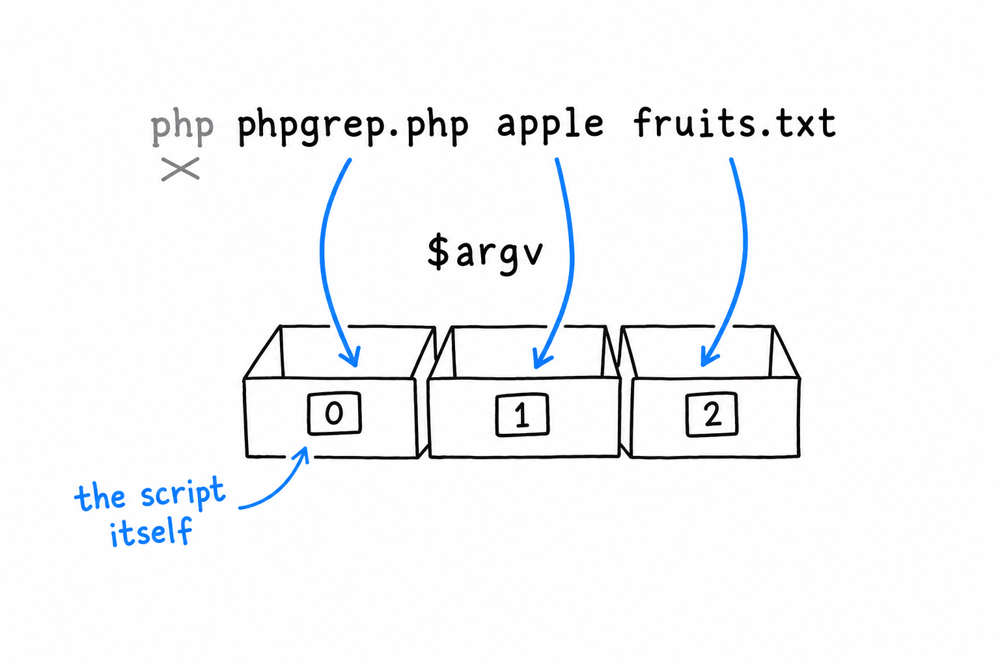

# Accepting Command Line Arguments

Create a directory for the project and, inside it, a file called `phpgrep.php`. **Everything typed after `php` on the command line lands in an array called `$argv`**, available to every script run from a terminal:

```php
<?php
declare(strict_types=1);

var_dump($argv);
```

```console
$ php phpgrep.php apple fruits.txt
array(3) {
  [0]=>
  string(11) "phpgrep.php"
  [1]=>
  string(5) "apple"
  [2]=>
  string(9) "fruits.txt"
}
```



The first surprise, if you have never met `$argv`: `$argv[0]` is not your first argument. It is the name of the script itself. Everybody trips on this once. Your real arguments start at index `1`: here `$argv[1]` is the word to search for and `$argv[2]` the file to search in, and that is the whole interface phpgrep needs.

## Reading two arguments, badly

The most direct way to grab them:

```php
<?php
declare(strict_types=1);

$query = $argv[1];
$filename = $argv[2];

echo "Searching for \"{$query}\" in \"{$filename}\"\n";
```

Run it right, and it works. Now run it with one argument too few:

```console
$ php phpgrep.php apple
```

PHP prints a warning about the missing `$argv[2]`, treats it as `null`, and limps on with garbage input instead of stopping to say what went wrong. Tolerable while you are the only user. Not for a tool anyone else will ever run. Let's guard the door:

```php
<?php
declare(strict_types=1);

if (count($argv) < 3) {
    echo "Usage: php phpgrep.php <query> <filename>\n";
    exit(1);
}

$query = $argv[1];
$filename = $argv[2];

echo "Searching for \"{$query}\" in \"{$filename}\"\n";
```

**`exit(1)` stops the script on the spot and hands the number `1` to the shell as the exit code.** By Unix convention, `0` means "it worked" and anything else means "something went wrong". Every command you have ever chained with `&&`, every `$?` you have checked in a shell, relies on that convention. phpgrep honors it from its very first version.

## Giving the arguments a home: `GrepOptions`

Two loose variables are fine today. But this project is going to grow, and passing a pair of separate strings into every function you write gets unwieldy fast. Better to bundle them in a small class whose only job is to hold what this run of the program was asked to do:

```php
<?php
declare(strict_types=1);

final class GrepOptions
{
    public function __construct(
        public readonly string $query,
        public readonly string $filename,
    ) {
    }

    public static function fromArgv(array $argv): self
    {
        return new self(
            query: $argv[1],
            filename: $argv[2],
        );
    }
}

if (count($argv) < 3) {
    echo "Usage: php phpgrep.php <query> <filename>\n";
    exit(1);
}

$options = GrepOptions::fromArgv($argv);

echo "Searching for \"{$options->query}\" in \"{$options->filename}\"\n";
```

Two readonly properties, set once through constructor promotion, as in [Chapter 5](ch05-00-classes.md). **A `GrepOptions` cannot change after it is built**, which is exactly right for something that represents the user's request for the lifetime of one run. `fromArgv()` is a static factory: give it the raw `$argv` array, get back a fully formed `GrepOptions`. The question "how do we parse arguments" now has one answer, in one place.

Run it again to check that nothing changed from the outside:

```console
$ php phpgrep.php apple fruits.txt
Searching for "apple" in "fruits.txt"
```

Same behavior, better bones. That is the whole point of introducing the class this early: it costs almost nothing now, and it is the seam the rest of the chapter needs. The class will grow a third property soon enough. Its shape and its job stay the same.
