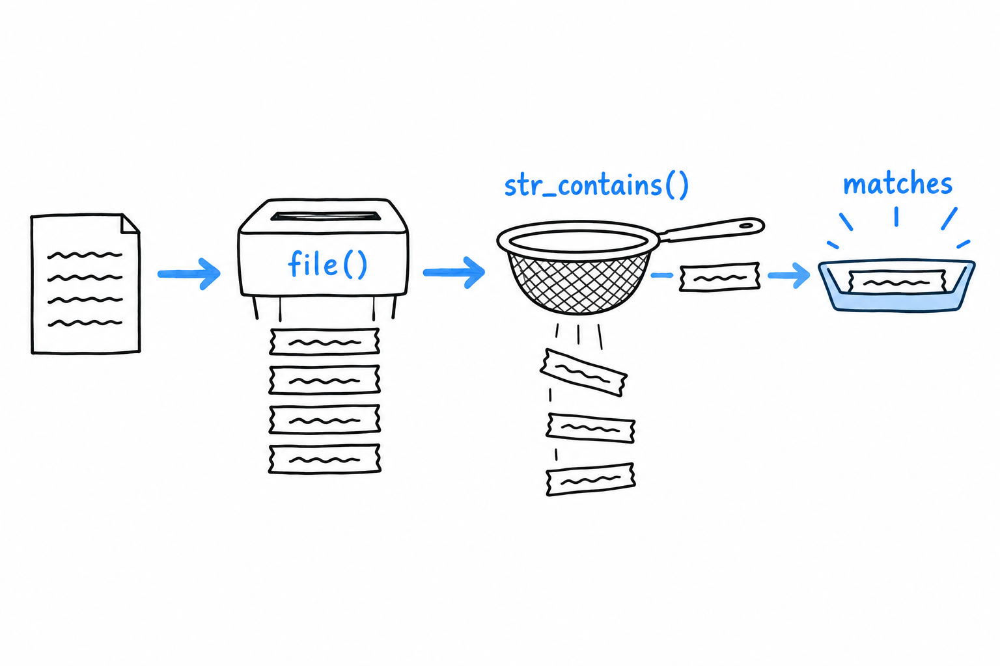

# Reading a File

phpgrep parses its arguments and searches nothing. Time to give it a file. Create one right next to `phpgrep.php`:

```console
$ cat fruits.txt
Apple pie recipe
apple sauce for the win
Banana bread is better
cherry clafoutis
```

Four lines, two of them about apples, one with a capital letter and one without. That detail is deliberate, and it comes back later.

## Reading the whole file into lines

**PHP's `file()` function reads a file straight into an array, one element per line**, exactly the shape a line-by-line search needs:

```php
<?php

$lines = file($options->filename, FILE_IGNORE_NEW_LINES);
```



The `FILE_IGNORE_NEW_LINES` flag strips the trailing `\n` from each line as it reads, which saves a `trim()` on every single one afterward. You could get the same result with `file_get_contents()` followed by `explode("\n", ...)`, and you will see that pair often in real code, particularly when the raw contents are needed for something else too. For a tool that thinks in lines, `file()` is the direct match.

## Searching each line

With the lines in hand, `str_contains()` does the matching. It arrived in PHP 8, after years of everyone hand-rolling `strpos($haystack, $needle) !== false`, and it reads like what it does:

```php
<?php
declare(strict_types=1);

final class GrepOptions
{
    public function __construct(
        public readonly string $query,
        public readonly string $filename,
    ) {
    }

    public static function fromArgv(array $argv): self
    {
        return new self(
            query: $argv[1],
            filename: $argv[2],
        );
    }
}

if (count($argv) < 3) {
    echo "Usage: php phpgrep.php <query> <filename>\n";
    exit(1);
}

$options = GrepOptions::fromArgv($argv);

$lines = file($options->filename, FILE_IGNORE_NEW_LINES);

foreach ($lines as $line) {
    if (str_contains($line, $options->query)) {
        echo $line . "\n";
    }
}
```

```console
$ php phpgrep.php apple fruits.txt
apple sauce for the win
```

Only the lowercase `apple` line matched. **`str_contains()` is case-sensitive**: `"Apple pie recipe"` does not contain the substring `"apple"`, capital A and all. Keep that fixture and that behavior in mind. Two sections from now, they become the exact test case for case-insensitive matching.

## The file that isn't there

Point phpgrep at a file that does not exist:

```console
$ php phpgrep.php apple missing.txt

Warning: file(missing.txt): Failed to open stream: No such file or directory in phpgrep.php on line 20
```

A warning, and then nothing. `file()` returns `false` when it cannot open its target, our `foreach` treats that `false` like an empty array, and the program ends with no matches and no explanation. **The tool looks like it ran and found nothing, when it never read anything at all.** That is the worst kind of failure, the quiet kind.

Let's patch it with the bluntest tool available, a check before the read:

```php
<?php

if (!file_exists($options->filename)) {
    echo "Error: file \"{$options->filename}\" not found.\n";
    exit(1);
}

$lines = file($options->filename, FILE_IGNORE_NEW_LINES);
```

```console
$ php phpgrep.php apple missing.txt
Error: file "missing.txt" not found.
```

Better, because at least it is honest. But look at what the check buys, and what it does not. `file_exists()` only answers "is there something at this path". It says nothing about whether *you* can read it: a file that exists with its permissions locked down passes this check and then fails at `file()` exactly as before, warning and all. And every place in this program that will ever open a file would need the same check pasted in front of it, with every copy a chance to forget one.


A clumsy, incomplete guard, standing in for something PHP has a proper mechanism for. Time to reach for it.
