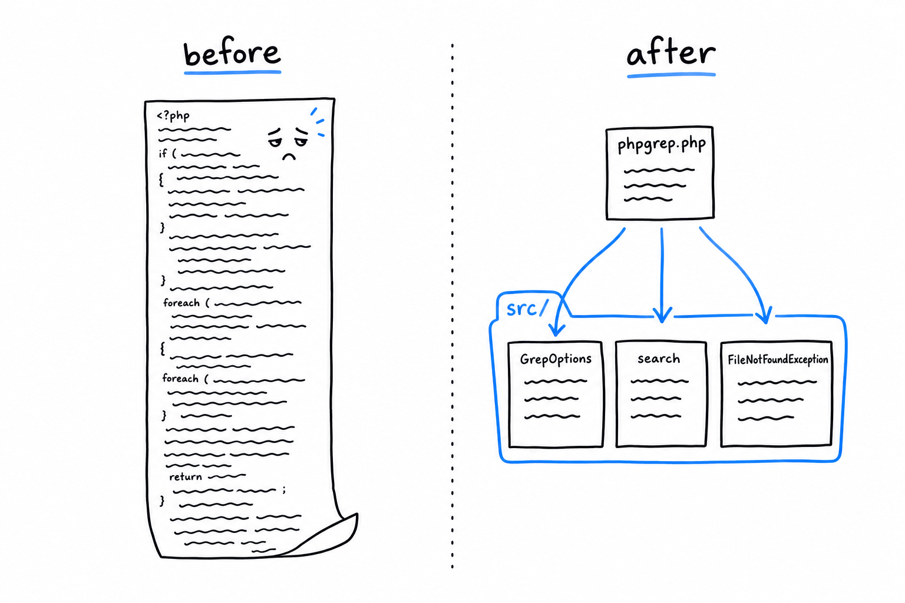

# Refactoring to Improve Modularity and Error Handling

Everything phpgrep does lives in one script, top to bottom: parse the arguments, check the file, read it, loop, print. Fine for thirty lines. It stops being fine the moment you want to test one piece without running the whole program, and that is exactly where this project is headed. **This section splits phpgrep into parts that can be called on their own**, and replaces the `file_exists()` patch with the mechanism PHP designed for the job: an exception.



## A named exception

[Chapter 9](ch09-00-error-handling.md) made the case for throwing a specific, well-named exception rather than returning a sentinel value or printing an error and hoping someone checks. PHP's `RuntimeException` is the right base class for "something went wrong while running, and the caller deserves a chance to handle it". Extend it with a name that says exactly what happened:

```php
<?php
// src/FileNotFoundException.php
declare(strict_types=1);

final class FileNotFoundException extends RuntimeException
{
}
```

That is the entire class. It adds no behavior, and it does not need to. **Its whole value is its name.** A `catch (FileNotFoundException $e)` tells whoever reads it precisely which failure is being handled, without a trip to the code that threw it.

## Extracting `search()`

Now pull the reading and matching out of the script and into a function with a real name and a real contract: it takes a `GrepOptions`, returns the matching lines, and throws if the file cannot be read:

```php
<?php
// src/search.php
declare(strict_types=1);

require_once __DIR__ . '/FileNotFoundException.php';

function search(GrepOptions $options): array
{
    if (!is_readable($options->filename)) {
        throw new FileNotFoundException("Cannot read file: {$options->filename}");
    }

    $lines = file($options->filename, FILE_IGNORE_NEW_LINES);

    $matches = [];
    foreach ($lines as $line) {
        if (str_contains($line, $options->query)) {
            $matches[] = $line;
        }
    }

    return $matches;
}
```

`is_readable()` is a genuine improvement over `file_exists()`. It checks that the file exists *and* that the current process has permission to read it, which is the precondition `file()` actually needs. Fail either, and `search()` throws immediately, naming the file. No warning on a stream nobody watches, no silent empty result, just a clear failure that a caller can catch.

`GrepOptions` moves into its own file too, unchanged:

```php
<?php
// src/GrepOptions.php
declare(strict_types=1);

final class GrepOptions
{
    public function __construct(
        public readonly string $query,
        public readonly string $filename,
    ) {
    }

    public static function fromArgv(array $argv): self
    {
        return new self(
            query: $argv[1],
            filename: $argv[2],
        );
    }
}
```

## The entry script, now just wiring

With `GrepOptions` and `search()` in `src/`, `phpgrep.php` shrinks to what it should have been all along: the part that talks to the outside world, and nothing else.

```php
<?php
// phpgrep.php
declare(strict_types=1);

require __DIR__ . '/src/GrepOptions.php';
require __DIR__ . '/src/FileNotFoundException.php';
require __DIR__ . '/src/search.php';

function main(array $argv): int
{
    if (count($argv) < 3) {
        echo "Usage: php phpgrep.php <query> <filename>\n";
        return 1;
    }

    $options = GrepOptions::fromArgv($argv);

    try {
        $matches = search($options);
    } catch (FileNotFoundException $e) {
        echo "Error: {$e->getMessage()}\n";
        return 1;
    }

    foreach ($matches as $line) {
        echo $line . "\n";
    }

    return 0;
}

exit(main($argv));
```

Look at `main()`: **it returns an exit code instead of calling `exit()` itself.** The process ends in exactly one place, the last line of the file. A function that returns a value instead of killing the process is a function you can call from anywhere, and "anywhere" includes a test, where you would much rather get `main()`'s mistakes back as a return value to assert on than watch your test runner vanish mid-suite.

```console
$ php phpgrep.php apple fruits.txt
apple sauce for the win

$ php phpgrep.php apple missing.txt
Error: Cannot read file: missing.txt
```

Same behavior from the outside, and that is deliberate. Nothing about *what* phpgrep does changed in this section, only how it is built.

> A refactor that changes behavior is not a refactor. It is a rewrite wearing a refactor's name.

What did change is that `search()` and `GrepOptions` now live in files that never `exit`, never `echo`, and never touch `$argv`. For the first time, they are things a test can call directly. That is what the next section does.
