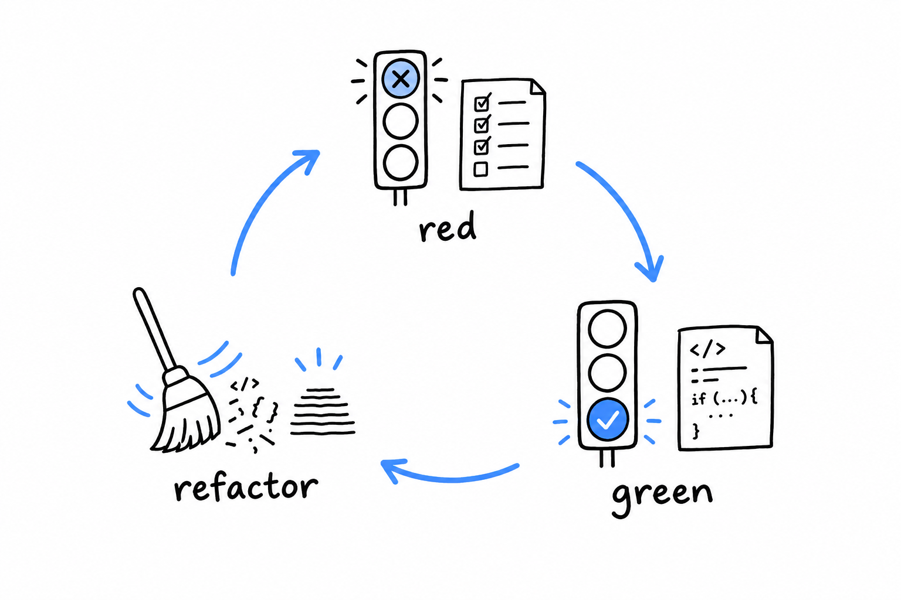

# Adding Functionality with Test-Driven Development

`search()` and `GrepOptions` now live in files that do not read `$argv`, do not `echo`, and do not `exit`. That was the point of the last section, and it pays off now: for the first time in this project, a PHPUnit test can call them directly, the way [Chapter 12](ch12-00-testing.md) taught. Let's use that to add a real feature, case-insensitive search, and add it test first.

Set up PHPUnit the same way you did there:

```console
$ composer require --dev phpunit/phpunit
```

## Red: write the test you wish already passed

Back to `fruits.txt`:

```text
Apple pie recipe
apple sauce for the win
Banana bread is better
cherry clafoutis
```

Searching for `apple` finds only the lowercase line, because `str_contains()` does not fold case. Write down, as a test, the behavior you want instead: **a `GrepOptions` with case-insensitivity turned on should match both `"Apple pie recipe"` and `"apple sauce for the win"`.**

```php
<?php
// tests/SearchTest.php
declare(strict_types=1);

use PHPUnit\Framework\TestCase;

require_once __DIR__ . '/../src/GrepOptions.php';
require_once __DIR__ . '/../src/FileNotFoundException.php';
require_once __DIR__ . '/../src/search.php';

final class SearchTest extends TestCase
{
    private string $fixture;

    protected function setUp(): void
    {
        $this->fixture = tempnam(sys_get_temp_dir(), 'phpgrep');
        file_put_contents(
            $this->fixture,
            "Apple pie recipe\napple sauce for the win\nBanana bread is better\ncherry clafoutis\n"
        );
    }

    protected function tearDown(): void
    {
        unlink($this->fixture);
    }

    public function testSearchCanIgnoreCase(): void
    {
        $options = new GrepOptions(
            query: 'apple',
            filename: $this->fixture,
            ignoreCase: true,
        );

        $this->assertSame(
            ['Apple pie recipe', 'apple sauce for the win'],
            search($options)
        );
    }
}
```

`setUp()` and `tearDown()` are PHPUnit hooks that run before and after *every* test method in the class. Here they build a fresh temporary file per test and delete it afterward, so no test ever depends on what a previous run left behind.

Run it:

```console
$ vendor/bin/phpunit tests
PHPUnit 10.5.0 by Sebastian Bergmann and contributors.

E                                                                   1 / 1 (100%)

Time: 00:00.014, Memory: 6.00 MB

1) SearchTest::testSearchCanIgnoreCase
Error: Unknown named parameter $ignoreCase
```

Red, and for exactly the right reason. `GrepOptions` has no `ignoreCase` property yet, so PHP cannot even build the object the test asks for. This is the whole rhythm of test-driven development in one step: **write the test for the behavior you want before the code exists, watch it fail, and let the failure tell you what to build next.**



## Green: make it pass

First, give `GrepOptions` the property the test asks for:

```php
<?php
// src/GrepOptions.php
declare(strict_types=1);

final class GrepOptions
{
    public function __construct(
        public readonly string $query,
        public readonly string $filename,
        public readonly bool $ignoreCase,
    ) {
    }

    public static function fromArgv(array $argv): self
    {
        return new self(
            query: $argv[1],
            filename: $argv[2],
            ignoreCase: false,
        );
    }
}
```

`fromArgv()` passes a hardcoded `false` for now. Letting the user control it is the next section's job. Then teach `search()` to honor the flag:

```php
<?php
// src/search.php
declare(strict_types=1);

require_once __DIR__ . '/FileNotFoundException.php';

function search(GrepOptions $options): array
{
    if (!is_readable($options->filename)) {
        throw new FileNotFoundException("Cannot read file: {$options->filename}");
    }

    $lines = file($options->filename, FILE_IGNORE_NEW_LINES);
    $query = $options->ignoreCase ? strtolower($options->query) : $options->query;

    $matches = [];
    foreach ($lines as $line) {
        $haystack = $options->ignoreCase ? strtolower($line) : $line;
        if (str_contains($haystack, $query)) {
            $matches[] = $line;
        }
    }

    return $matches;
}
```

When `ignoreCase` is on, both the query and the line are lowercased for the *comparison*. Notice what gets pushed into `$matches`, though: the original `$line`, untouched. **We want case-insensitive matching, not case-mangled output.**

```console
$ vendor/bin/phpunit tests
PHPUnit 10.5.0 by Sebastian Bergmann and contributors.

.                                                                   1 / 1 (100%)

Time: 00:00.013, Memory: 6.00 MB

OK (1 test, 1 assertion)
```

Green. Red, then green, then, traditionally, refactor, though there is not much worth reshaping here yet. While you are in the file, add one more test, to pin down the behavior you are *not* changing:

```php
<?php

public function testSearchIsCaseSensitiveByDefault(): void
{
    $options = new GrepOptions(
        query: 'apple',
        filename: $this->fixture,
        ignoreCase: false,
    );

    $this->assertSame(['apple sauce for the win'], search($options));
}
```

It passes at once. It tests nothing new; it guards the old behavior against a future regression. Both tests earn their place: the first proves the feature works, the second proves that adding it did not quietly break what was already there.
