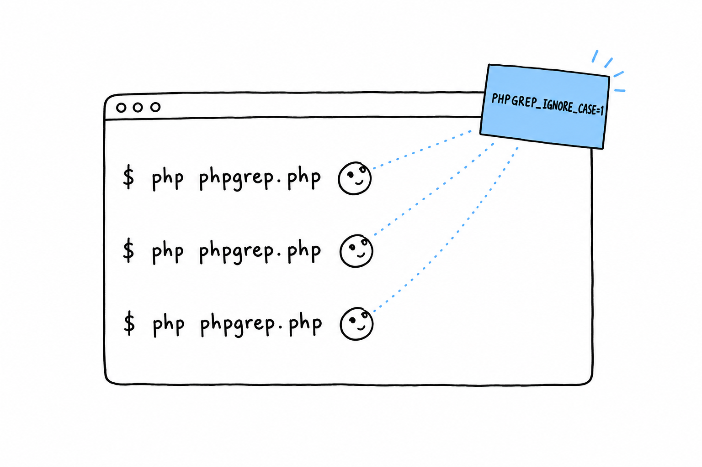

# Working with Environment Variables

`GrepOptions` carries an `ignoreCase` flag and `search()` honors it, but `fromArgv()` still hardcodes it to `false`. Nobody running phpgrep from a terminal can turn it on. Let's fix that with an environment variable rather than a third argument.

Why not simply `$argv[3]`? Because ignoring case is closer to a standing preference than a per-search decision. It is something you may want on for every search in a shell session, without retyping a flag each time. **An environment variable is set once and inherited by every command you run afterward**, until you close the terminal or unset it. That is exactly the tool for a preference.



## Reading it with `getenv()`

```php
<?php
// src/GrepOptions.php
declare(strict_types=1);

final class GrepOptions
{
    public function __construct(
        public readonly string $query,
        public readonly string $filename,
        public readonly bool $ignoreCase,
    ) {
    }

    public static function fromArgv(array $argv): self
    {
        return new self(
            query: $argv[1],
            filename: $argv[2],
            ignoreCase: getenv('PHPGREP_IGNORE_CASE') !== false,
        );
    }
}
```

**`getenv('PHPGREP_IGNORE_CASE')` returns the variable's value as a string if it is set, and the boolean `false` if it is not set at all.** That is why the check is `!== false` rather than an attempt to interpret the value. It means `PHPGREP_IGNORE_CASE=1` turns the flag on, but so does `PHPGREP_IGNORE_CASE=` with nothing after the `=`: an empty string is still a value, and setting the variable at all counts as "on". If that looseness bothers you, you are right to notice it. Tightening it (say, requiring the value to be exactly `"1"`) is a good improvement to make on your own once the chapter is done.

## Trying it

```console
$ php phpgrep.php APPLE fruits.txt
```

No output at all: `APPLE`, compared case-sensitively, appears in neither the `Apple` line nor the `apple` line. Now flip the flag on:

```console
$ PHPGREP_IGNORE_CASE=1 php phpgrep.php APPLE fruits.txt
Apple pie recipe
apple sauce for the win
```

Writing `PHPGREP_IGNORE_CASE=1` just before the command, on the same line, sets it for that one invocation only. It is a common shell idiom for a setting that should not outlive the command it is attached to. Export it instead, and it sticks around for the rest of the session:

```console
$ export PHPGREP_IGNORE_CASE=1
$ php phpgrep.php APPLE fruits.txt
Apple pie recipe
apple sauce for the win
```

## `getenv()` versus `$_ENV`

PHP also exposes the environment through the `$_ENV` superglobal, and it is worth knowing why this chapter did not reach for it. `$_ENV` is only filled according to the `variables_order` setting in `php.ini`. On plenty of default installations, especially ones tuned for serving web pages, the `E` is missing from that setting, and `$_ENV` stays empty whatever the process environment holds. `getenv()` has no such dependency: it asks the operating system directly, every time, and behaves the same in CLI scripts, web requests and every hosting setup you are likely to meet. For a tool meant to run reliably wherever it is installed, that consistency is worth the slightly less fashionable syntax.
