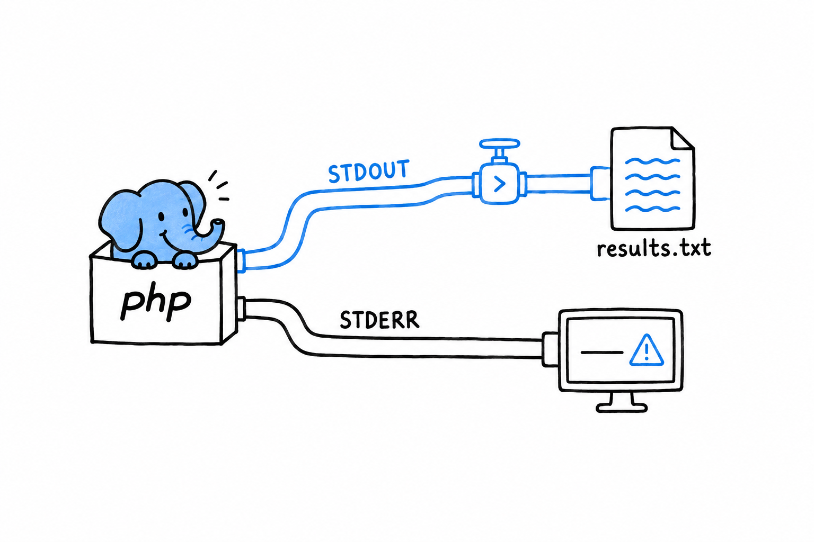

# Writing to Standard Error

Since the first section, phpgrep has printed everything the same way. Matches, usage message, error text: all through `echo`, all onto the same stream. That has been a quiet problem the whole time, and this is where it bites.

**Every process has two output streams, not one.** Standard output (`STDOUT`) is for the program's results. Standard error (`STDERR`) is for diagnostics, warnings and error messages. `echo` always writes to the first. So phpgrep's errors have been landing right next to its matches, which is fine as long as you only ever read the terminal directly. It stops being fine the moment someone sends phpgrep's output somewhere else, which is the entire reason command-line tools exist.

## Watch it go wrong

```console
$ php phpgrep.php apple missing.txt > results.txt
$ cat results.txt
Error: Cannot read file: missing.txt
```

The error message landed *inside* `results.txt`. Whatever reads that file next (another script, a report, a colleague trusting it holds only matches) now has a stray error line mixed into its data, with nothing marking it as different from a real result. This is exactly the mix-up the two streams exist to prevent.



## Fixing it with `fwrite(STDERR, ...)`

PHP exposes standard error as the constant `STDERR`, and `fwrite()` writes to it directly, bypassing `echo`:

```php
<?php
// phpgrep.php
declare(strict_types=1);

require __DIR__ . '/src/GrepOptions.php';
require __DIR__ . '/src/FileNotFoundException.php';
require __DIR__ . '/src/search.php';

function main(array $argv): int
{
    if (count($argv) < 3) {
        fwrite(STDERR, "Usage: php phpgrep.php <query> <filename>\n");
        return 1;
    }

    $options = GrepOptions::fromArgv($argv);

    try {
        $matches = search($options);
    } catch (FileNotFoundException $e) {
        fwrite(STDERR, "Error: {$e->getMessage()}\n");
        return 1;
    }

    foreach ($matches as $line) {
        echo $line . "\n";
    }

    return 0;
}

exit(main($argv));
```

Two lines changed, `echo` became `fwrite(STDERR, ...)` on both error paths, and the behavior at the boundary is completely different:

```console
$ php phpgrep.php apple missing.txt > results.txt
Error: Cannot read file: missing.txt
$ cat results.txt
$
```

The error still shows up on your terminal immediately. **`STDERR` is not hidden, it is a different stream**, one that redirecting `STDOUT` with `>` does not touch. And `results.txt` is now empty, exactly as it should be: no match was found because the search never ran, and no error text is posing as a result. Try it against a file that does have matches, and the split holds: results go to `results.txt`, errors stay on your screen, and the two never mix.

> Results go to `STDOUT`. Everything else goes to `STDERR`.

## Exit codes, one more time

`main()` still returns an `int`, and `exit(main($argv))` at the bottom of the file is still the only place the process ends. That discipline from two sections ago is doing double duty now. It is what let `SearchTest` call `search()` without launching a process, and it is why `main()`'s return value becomes the real exit code: `1` on either failure path, `0` when it reaches the end having printed whatever it found. Printing nothing at all is a successful outcome for a search tool, not a failure. A shell script or a CI pipeline can chain phpgrep with other commands and trust that code, the way it trusts every other well-behaved Unix tool, without parsing phpgrep's output to know whether it worked.

That is phpgrep, for now. It accepts its arguments properly, reads a file and searches it, fails loudly and specifically when it cannot, is backed by tests of its real logic, respects an environment variable, and keeps results and errors on separate streams. A small program, with very little left to apologize for.

One improvement remains. [Chapter 15](ch15-00-functional-features.md) introduces generators, and comes back to this exact project for one last pass.
