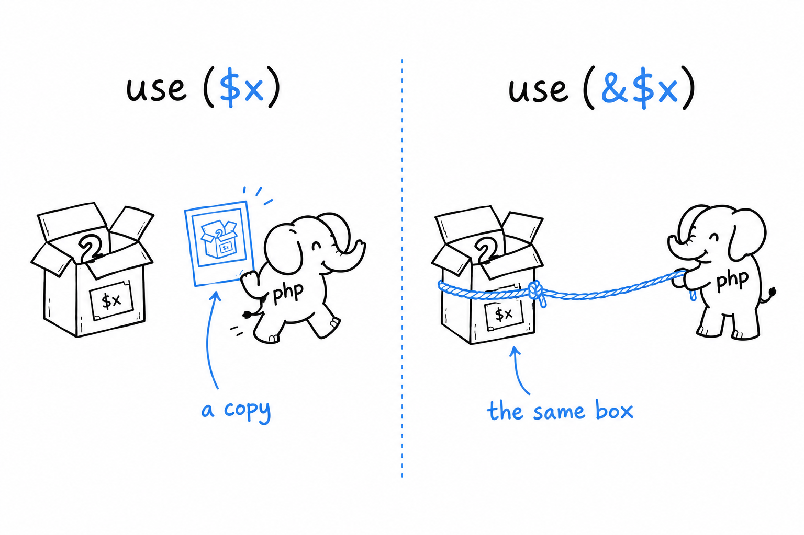

# Closures and Arrow Functions

A closure is a function without a name. You met one at the end of Chapter 3, stored in a variable and called like any other function. What Chapter 3 skipped is the part that makes closures useful: **a closure can carry variables from the code around it**, and PHP gives you two ways to hand those variables over, with two very different results.

## Capturing by value with `use`

Inside a closure, the variables of the surrounding code are invisible by default. You have to name the ones you want to bring along, with `use`:

```php
<?php
declare(strict_types=1);

function makeMultiplier(int $factor): callable
{
    return function (int $n) use ($factor): int {
        return $n * $factor;
    };
}

$double = makeMultiplier(2);
$triple = makeMultiplier(3);

echo $double(21) . "\n"; // 42
echo $triple(21) . "\n"; // 63
```

`makeMultiplier(2)` runs, `$factor` holds 2, and the closure is created. **At that instant, `use ($factor)` copies the value of `$factor` into the closure**, and the copy is what the closure will use for the rest of its life. It is the same by-value rule you saw in [Chapter 4](ch04-02-references.md), applied to a function instead of a variable.

That is why calling `makeMultiplier()` twice gives two closures that behave differently forever. `$double` left with a copy of 2, `$triple` with a copy of 3, and nothing that happens later to any variable called `$factor`, anywhere, can reach either of them. Think of it as a photograph: the closure took a picture of `$factor` on its way out, and a picture does not change when the subject does.

## Capturing by reference with `use (&$var)`

Sometimes a photograph is not enough. You want the closure to share a variable with the code around it, so that a change on either side shows on the other. That is `use (&$var)`, the same `&` you have seen on function parameters:

```php
<?php
declare(strict_types=1);

function makeCounter(): callable
{
    $count = 0;

    return function () use (&$count): int {
        $count++;
        return $count;
    };
}

$counter = makeCounter();
echo $counter() . "\n"; // 1
echo $counter() . "\n"; // 2
echo $counter() . "\n"; // 3
```

`$count` lives inside `makeCounter()`, and by every rule you know it should vanish when that function returns. It does not, because the closure holds a reference to it. **The closure and the variable are now two labels on the same box**, and each call to `$counter()` adds one to what is in the box. Nobody else can see `$count` anymore, but it stays alive for as long as the closure does.



Try it: remove the `&` and run the file again. Every call now gets its own fresh copy of `$count`, starting at 0, and the counter prints 1, 1, 1. One character is the whole difference between a snapshot and a shared box.

## Arrow functions: capture without asking

Writing `use` for every variable gets tedious quickly, especially for the one-liners you pass to functions like `array_map()`. Arrow functions exist for exactly that:

```php
<?php
$factor = 3;
$triple = fn(int $n): int => $n * $factor;

echo $triple(14) . "\n"; // 42
```

No `use` anywhere, and `$factor` is still visible inside. **An arrow function automatically captures every variable it mentions from the surrounding code, by value**, as if PHP had written `use ($factor)` for you. That convenience is the reason `fn` exists.

It comes with two limits. The body is a single expression: whatever follows `=>` is the return value, with no braces, no `return`, and no statements before it. And the capture is always by value. There is no arrow-function version of `use (&$var)`; when you need a reference, you write a full closure.

> A closure declares what it captures. An arrow function captures whatever it uses, always as a copy.

## Where this actually gets used

You will write far more arrow functions than closures, because most of the behavior you pass around is short. `array_map()`, `array_filter()` and `usort()` are its natural homes:

```php
<?php
declare(strict_types=1);

$prices = [10.00, 25.50, 3.99, 100.00];

$withTax = array_map(fn(float $p): float => round($p * 1.2, 2), $prices);

$expensive = array_filter($prices, fn(float $p): bool => $p > 20.00);

usort($prices, fn(float $a, float $b): int => $a <=> $b);
```

`array_map()` runs the function on every element and returns a new array of the results. `array_filter()` keeps the elements for which the function returns `true`, or anything PHP treats as true. `usort()` sorts the array in place, calling the function to compare two elements at a time; `<=>`, the spaceship operator, is the standard way to write that comparison, since it returns a negative number, zero or a positive number depending on which side is bigger.

None of the three needed more than a one-line arrow function, which is precisely the case they were designed for. **Reach for a full closure when you need to capture by reference, or when the logic takes more than one expression.** The rest of the time, the arrow function is the better default.
