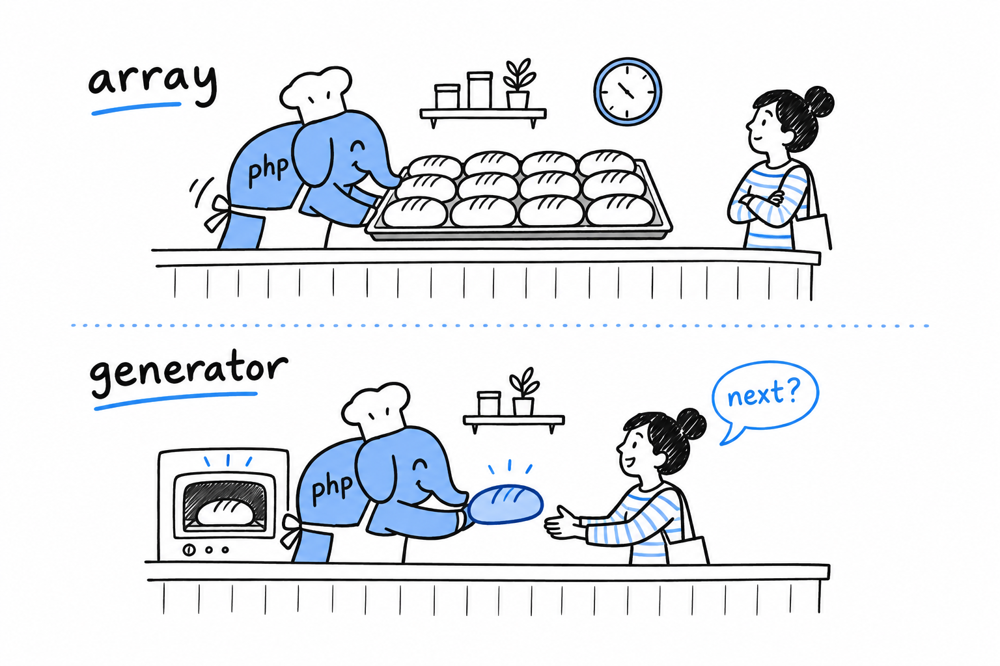
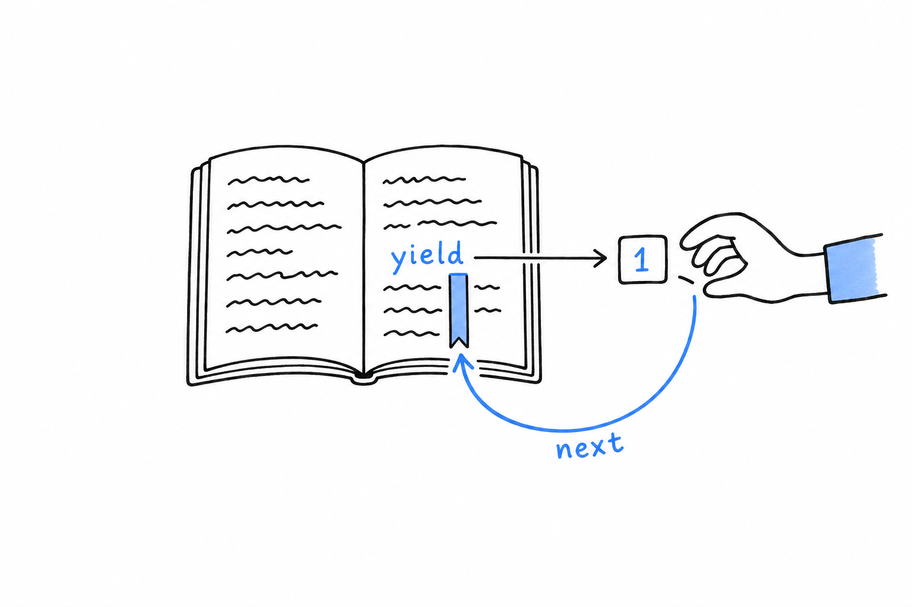

# Processing a Series of Items with Generators

Every function you have written so far that hands back a series of values has done it the same way: build an array, fill it, `return` it. That works right up to the day the series is so big that building the whole thing before anyone looks at the first item stops being reasonable. **A generator is a function that produces its values one at a time, on demand, instead of all at once.**

## The array way, and its limit

Here is an ordinary function that returns the first `$max` square numbers:

```php
<?php
declare(strict_types=1);

function squaresUpTo(int $max): array
{
    $result = [];
    for ($i = 1; $i <= $max; $i++) {
        $result[] = $i * $i;
    }
    return $result;
}

foreach (squaresUpTo(5) as $square) {
    echo $square . "\n";
}
```

For five squares, nobody minds that `squaresUpTo()` builds the entire array before the `foreach` sees a single value. For five million, that is five million integers sitting in memory before anything gets printed. And if you only wanted to look at the first three, you paid for all five million anyway.

## The same function, rewritten with `yield`

Replace `return` with `yield`, and change the return type to `Generator`:

```php
<?php
declare(strict_types=1);

function squaresUpTo(int $max): Generator
{
    for ($i = 1; $i <= $max; $i++) {
        yield $i * $i;
    }
}

foreach (squaresUpTo(5) as $square) {
    echo $square . "\n";
}
```

The calling code did not change at all: `foreach` does not know or care whether it is walking an array or a generator. What changed is *when* the work happens. **A function that contains `yield` does not run its body when you call it.** `squaresUpTo(5)` returns a `Generator` object immediately, with nothing computed inside it. The loop then runs one turn at a time, as `foreach` asks for the next value, and at any moment exactly one square exists.



Picture a bakery. The array function bakes every loaf, stacks them on a tray and hands you the tray. The generator hands you one loaf, waits until you come back for more, then bakes the next.

## Watching the laziness happen

"Runs lazily" is easy to nod along to, and much more convincing when you watch it:

```php
<?php
function countUp(): Generator
{
    echo "starting\n";
    for ($i = 1; $i <= 3; $i++) {
        echo "about to yield {$i}\n";
        yield $i;
        echo "resumed after {$i}\n";
    }
}

$gen = countUp();
echo "generator created, nothing has run yet\n";

foreach ($gen as $value) {
    echo "got {$value}\n";
}
```

```console
$ php lazy.php
generator created, nothing has run yet
starting
about to yield 1
got 1
resumed after 1
about to yield 2
got 2
resumed after 2
about to yield 3
got 3
resumed after 3
```

Look at the order. Calling `countUp()` prints nothing, not even `"starting"`, because the body has not run. Execution begins when `foreach` pulls the first value, and it stops dead at `yield`, handing `1` to the loop. `"resumed after 1"` only prints when `foreach` comes back for the next value, and `countUp()` picks up exactly where it stopped, in the middle of its loop, with `$i` and every other local variable intact.



**A generator is a function that can be paused and resumed, and `yield` is where the pause happens.** That is the whole mechanism.

> `yield` hands out a value and leaves a bookmark in the function. The next request reopens the function at the bookmark.

## Associative generators

`yield` can produce key-value pairs too, with the same `key => value` syntax you use to build an associative array:

```php
<?php
function statusCodes(): Generator
{
    yield 200 => 'OK';
    yield 404 => 'Not Found';
    yield 500 => 'Internal Server Error';
}

foreach (statusCodes() as $code => $message) {
    echo "{$code}: {$message}\n";
}
```

Everything else works the same way: the pairs come out lazily, one at a time, as `foreach` asks for them. A small feature, and a handy one whenever what you are generating has an obvious key, the way an associative array often does.

Generators do not replace arrays. Plenty of code needs a real array it can index into, count, or pass to `array_map()`. **Generators are for a series of values that nobody needs in memory all at the same time.** Later in this chapter, that goes to work on a file a good deal bigger than five squares.
