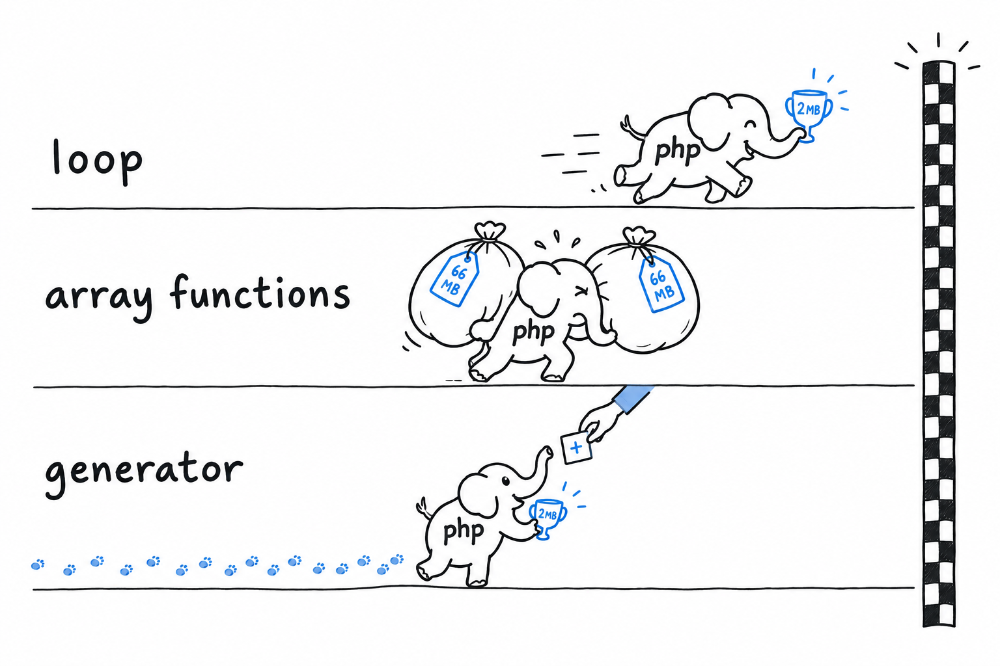

# Performance: Loops vs. Generators vs. Array Functions

Square two million integers and add them up. You can write that as a plain loop, with `array_map()`, or with a generator, and the three programs print the same number. **They do not cost the same, and cost means two things here, time and memory, that do not always move together.** Rather than guess, measure.

## A small benchmark

The same task, three ways:

```php
<?php
declare(strict_types=1);

const N = 2_000_000;

// 1. plain loop
$sum = 0;
for ($i = 1; $i <= N; $i++) {
    $sum += $i * $i;
}

// 2. array functions
$numbers = range(1, N);
$squares = array_map(fn(int $n): int => $n * $n, $numbers);
$sum = array_sum($squares);

// 3. generator
function squares(int $max): Generator {
    for ($i = 1; $i <= $max; $i++) {
        yield $i * $i;
    }
}
$sum = 0;
foreach (squares(N) as $square) {
    $sum += $square;
}
```

Run each version in its own process, so that one does not inflate another's peak-memory reading, and measure with `hrtime()` and `memory_get_peak_usage()`. On the machine this book was written on:

```console
loop              ~100 ms   peak memory:   2 MB
array functions   ~140 ms   peak memory:  66 MB
generator         ~170 ms   peak memory:   2 MB
```



Take the exact numbers with a grain of salt: they shift with your PHP version, your hardware and whatever else is running. The *shape* of the result is what to trust. **The plain loop is the fastest and the leanest, full stop.** The array-function version is the slowest and by far the hungriest: `range()` builds a two-million-element array, then `array_map()` builds a second one to hold the squares, and both exist at once before `array_sum()` even starts. The generator lands in between on time, since pausing and resuming a function two million times has a real cost, but it matches the loop's flat memory use, because it never holds more than one value.

## Reading that honestly

None of this means "always write loops". The three tools are good at different things, and choosing one means knowing which thing you need.

**A `for` or `foreach` loop is the fastest option, and often the clearest.** There is nothing to learn, just a variable changing on every pass. Reach for it when speed matters, when the logic is more than a one-line transformation, or whenever you are unsure. It is rarely the wrong default.

**A generator trades a little speed for memory that does not grow with the input.** A huge file, an API you page through, an endless sequence: that is its territory. You saw it pay off in `phpgrep`, printing its first match before the file was finished. If the whole series would comfortably fit in memory anyway, the pause-and-resume overhead buys you nothing.

**`array_map()` and `array_filter()` are often the most readable option for small and medium data already in memory.** A one-line `array_map(fn($x) => ..., $items)` reads better than the five-line loop it replaces, and that is a real win. What they are not is a memory saving: each one builds a brand-new array on top of the one you gave it. For a hundred items, irrelevant. For millions, it is the 66 MB you just saw.

## A decision rule, not a table

If the data is small enough that you would never think twice about holding it all in memory, pick whichever reads best where it is called: usually an array function for a simple transformation, a loop for anything with real logic in it. If the data is large, unbounded or expensive to produce (a big file, a database cursor, anything you page through), pick a generator and accept the modest overhead in exchange for memory that stays put. And if you are chasing raw speed on a hot path, and you have measured that it matters, the plain loop is still, quietly, the fastest thing PHP gives you.

> Small data: whatever reads best. Big data: a generator. Hot path: a loop, once you have measured.

Do not guess which case is yours. The benchmark above is a dozen lines. Measure your own, if the question matters enough to ask it.
