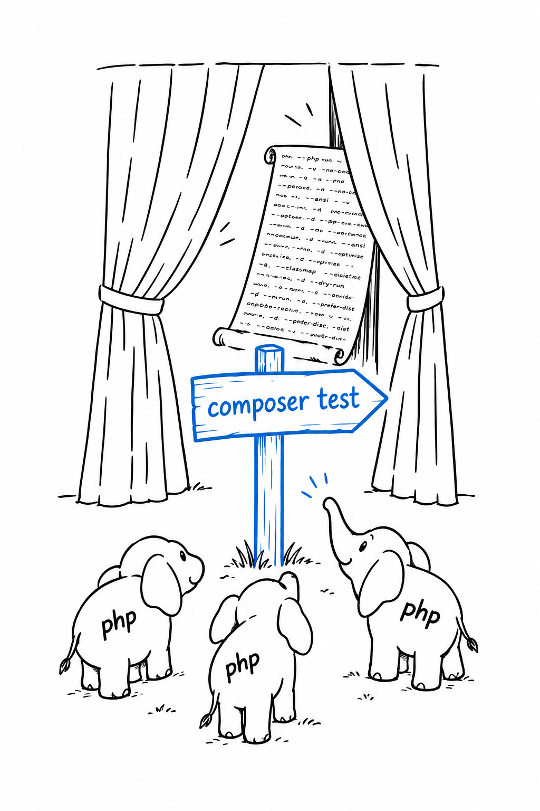
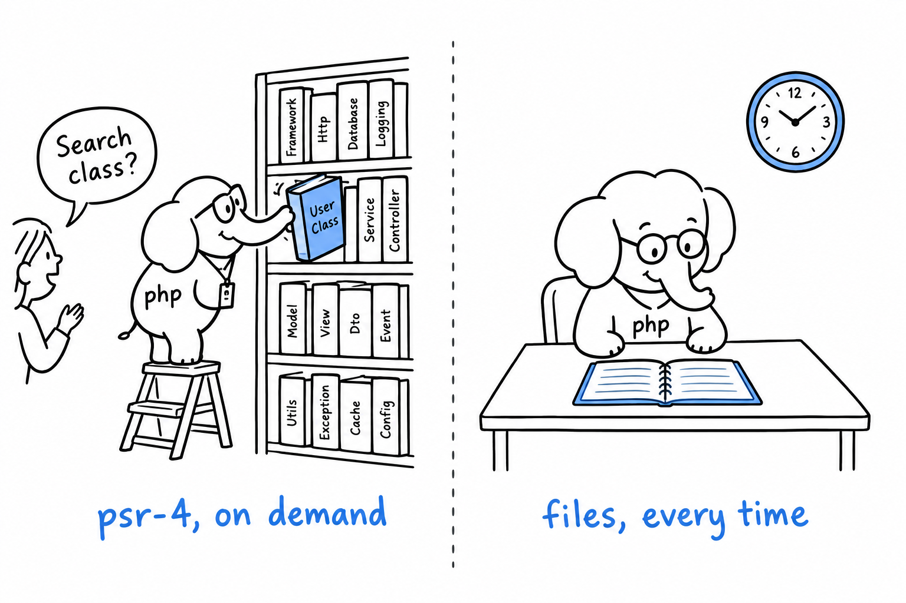

# Customizing Autoload and Scripts

So far your `composer.json` has done two things: list dependencies, and map a namespace to a folder. Two more entries, a few lines each, are worth adding to your habits right away.

## Scripts: shortcuts for commands you run constantly

Think of the commands you type ten times a day in a project: the test suite, the linter, a cache clear. Each has its own name, its own flags, and a teammate who types it slightly differently. **Composer lets you give each of them a short name, in the `"scripts"` section of `composer.json`:**

```json
{
    "name": "you/phpgrep",
    "require": {},
    "require-dev": {
        "phpunit/phpunit": "^11.0"
    },
    "scripts": {
        "test": "phpunit",
        "check": "phpstan analyse src"
    }
}
```

Run either one with `composer run`, or, when the name does not collide with a built-in Composer command, with `composer` followed directly by the name:

```console
$ composer test
$ composer check
```

Saving a few keystrokes is the small win. The big one shows up on a team. Everyone runs `composer test`, whether the tool underneath is PHPUnit, Pest, or something else, and whatever flags it needs. Swap the tool or change a flag, and every developer and every CI pipeline picks up the change on its next run, with nothing to edit on their side. **The script name is the contract; the command behind it is a detail.**



When a task genuinely needs more than one step, an entry can be a list of commands, run in order:

```json
{
    "scripts": {
        "check": [
            "phpstan analyse src",
            "phpunit"
        ]
    }
}
```

Try it: `composer run --list` prints every script a project defines. It is the fastest way to learn your way around a repository you have just cloned.

## `"files"` autoloading: for code that isn't a class

PSR-4, from [Chapter 7](ch07-06-psr4.md), works like a well-ordered library: ask for a class by name, and Composer knows which shelf and which file. A file full of plain functions has no class name to ask for, so PSR-4 walks straight past it. **For that, `composer.json` has a second mechanism, `"files"`: a list of files loaded every time the autoloader starts, no questions asked:**

```json
{
    "autoload": {
        "psr-4": {
            "PhpGrep\\": "src/"
        },
        "files": [
            "src/helpers.php"
        ]
    }
}
```

Everything defined at the top level of `src/helpers.php`, functions and constants, becomes available everywhere in the project as soon as `vendor/autoload.php` is included. No `use` statement, the same way a built-in like `strtolower()` needs none.



That convenience has a price. A PSR-4 class is loaded only when something references it. A `"files"` entry is loaded on every single request, whether the request uses it or not. Keep the list for a handful of small, truly global helpers, and let PSR-4 handle everything that reasonably belongs on a class.

> PSR-4 loads a class when asked. `"files"` loads a file every time.

After editing either section by hand, one step remains: `composer dump-autoload`, so Composer regenerates the autoloader to match what you wrote. `composer install` and `composer require` do it for you; a manual edit does not, until you ask.
