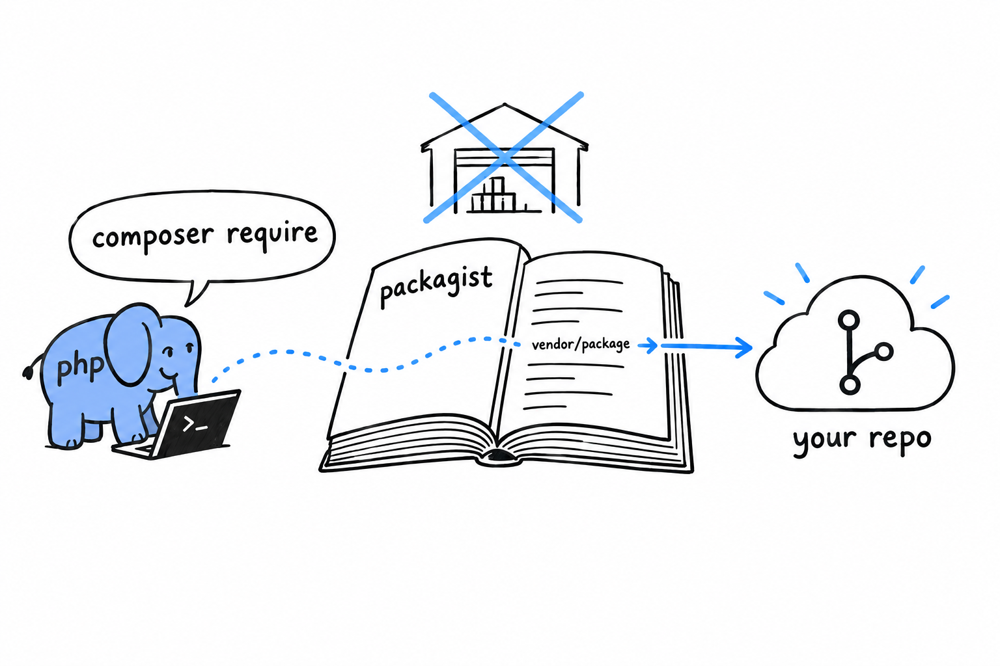
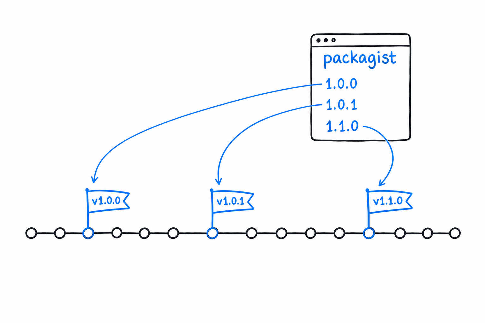

# Publishing a Package to Packagist

Every `composer require` you have typed has relied on a service you never had to name: [Packagist](https://packagist.org/), the public registry Composer checks by default. It is why `composer require nunomaduro/termwind` in [Chapter 7](ch07-01-hello-composer.md) needed no URL and no server. Packagist already knew where that package lived. **Putting your own package there is easier than it sounds, and the mechanism is worth understanding, because it explains what "publishing a PHP package" really means.**

## What a publishable `composer.json` needs

Four things, at minimum:

```json
{
    "name": "yourname/phpgrep",
    "description": "A small line-searching CLI tool, built as a learning project.",
    "license": "MIT",
    "require": {
        "php": ">=8.1"
    },
    "autoload": {
        "psr-4": {
            "PhpGrep\\": "src/"
        }
    }
}
```

`"name"` has a fixed shape, `vendor/package`, all lowercase, words separated by hyphens. The vendor part is usually your GitHub username or organization, not a formal company name; plenty of published packages belong to one person. `"description"` and `"license"` are what visitors read on your Packagist page. **The license matters for a practical reason: without one, nobody knows under which terms they may legally use your code**, and that kind of doubt quietly scares off users. `"MIT"` is the common permissive choice when you have no reason to pick another.

## You don't upload anything

This is the part that surprises people coming from ecosystems with a `publish` command. **Packagist does not host your code. It hosts information about your code, and reads the source straight from your Git repository**, GitHub included.



Publishing is three moves. Push a `composer.json` like the one above to a public Git repository. Sign in on [packagist.org](https://packagist.org/), click "Submit", and paste your repository's URL. Packagist then reads your `composer.json`, indexes the package under the `"name"` you gave it and, this is the important part, sets up a webhook so it hears about every push you make from then on.

No release step, no build artifact to hand over. Packagist watches your repository.

> Packagist is a phone book, not a warehouse. It knows where your code lives and sends Composer there.

## Versions come from Git tags

If Packagist reads your repository, where does a version like `1.2.0` come from? From an ordinary Git tag, named after [semantic versioning](https://semver.org/): `MAJOR.MINOR.PATCH`.

```console
$ git tag v1.0.0
$ git push origin v1.0.0
```

Push the tag, the webhook fires, and `1.0.0` appears as an installable version within moments. **The tag is the release.** There is nothing else to do.



The three numbers carry a promise. Bump the patch for a fix that breaks nothing, the minor for a new feature that breaks nothing, and the major the moment you break something a user might rely on. That last rule is the one that matters to whoever depends on you: it is what lets them write `^1.0` in their own `composer.json` and trust that anything matching it will not break their code.
