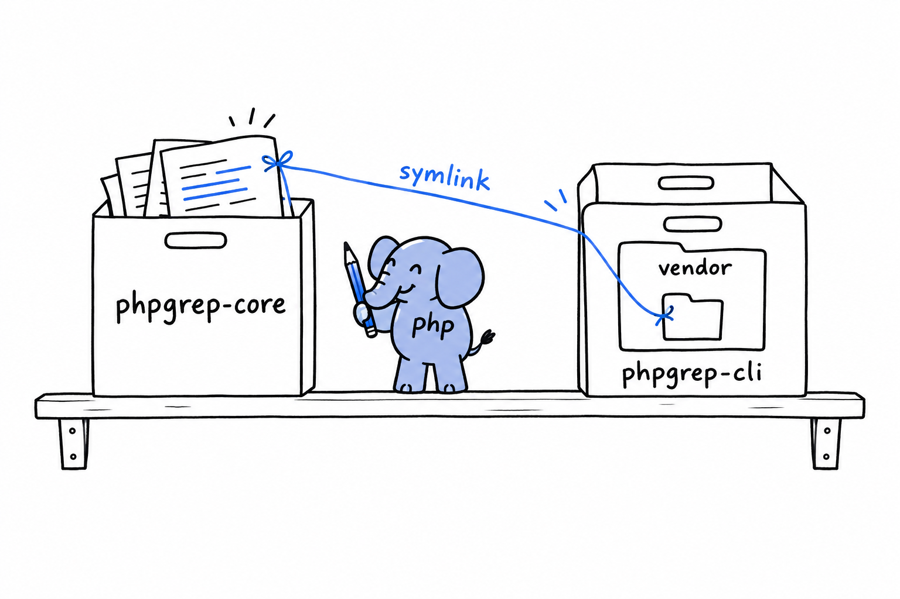

# Composer Path Repositories and Monorepos

Publishing assumes your package is finished enough to hand to strangers. A lot of real work happens before that point, in the stretch where two related packages grow together and a change in one must show up in the other right away. **Composer has a repository type built for that stretch: the path repository.**

## The problem it solves

Say you split `phpgrep` in two: a core library, `phpgrep/core`, and a CLI wrapper, `phpgrep/cli`, that depends on it. Type `composer require phpgrep/core` in the CLI package and Composer comes back empty-handed. Packagist has never heard of the core, and neither has any other registry. You could publish a half-finished version just to unblock yourself, but that is backwards: you would be publishing code for the sole purpose of testing it on your own machine.

## Pointing Composer at a local folder instead

A path repository tells Composer, for one project: **when you meet this package name, do not look on Packagist, look in this folder on disk.**

```json
{
    "repositories": [
        {
            "type": "path",
            "url": "../phpgrep-core"
        }
    ],
    "require": {
        "phpgrep/core": "*"
    }
}
```

With a layout like this:

```console
projects/
├── phpgrep-core/
│   └── composer.json     ("name": "phpgrep/core")
└── phpgrep-cli/
    └── composer.json     (the file above)
```

running `composer install` inside `phpgrep-cli` resolves `phpgrep/core` to `../phpgrep-core`. By default it does not copy the folder. It creates a *symlink* at `vendor/phpgrep/core` that points back at the real one.



Edit a file in `phpgrep-core`, and `phpgrep-cli` sees the change instantly. No reinstall, no publish, nothing to run in between. Day to day it feels like a single package. It remains two packages all the same, each with its own `composer.json`, its own version constraints, and its own road to Packagist when the time comes.

Try it: inside `phpgrep-cli`, run `ls -l vendor/phpgrep` and read the arrow `ls` draws next to `core`. That arrow is the symlink.

## Where this leads: monorepos

Put several related packages in one Git repository, each with its own `composer.json`, wired together with path repositories pointing at each other's subfolders, and you have the shape most PHP monorepos take. **There is no monorepo mode in Composer.** A monorepo is an ordinary directory tree of packages that share one repository and point at each other during development.

Some teams keep it that way for good and ship the monorepo as is. Others treat it as a development convenience and, once a package settles, move it to its own repository and publish it to Packagist on its own. Both are legitimate. The choice depends on how your team releases, not on anything Composer enforces.
