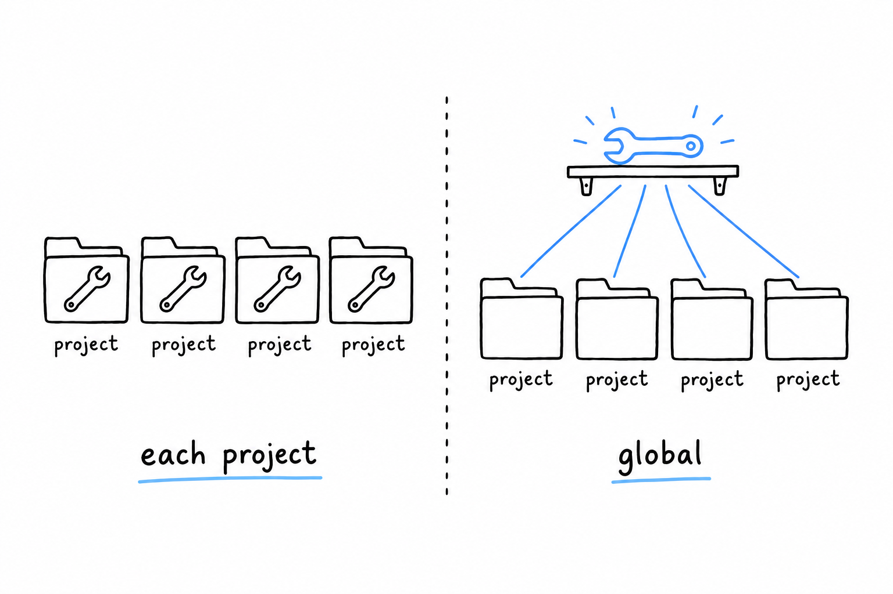

# Installing Global Tools with Composer

Not everything you install with Composer belongs to a project. A static analyzer like PHPStan or a formatter like PHP-CS-Fixer is a tool you carry with you, to run against whatever project you happen to be standing in. **Composer has a separate command for tools like these.**

## `require --dev` vs. `global require`

You already know `require-dev`: a dependency needed only while developing, like PHPUnit, listed in the project's `composer.json` and installed into its `vendor/` folder:

```console
$ composer require --dev phpunit/phpunit
```

That is the right call for anything the tests or the build depend on. Everyone who clones the repository and runs `composer install` gets the same version, and that reproducibility matters. It is the wrong call for a tool you like to run everywhere, regardless of what a project declares. Ten projects, ten copies of PHPStan in ten `vendor/` folders, at ten possibly different versions: a lot of duplication for something that belongs to none of them.



`composer global require` installs it once:

```console
$ composer global require phpstan/phpstan
```

PHPStan lands in a global Composer directory, apart from any project: `~/.config/composer` on Linux, `~/.composer` on macOS by default, and the exact path is worth checking with `composer global config home`. From then on there is one shared install, whatever directory you are standing in.

## Getting it on your `PATH`

Installing globally does not, by itself, make `phpstan` a command your shell knows. The binary sits in a `vendor/bin` folder inside that global directory, and **your shell only looks in the folders listed in `PATH`**:

```console
$ export PATH="$HOME/.composer/vendor/bin:$PATH"
```

Put that line in your shell's startup file (`~/.zshrc`, `~/.bashrc`, or the equivalent) so every new terminal gets it, then check:

```console
$ phpstan --version
PHPStan - PHP Static Analysis Tool 1.11.5
```

If the command is not found, the `PATH` line is almost always the culprit. It is missing, it points at the wrong directory for your platform, or you edited the startup file and never reloaded it (`source ~/.zshrc`, or open a new terminal).

## Choosing between the two

**A tool that must run identically for everyone, CI included, at a version pinned in version control, belongs in `require-dev`. A personal tool you run across every project, and that may drift a version away from a teammate's copy without anyone minding, belongs in `composer global require`.** Many setups use both: PHPStan pinned per project so CI is reproducible, and PHP-CS-Fixer installed globally for a quick format while editing.
