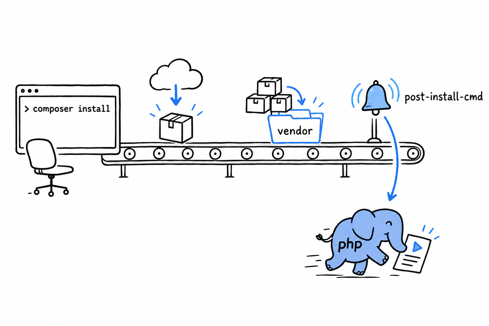

# Extending Composer with Scripts and Plugins

`composer test` and `composer check` are scripts you run yourself. Scripts have a second, quieter use. **Attach one to a moment in Composer's own lifecycle, and it runs by itself, at the right time, without anyone having to remember it.**

## Lifecycle events

Composer fires a named event at each stage of its work: before and after an install, before and after an update, and a few more. Use one of those names as the script key, instead of inventing your own, and Composer calls it when the moment comes:

```json
{
    "scripts": {
        "post-install-cmd": "@php artisan-like-thing:setup",
        "post-update-cmd": [
            "@php bin/generate-config.php"
        ]
    }
}
```



`post-install-cmd` runs after every `composer install`: a fresh clone fetching its dependencies, a CI job setting up before the tests, a new colleague on their first day. Nobody has to find the extra step buried in a README, because Composer performs it, in the right order, every time. `post-update-cmd` is the same hook for `composer update`. Other events exist for narrower moments, before a single package is installed or removed for instance, but these two cover most real needs: regenerating a config file, warming a cache, printing a reminder about an environment variable still to set.

> [!TIP]
> The `@php` prefix runs the script with the same PHP binary Composer itself is running under. On a machine with several PHP versions installed, it removes any doubt about which `php` gets used.

## Where scripts stop, and plugins start

A lifecycle script is a command Composer runs at a fixed point. That is useful, and that is all it is. Sometimes you want more: a new Composer command, a different way of installing packages, a reaction to an event written in real PHP logic rather than a fire-and-forget shell line. **That is what plugins are for: ordinary Composer packages that hook into Composer's internals, written in PHP, installed like any other dependency.** You have probably used one without knowing it; the automatic `.env` handling in some frameworks is a Composer plugin under the hood.

Writing one is a legitimate thing to do, and it is real Composer-internals territory: event subscriber classes, Composer's own plugin API, well beyond what this book covers. When lifecycle scripts stop being enough, that is the next door, and the [official Composer documentation](https://getcomposer.org/doc/articles/plugins.md) is the place to start.
