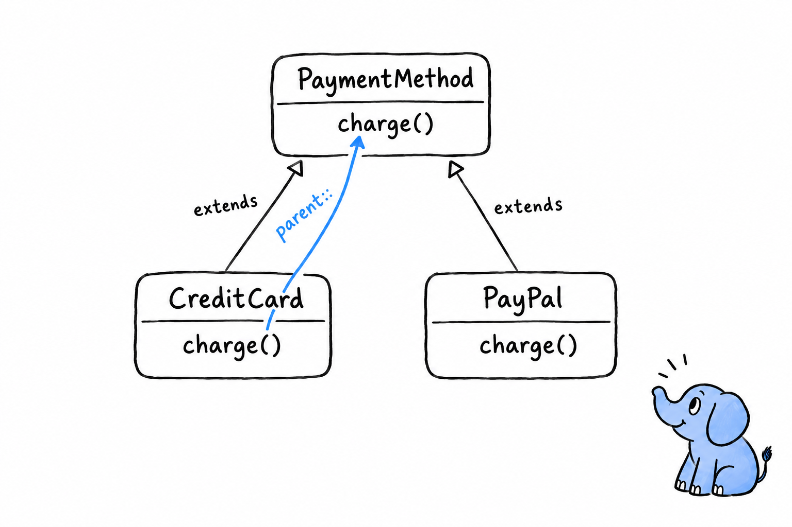

# Classes, Inheritance, and Polymorphism

A shop takes credit cards. Then it takes PayPal. Next quarter it will take bank transfers. Each one charges money in its own way, yet from the checkout's point of view they are all the same thing: a way to pay. **Inheritance is how you tell PHP that several classes are variations on one idea**, sharing what they have in common and differing only where they must. Every class you have written since Chapter 5 has stood alone. Time to make some of them related.

## `extends` and method overriding

A class builds on another with `extends`, inheriting its properties and methods and replacing whichever ones need to behave differently:

```php
<?php
declare(strict_types=1);

class PaymentMethod
{
    public function charge(float $amount): string
    {
        return sprintf('Charged $%.2f.', $amount);
    }
}

class CreditCard extends PaymentMethod
{
    public function __construct(private string $last4)
    {
    }

    public function charge(float $amount): string
    {
        $base = parent::charge($amount);
        return $base . " (card ending {$this->last4})";
    }
}
```

Read `class CreditCard extends PaymentMethod` as "a credit card is a payment method". **Everything `PaymentMethod` knows how to do, `CreditCard` knows too, without writing a line.** The one method `CreditCard` defines for itself is `charge()`, and since the parent already has a `charge()`, the child's version takes its place. That is called overriding.



Now look at the first line of the override. `parent::charge($amount)` calls the parent's original `charge()`, the very method that was just replaced, and builds on its result instead of throwing it away. **`parent::` is how an override says "do what you were going to do, then let me add something."** The base class still formats the amount; `CreditCard` only appends the last four digits. Without `parent::`, that `sprintf()` line would be copied into every subclass, which is exactly the duplication inheritance is meant to remove.

> `extends` says "is a". `parent::` says "and also".

## A second subclass

Add another payment method the same way, with a `charge()` that does something else entirely:

```php
<?php
declare(strict_types=1);

class PayPal extends PaymentMethod
{
    public function __construct(private string $email)
    {
    }

    public function charge(float $amount): string
    {
        return sprintf('Charged $%.2f via PayPal account %s.', $amount, $this->email);
    }
}
```

`PayPal` never calls `parent::charge()`. Nothing forces an override to reuse the parent's version; it only has to exist. **A subclass may keep the parent's behavior, add to it, or replace it outright**, and all three are ordinary uses of inheritance. `CreditCard` and `PayPal` share the promise that every `PaymentMethod` can `charge()`, and only one of them shares any code.

## Polymorphism: the actual payoff

Here is why any of this was worth setting up. Write a function against the base type and hand it any subclass:

```php
<?php
declare(strict_types=1);

function processPayment(PaymentMethod $method, float $amount): void
{
    echo $method->charge($amount) . "\n";
}

$methods = [
    new CreditCard('4242'),
    new PayPal('damien@example.com'),
];

foreach ($methods as $method) {
    processPayment($method, 42.00);
}
```

```console
$ php payments.php
Charged $42.00. (card ending 4242)
Charged $42.00 via PayPal account damien@example.com.
```

`processPayment()` asks for a `PaymentMethod`. It never mentions `CreditCard` or `PayPal`. Yet give it either one and the right `charge()` runs. **The same call, `$method->charge($amount)`, does the right thing for whatever object is actually behind `$method`.** That is polymorphism.


Think of a letterbox. It does not care who wrote the envelope, only that the envelope fits the slot. `PaymentMethod` is the slot, and every subclass is an envelope cut to that size, including the ones nobody has written yet. Add `BankTransfer` next month: as long as it extends `PaymentMethod` and implements `charge()`, neither `processPayment()` nor the loop changes. They were never written against a specific class, only against the shape every `PaymentMethod` guarantees.

Try it: write `BankTransfer`, add `new BankTransfer()` to the `$methods` array, and run again. Count the lines you changed in `processPayment()`.

This should feel familiar. It is the same move as programming against an interface in [Chapter 11](ch11-01-interfaces.md): interfaces and inheritance are two roads to the same place, code that does not need to know which concrete class it holds. The next section puts the two roads side by side and asks when to take which.
