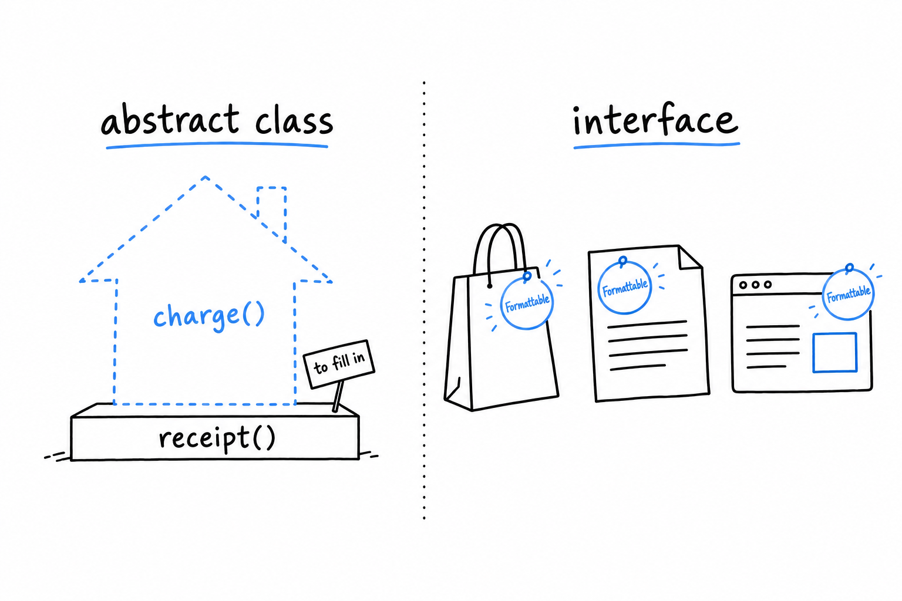

# Abstract Classes and Interfaces Revisited

Nothing stops you from writing `new PaymentMethod()` and charging forty-two dollars to it. The base class from the previous section has a working `charge()`, so PHP obliges, and money gets "charged" to a payment method attached to no card, no account, nothing at all. `PaymentMethod` was only ever meant as a foundation for subclasses, but a comment saying so is not a rule. **`abstract` turns that intention into something PHP enforces.**

## Making the contract explicit

```php
<?php
declare(strict_types=1);

abstract class PaymentMethod
{
    abstract public function charge(float $amount): string;

    protected function receipt(float $amount): string
    {
        return sprintf('$%.2f processed on %s', $amount, date('Y-m-d'));
    }
}

class CreditCard extends PaymentMethod
{
    public function __construct(private string $last4)
    {
    }

    public function charge(float $amount): string
    {
        return $this->receipt($amount) . " (card ending {$this->last4})";
    }
}
```

Two things changed. `abstract class PaymentMethod` means PHP refuses `new PaymentMethod()` outright: a fatal error, enforced by the language rather than left as a convention you hope people follow. And `charge()` became `abstract public function charge(float $amount): string;`, a signature with no body, exactly like an interface method. **Every non-abstract subclass must now implement `charge()`, or PHP refuses to load that subclass too.**

What the base class kept is `receipt()`: a real, working method that every subclass inherits for free. That pairing is the point of an abstract class. **A contract the language enforces, bundled with shared code written once.** A plain interface can only give you the first half.



> [!TIP]
> `receipt()` is `protected`: visible to `PaymentMethod` and its subclasses, hidden from everyone else. That is the usual visibility for a helper a base class offers to its children and to nobody else.

## Compare this to `Formattable`

Go back to the `Formattable` interface from [Chapter 11](ch11-01-interfaces.md):

```php
<?php
interface Formattable
{
    public function format(): string;
}
```

An interface is nothing but a contract. **No method bodies, not even optional ones a class could choose to inherit.** Every class implementing `Formattable` writes its own `format()` from scratch, because there is nothing to inherit.

That is not a shortcoming; it is the job. An interface names a capability that classes with nothing else in common can all claim. A `Product`, a `LogEntry` and an `HttpResponse` share no ancestor and never will, yet each can promise `format()`. A class can implement as many interfaces as it likes, which is how PHP gets by without multiple inheritance. An abstract class is a real ancestor: a class can extend only one, and everything the parent carries comes along with it, properties, working methods, constructor logic.

> An interface is a badge a class wears. An abstract class is a parent it descends from. You get one parent, and as many badges as you want.

## When to reach for which

Reach for an **abstract class** when you have real code every subclass should share, and you also want to force each subclass to fill in the parts that must differ. `receipt()` shared, `charge()` mandatory but unique to each subclass: the example above is the textbook case.

Reach for an **interface** when all you need is the guarantee that a method exists, with no assumption that the classes are related. It is also the only option when a class already extends something and still needs to promise a second, unrelated capability.

They are not rivals, and PHP does not make you choose:

```php
<?php
declare(strict_types=1);

interface Formattable
{
    public function format(): string;
}

abstract class PaymentMethod implements Formattable
{
    abstract public function charge(float $amount): string;

    public function format(): string
    {
        return static::class;
    }
}
```

`PaymentMethod` gets both. The enforced structure of an abstract class for its own family of subclasses, and a separate `Formattable` badge that lets any code in the system call `format()` on it without knowing, or caring, that payments are involved. `static::class` is the name of the concrete class at runtime, so a `CreditCard` formats as `CreditCard`, and the parent never had to know its children by name.
