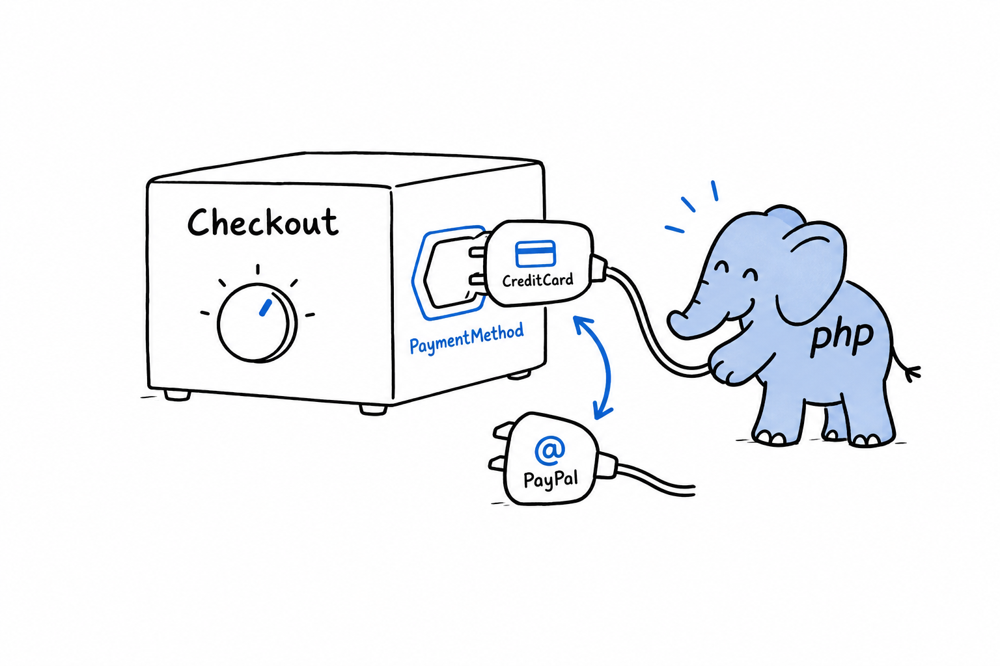

# Implementing a Classic OOP Design Pattern

A design pattern is a name for a shape of code that shows up so often, across so many different problems, that people learned to recognize it on sight. **You have been building one for three sections without naming it.** The `PaymentMethod` family is most of the Strategy pattern, one of the most common in all of object-oriented programming. This section finishes it.

## The idea

Take a behavior that can vary: *how* a payment is charged, *how* a list is sorted, *how* a price is discounted. Pull it out behind an interface. Hand it to a class that uses the behavior without knowing which version it received. That last step is the polymorphism from [earlier in this chapter](ch17-01-inheritance-and-polymorphism.md). **Strategy adds one piece, the context: a class whose whole job is to hold a strategy, delegate to it, and let it be swapped, even after the context exists.**



## Building it

An interface this time, not an abstract class. There is no shared code worth forcing on every payment method, only a contract, and that is exactly the case [the previous section](ch17-02-abstract-classes.md) said an interface fits best:

```php
<?php
declare(strict_types=1);

interface PaymentMethod
{
    public function charge(float $amount): string;
}

final class CreditCard implements PaymentMethod
{
    public function __construct(private string $last4)
    {
    }

    public function charge(float $amount): string
    {
        return sprintf('Charged $%.2f to card ending %s.', $amount, $this->last4);
    }
}

final class PayPal implements PaymentMethod
{
    public function __construct(private string $email)
    {
    }

    public function charge(float $amount): string
    {
        return sprintf('Charged $%.2f via PayPal account %s.', $amount, $this->email);
    }
}
```

Nothing new here: the same two classes as earlier in the chapter, implementing an interface instead of extending a base. Now the context:

```php
<?php
declare(strict_types=1);

final class Checkout
{
    public function __construct(private PaymentMethod $paymentMethod)
    {
    }

    public function setPaymentMethod(PaymentMethod $paymentMethod): void
    {
        $this->paymentMethod = $paymentMethod;
    }

    public function complete(float $amount): void
    {
        echo $this->paymentMethod->charge($amount) . "\n";
    }
}
```

`Checkout` holds a `PaymentMethod`, any `PaymentMethod`, and `complete()` hands the work to whichever one it is holding. Notice what is missing. **There is no `if` asking "are you a card or a PayPal account?"** That absence is the tell of Strategy done right: the context calls `charge()` and trusts the interface.

## Using it and swapping strategies at runtime

```php
<?php
$checkout = new Checkout(new CreditCard('4242'));
$checkout->complete(42.00);

$checkout->setPaymentMethod(new PayPal('damien@example.com'));
$checkout->complete(19.99);
```

```console
$ php checkout.php
Charged $42.00 to card ending 4242.
Charged $19.99 via PayPal account damien@example.com.
```

Same `$checkout` object, same `complete()` call, two different outcomes, because `setPaymentMethod()` swapped the strategy in between. Picture the alternative: an `if ($type === 'credit_card')` inside `Checkout`, growing a new branch with every payment method the product adds. With Strategy, next quarter's bank transfer is one new class that implements `PaymentMethod`, and `Checkout` does not change. It already works, for the same reason `processPayment()` worked earlier in the chapter: it was written against the interface, never against a particular class.

Try it: write `BankTransfer`, pass it to `setPaymentMethod()`, and complete a third payment. Count the lines you changed in `Checkout`.

That is the entire pattern. An interface describing a swappable behavior, classes implementing it, and a context that delegates to whichever one it holds. No new syntax, no library, nothing specific to PHP: the interfaces and polymorphism you already had, arranged on purpose to solve a recognizable problem. Once you have built one this way, you will start seeing the same shape everywhere, under other names, in code you did not write.

> A strategy is a behavior you can unplug and replace. The context is the socket.
