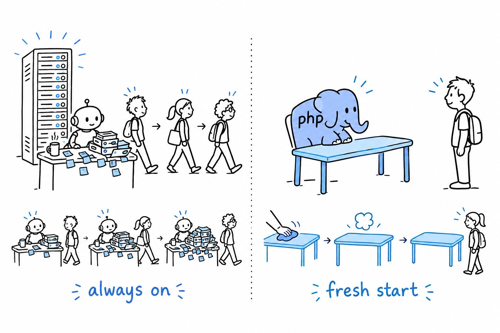
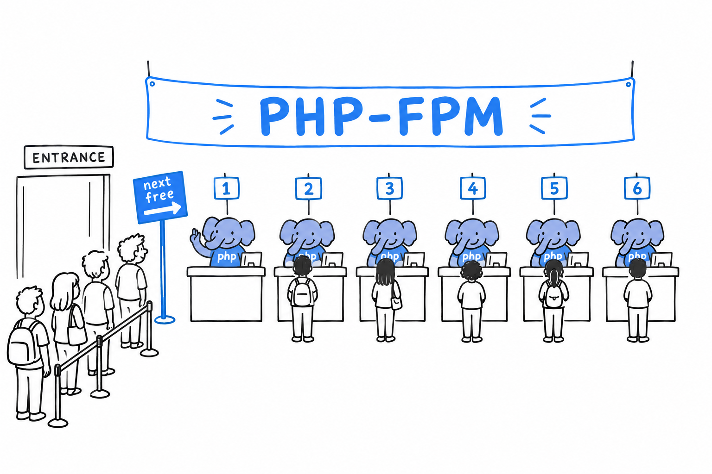

# The PHP Request Model: Why PHP Is (Usually) Single-Threaded

A Node.js or Java server starts once and stays up. It handles every request that arrives while it is alive, and its memory lives on between them. A variable set while serving one user can, if you are not careful, still be sitting there when the next user shows up.

PHP, in its classic and still most common form, does not work that way. **Every HTTP request gets a fresh start.** The PHP process (or thread, depending on how your web server is set up) loads your script, runs it from the top, sends a response, and throws everything away. Every variable, every object, every static property: gone. The next request starts from zero. Nothing survives except what you have deliberately put somewhere outside PHP: a database, a file, a cache such as Redis or Memcached.

This is called a **shared-nothing** architecture, and it is the single biggest structural difference between PHP and languages built around long-running server processes. You already saw it in miniature in [Chapter 1](ch01-02-hello-world.md): `php hello.php` starts the interpreter, runs the script top to bottom, and exits. Production is the same lifecycle behind a web server. Under PHP-FPM (the FastCGI Process Manager, the standard way to run PHP behind nginx or Apache), a pool of PHP worker processes sits ready, and each incoming request is handed to one of them for exactly as long as it takes to produce a response.

> A PHP request is born, works, answers, and forgets. The next one starts clean.

## Why this made threading unnecessary

Threads exist to let one running program do several things at once while sharing memory. But if your program only ever handles one request from start to finish and then vanishes, there is rarely anything to run concurrently *inside* it. **The concurrency a PHP application needs, thousands of users at the same time, is handled a level up**, by running many PHP processes side by side, not by teaching a single process to juggle. Think of a post office: rather than one very fast clerk serving ten customers at once, ten counters each serve one customer. Your web server and process manager are the ones opening the counters, and they are already doing the hard part.

The practical upside is large. You never reason about race conditions inside a request the way you would in a multi-threaded Java servlet. Two users cannot corrupt each other's `$_SESSION` data by writing to the same variable at once, because there is no shared variable: each user gets a separate execution. **Whole categories of bugs that plague long-running, shared-memory servers simply cannot happen in classic PHP.** The model rules them out from the start, instead of asking you to avoid them through discipline.

## Where it stops being the whole story

PHP *can* share state and run things concurrently. By default it does not, and traditional PHP applications were designed around that constraint rather than against it. Three exceptions are worth knowing.

Work that has to happen but should not hold up the response (sending an email, resizing an uploaded image) is pushed to a separate process rather than run inline. The [next section](ch18-02-queues-and-processes.md) is about exactly that.

Long-running PHP processes do exist. Command-line daemons, queue workers, and newer tools such as Swoole servers keep one process alive across many units of work, and *there* the shared-nothing guarantee no longer applies automatically. It becomes your job again.

Opcache, PHP's bytecode cache, does share compiled code across requests to save time. But that is compiled code, not your application's runtime state: your variables still die with the request.

**Whenever a PHP process outlives a single request, the clean-slate guarantee is gone, and you are back to thinking about shared state like everyone else.** How PHP applications get concurrent-ish work done in practice, without a single thread, is the next stop.
