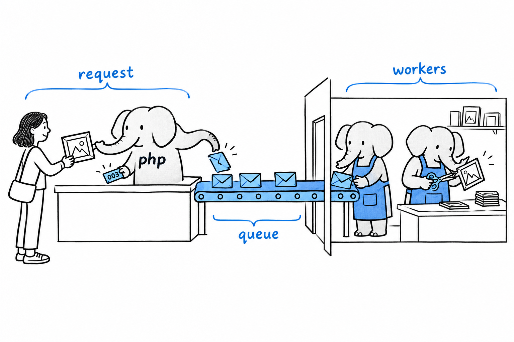

# Background Work with Queues and Processes

A request comes in, PHP handles it, and the process disappears when the response is sent. That is fine for "look up this user and show their profile". It is a problem for "resize this uploaded photo, make three thumbnails, and email a confirmation". Nobody wants to stare at a spinner for eight seconds because your code is busy processing images before it can say "Upload successful".

The user does not need to wait for that work. They only need to know it has been accepted. **The standard PHP answer is: don't do it now. Do it later, in a different process.**

## Job queues

Think of a dry cleaner. You hand over the coat, you get a ticket, you leave. The cleaning happens in the back room, after you are gone, and you are not standing at the counter watching.

A job queue is that counter. **Instead of doing the slow work inline, the request handler writes down what needs to happen, "resize image #482 for user #17", as a small message, and pushes that message onto a queue.** Then it answers the user right away: "Upload received, processing". Meanwhile, one or more separate PHP processes, called **workers**, sit in a loop watching the queue. As soon as a message appears, a worker picks it up and does the actual work, entirely disconnected from the original request.



The queue itself is usually backed by something built for the job. Redis is a common, lightweight choice; RabbitMQ and Amazon SQS show up in larger systems. Frameworks such as Laravel and Symfony ship queue abstractions on top of these, so you are not hand-rolling the plumbing. The underlying idea is simple enough, though, that you could build a crude version yourself with nothing more than a database table and a `SELECT ... WHERE processed = false`.

The workers are ordinary PHP, run from the command line, usually kept alive by a process supervisor:

```console
$ php worker.php
Waiting for jobs...
Processing job: resize-image #482
Done.
Waiting for jobs...
```

That worker script loops forever: check the queue, handle whatever is there, loop again. **It is a long-running PHP process, exactly the kind of thing that steps outside the shared-nothing model** of the [previous section](ch18-01-request-model.md). It keeps state across many jobs, a database connection, perhaps a cache of configuration, the way a Node.js server does across many requests.

> The request hands out the ticket. The worker does the cleaning. Nobody waits at the counter.

Next time you upload a photo to a big site, watch: the page says "received" almost instantly, and the thumbnails appear a few seconds later. That is a queue at work.

## Spinning up a separate process directly

Queues are the right tool when many small units of work arrive over time. Sometimes you want something simpler: run this other program right now, and either don't wait for it or let it run alongside what you are doing. For that, **PHP can launch operating-system processes directly.**

`proc_open()` is the general-purpose tool. It starts an external command (which may itself be another PHP script) and gives you handles to its input, output, and error streams, so you can talk to it while it runs. Composer uses it for its own process handling.

There is also the `pcntl` extension, which lets a PHP script fork itself into several copies with `pcntl_fork()`: genuinely parallel PHP, as separate OS processes, each with its own memory. Honestly, it is a little unforgiving. Forking only exists on Unix-like systems, not on Windows, and reasoning correctly about several processes at once takes real care. It shows up in command-line tools and daemons far more than in web applications.

Both are worth knowing about. **Neither is something to reach for before a job queue**, which solves the same problem, "run this later, not now", with far less to get wrong.
