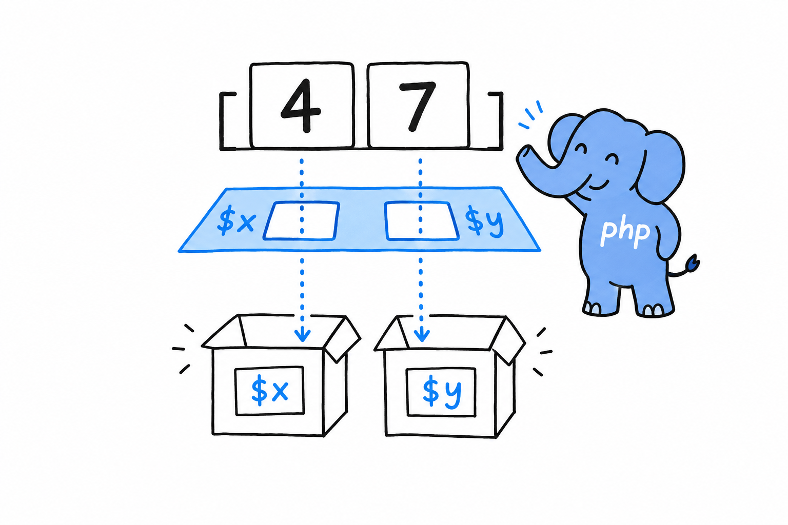

# Where `match` and Destructuring Can Be Used

An assignment normally moves one value into one variable. **Destructuring is an assignment that unpacks: several values out of an array, into several variables, in a single statement.** You describe the shape you expect on the left-hand side, and PHP fills in the names.

## The two spellings

PHP has had this for a long time, under the name `list()`:

```php
<?php

$coordinates = [4, 7];

list($x, $y) = $coordinates;

echo "x={$x}, y={$y}\n";
```

The square-bracket form came later and does exactly the same thing:

```php
<?php

$coordinates = [4, 7];

[$x, $y] = $coordinates;

echo "x={$x}, y={$y}\n";
```



Both forms match by position: the first element goes to the first name, the second to the second, and so on. `list()` still lives in older codebases and in a few examples of PHP's own documentation, so recognize it when you meet it, but write the bracket form. It is shorter, and it looks like the array it takes apart.

Try it: change the array to `[4, 7, 9]` and run again. Nothing breaks. The third value simply has no name to land in, so it is left where it is.

## Inside a foreach

The first place destructuring really pays off is `foreach`, where you unpack each element as the loop hands it to you:

```php
<?php

$pairs = [
    ['Alice', 30],
    ['Bob', 25],
    ['Carol', 35],
];

foreach ($pairs as [$name, $age]) {
    echo "{$name} is {$age} years old.\n";
}
```

```console
$ php pairs.php
Alice is 30 years old.
Bob is 25 years old.
Carol is 35 years old.
```

Without it, the loop body would read `$pair[0]` and `$pair[1]`, and whoever reads the code would have to guess what position 0 means. **`foreach ($pairs as [$name, $age])` states the shape of the data in the loop header**, the first line anyone looks at.

## Skipping elements

Sometimes an array offers more than you want. Leave a slot empty and PHP skips it, without shifting the ones that follow:

```php
<?php

$row = [1, 'Second', 'Third'];

[, $second, $third] = $row;

echo "{$second}, {$third}\n"; // Second, Third
```

The comma with nothing before it says "skip the first one": the list of names has a gap where a name would normally go. A small thing, but it reads better than filling an `$unused` variable you will never touch.

Flat arrays are the easy case. Real ones nest, most carry keys rather than positions, and destructuring follows them there, swap trick included.
