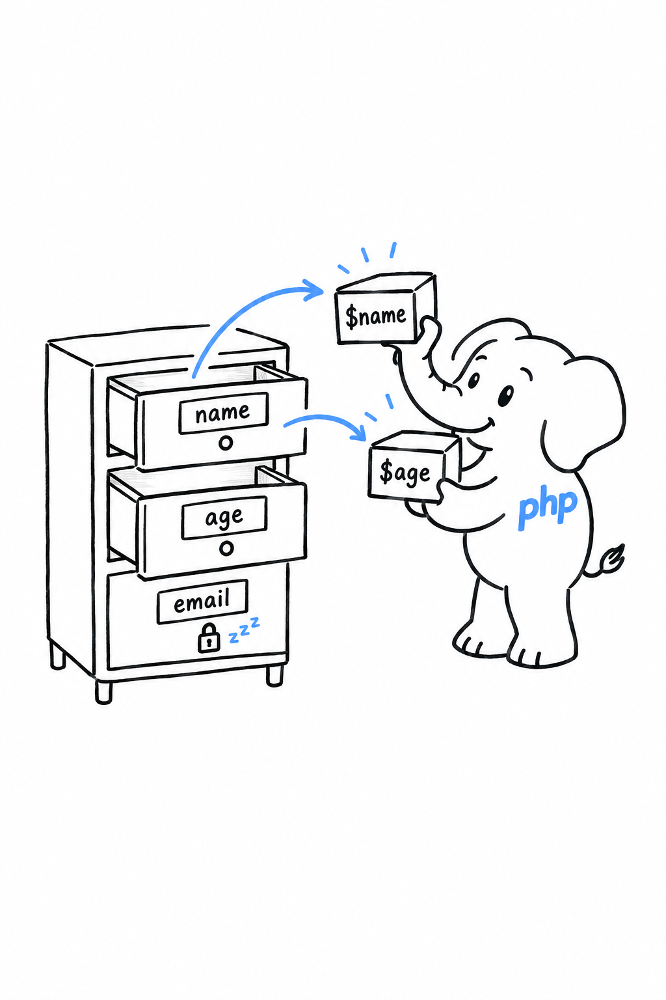
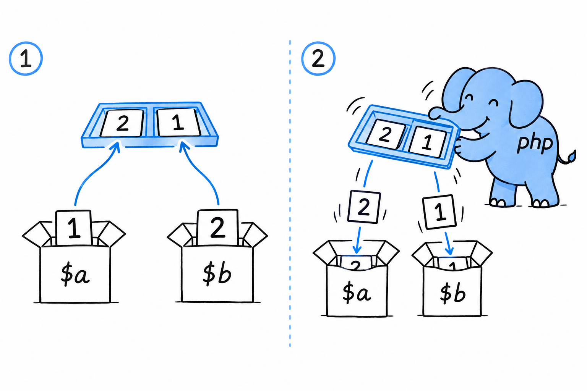

# List and Array Destructuring

Real arrays are rarely flat lists. They nest, and more often than not they carry keys instead of positions. **Destructuring follows the shape of the data, whatever that shape is.**

## Nested destructuring

If an array contains other arrays, the pattern mirrors that structure directly:

```php
<?php

$point = [[1, 2], 3];

[[$x, $y], $z] = $point;

echo "x={$x}, y={$y}, z={$z}\n"; // x=1, y=2, z=3
```

Put the two sides next to each other: `[[$x, $y], $z]` and `[[1, 2], 3]`. The pattern is a tracing of the data. That symmetry is the whole appeal. Past one level of depth, a chain like `$point[0][0]` starts hiding what you are after, while the pattern says "give me exactly this shape" in one line.

## Keyed destructuring

Coordinates come as positions. Almost everything else you will unpack in an application comes with keys: a database row, decoded JSON, a submitted form. For those, name the keys instead:

```php
<?php

$userData = [
    'name' => 'Priya',
    'age' => 29,
    'email' => 'priya@example.com',
];

['name' => $name, 'age' => $age] = $userData;

echo "{$name} is {$age}.\n"; // Priya is 29.
```

`email` is not mentioned, so it is left alone. **You name only the keys you want, and the rest of the array stays where it is.**



This is where destructuring stops being a shorthand and becomes clearer than the alternative. One line says "this code needs a name and an age"; two lines of `$userData['name']` and `$userData['age']` say it more slowly.

Keys and nesting combine:

```php
<?php

$response = [
    'status' => 'ok',
    'user' => ['name' => 'Priya', 'age' => 29],
];

['user' => ['name' => $name, 'age' => $age]] = $response;

echo "{$name}, {$age}\n"; // Priya, 29
```

## Swapping two variables

Destructuring has one small, satisfying party trick: swapping two variables without a third one to hold the spare.

```php
<?php

$a = 1;
$b = 2;

[$a, $b] = [$b, $a];

echo "a={$a}, b={$b}\n"; // a=2, b=1
```



PHP builds the array `[$b, $a]` on the right first, which captures both original values, and only then pours them into `$a` and `$b` on the left. By the time `$a` is overwritten, the old value of `$b` has already been read. That ordering is what makes the swap safe, and it is the cleanest way to swap two values in PHP: no `$temp` variable required.

## A word of caution

Destructure an array that lacks a key or a position you asked for, and nothing throws. The missing element becomes `null`, with a warning in strict error-reporting setups. Try it: remove `'age'` from `$userData` above and run the file again.

> [!WARNING]
> **Destructuring matches a shape; it never checks it.** PHP will let you unpack a three-element array as if it had five.

Treat it as a convenience for code where you already trust the shape of the data. When the data comes from outside your control, validate first, destructure second.
