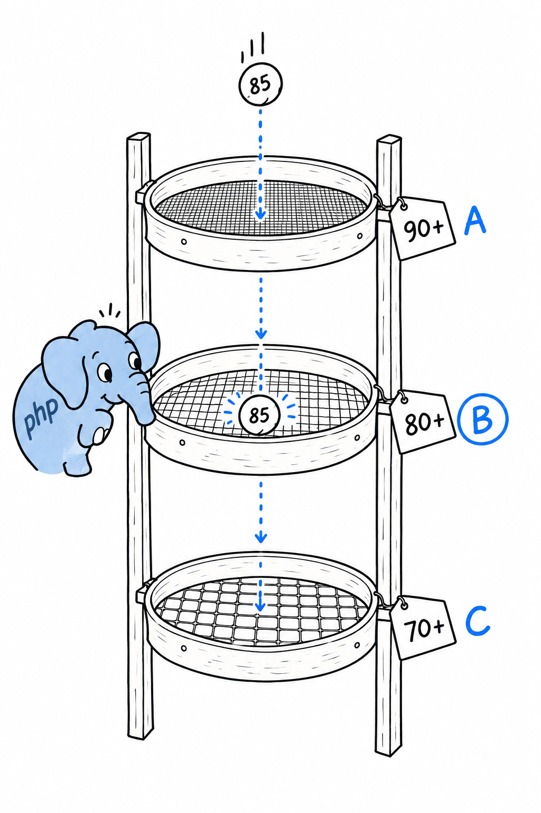

# `match` Pattern Syntax

Chapter 6 gave `match` its proper introduction, next to enums, where it shines the most. Three details did not fit there, and you will want all three the first time you write a `match` with more than two or three arms.

## Multiple conditions per arm

An arm does not have to test a single value. Separate several with commas, and the arm matches if any one of them equals the subject:

```php
<?php

$dayNumber = 6;

$dayType = match ($dayNumber) {
    1, 2, 3, 4, 5 => 'Weekday',
    6, 7 => 'Weekend',
    default => 'Invalid',
};

echo $dayType; // Weekend
```

**Read the comma as "or".** `1, 2, 3, 4, 5 =>` means "if the subject is 1, or 2, or 3, or 4, or 5". Without it you would write five arms that all return `'Weekday'`, which is exactly the repetition `match` exists to remove.

## Order matters: first match wins

`match` checks its arms from top to bottom and stops at the first one that fits. Most of the time you never think about it, because well-designed conditions do not overlap. Pair `match (true)` (testing boolean conditions instead of a single value, as in [Chapter 3](ch03-05-control-flow.md)) with conditions that can overlap, and order stops being a formality:

```php
<?php

$score = 85;

$grade = match (true) {
    $score >= 90 => 'A',
    $score >= 80 => 'B',
    $score >= 70 => 'C',
    default => 'F',
};

echo $grade; // B
```



Move `$score >= 70` to the top, and 85 satisfies it before the `B` arm gets a look. So does 95. The `A` and `B` arms become unreachable code, and PHP will not say a word about it. Try it: reorder the arms and run the file again.

> [!TIP]
> **When arms can overlap, put the most restrictive condition first**, like sieves stacked from finest to coarsest.

## Arms are expressions, not just values

An arm does not have to be a bare literal. **Every arm of a `match` is a full expression, evaluated and returned only when that arm is chosen.** Call a function, construct an object, run anything PHP accepts as an expression:

```php
<?php

enum LogLevel
{
    case Info;
    case Warning;
    case Error;
}

function formatMessage(string $level, string $text): string
{
    return "[" . strtoupper($level) . "] {$text}";
}

$level = LogLevel::Warning;

$output = match ($level) {
    LogLevel::Info => formatMessage('info', 'Request completed'),
    LogLevel::Warning => formatMessage('warning', 'Disk usage above 80%'),
    LogLevel::Error => (new RuntimeException('Disk full'))->getMessage(),
};

echo $output; // [WARNING] Disk usage above 80%
```

The last arm builds an exception and calls a method on it, in one go; the parentheses around `new RuntimeException(...)` are needed so PHP knows to call `getMessage()` on the finished object rather than parsing the line some other way. Arms have no obligation to be short or trivial. They have to be expressions, and in PHP that covers almost everything, which is what makes `match` a real replacement for a lot of small helper functions, not just a tidier `switch`.
