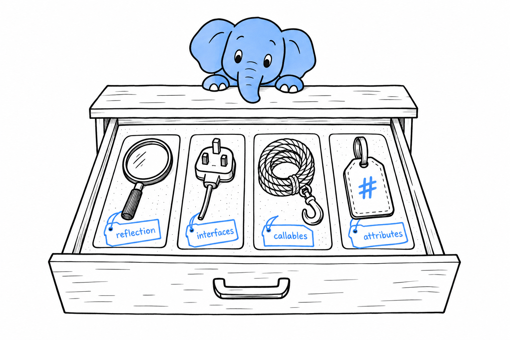

# Advanced Features

Every workshop has a drawer for the tools you use twice a year. The wood chisel, the pipe wrench, the tap and die set. You do not carry them around, but the day the right job turns up, knowing they exist saves the afternoon. **This chapter is that drawer.**

The four sections that follow do not build on each other, and none of them is needed to finish this book. **Skip the chapter now if you like, and come back the day a framework does something you cannot explain.** All of it is common in the PHP ecosystem, in the libraries you install with Composer, in Symfony and Laravel, in code written by people who have been at this a while. None of it is code you will write every day, which is exactly why it sits here, near the end, instead of being woven through the earlier chapters.

Here is what is in the drawer. Magic constants and Reflection let code look at itself, and at other code, while it runs; you will call them rarely, because frameworks and testing tools do it on your behalf. A few built-in interfaces let your own objects plug into PHP's syntax, so that `count()`, square brackets and `foreach` work on them as if they were arrays. Closures get a second look, with the first-class callable syntax PHP 8.1 introduced. And attributes put metadata right into the code, where a comment used to do the job.

Pick whichever section matches the puzzle in front of you. Each one stands alone.
