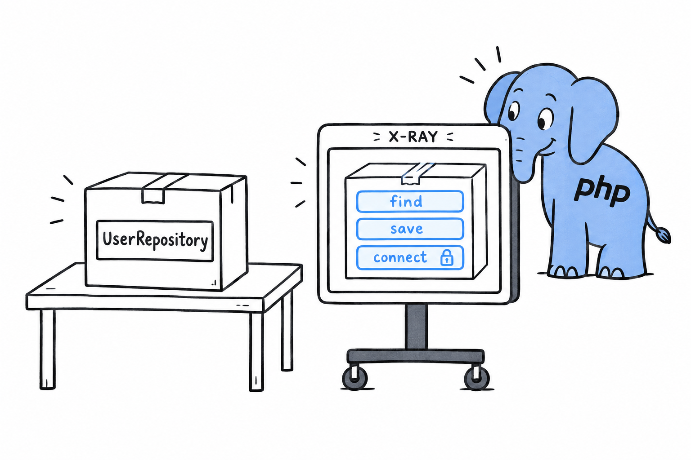

# Magic Constants and Reflection

Your code usually knows what it is: you wrote it. But sometimes a program has to ask that question of itself while it runs. A logger wants to say which method emitted a warning. A testing tool wants the list of methods in a class it has never seen. **PHP answers those questions with two tools of very different sizes: a handful of magic constants for the cheap questions, and Reflection, a whole API, for the detailed ones.**

## Magic constants

Start with the logger.

```php
<?php

class Logger
{
    public function warn(string $message): void
    {
        echo __CLASS__ . '::' . __FUNCTION__ . " at line " . __LINE__ . ": {$message}\n";
    }
}

(new Logger())->warn('Disk space low');
```

```console
$ php logger.php
Logger::warn at line 7: Disk space low
```

The `warn()` method never spells out its own name, yet the output shows `Logger::warn` and a line number. **`__CLASS__`, `__FUNCTION__` and `__LINE__` are filled in by PHP before the code runs, with the name of the class, the name of the function and the line where they appear.** Two more do the same job: `__METHOD__` gives both names at once, as `Class::method`, and `__FILE__` gives the full path of the current file.

They are called magic because their value depends on where you write them. Try it: push the `echo` line down with a blank line above it and run again. The `7` becomes an `8`.

There is nothing clever underneath. The parser replaces each constant with a plain value, so they cost nothing and cannot be wrong. That is what a log line needs: where a message came from, without a hardcoded name that drifts when someone renames the method.

> A magic constant is a name tag the parser sews into your code. It always reads the current location.

## Reflection

Magic constants tell code about itself. **Reflection lets code examine other code, class by class and method by method, as data it can query at runtime.**

```php
<?php

class UserRepository
{
    public function find(int $id): ?string
    {
        return "User #{$id}";
    }

    public function save(string $name): void
    {
        // ...
    }

    private function connect(): void
    {
        // ...
    }
}

$reflection = new ReflectionClass(UserRepository::class);

foreach ($reflection->getMethods(ReflectionMethod::IS_PUBLIC) as $method) {
    echo $method->getName() . "\n";
}
```

```console
$ php reflect.php
find
save
```

`ReflectionClass` wraps a class and exposes its shape: `getMethods()`, `getProperties()`, `getConstructor()`, and more. Each returns further reflection objects, `ReflectionMethod` or `ReflectionProperty`, that you can query in turn for a method's parameters, their types, or whether a property is `readonly`. Passing `ReflectionMethod::IS_PUBLIC` filters out `connect()`, the private helper, and leaves just the public interface. Attributes, later in this chapter, are read back the same way.



Think of it as an X-ray. The object stays closed, and you still get a full picture of what is inside.

## Where you will actually meet this

Be honest about how often you will write `new ReflectionClass(...)` yourself: rarely. **Reflection exists so that other tools can work on classes they have never seen.** A dependency injection container reads a constructor's parameters to figure out what to pass in. PHPUnit uses it to find your test methods. Laravel and Symfony lean on it constantly under the hood.

You will use Reflection through those tools far more often than directly. But the next time a framework does something that looks like magic with a class you just wrote, you know what happened. It took an X-ray.
