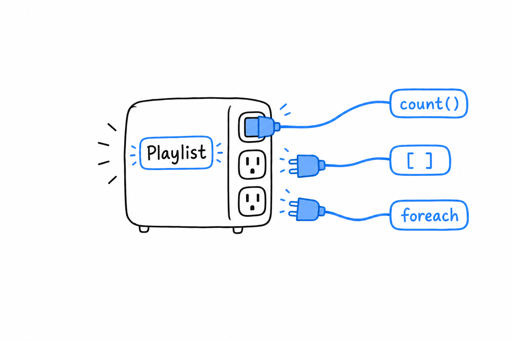

# Built-in Interfaces: Countable, ArrayAccess, IteratorAggregate

Call `count()` on an object you wrote, and PHP refuses: it counts arrays, not objects. Write `$config['debug']`, and the object has no idea what square brackets mean. Put it in a `foreach`, and you get its properties, not the things it holds. **A small set of built-in interfaces fixes all three. Implement one, and PHP's own syntax starts treating your object like an array.**

An interface, as [Chapter 11](ch11-00-interfaces-and-traits.md) showed, is a contract: implement its methods and your class can go anywhere that contract is expected. These three come from the SPL (Standard PHP Library), and the party expecting the contract is PHP itself.



## `Countable`

The smallest one. **Implement a `count()` method, and PHP's built-in `count()` function calls it for you.**

```php
<?php

class Playlist implements Countable
{
    private array $tracks = [];

    public function add(string $track): void
    {
        $this->tracks[] = $track;
    }

    public function count(): int
    {
        return count($this->tracks);
    }
}

$playlist = new Playlist();
$playlist->add('Track One');
$playlist->add('Track Two');

echo count($playlist); // 2
```

Nothing here does more than `$playlist->count()` would. What changes is what the caller reads: `count($playlist)` says "this thing is a collection", and that is the impression you want to give the next person who uses your class.

## `ArrayAccess`

`ArrayAccess` is the dramatic one. **Implement its four methods, and square brackets work on your object.**

```php
<?php

class Config implements ArrayAccess
{
    private array $values = [];

    public function offsetExists(mixed $offset): bool
    {
        return isset($this->values[$offset]);
    }

    public function offsetGet(mixed $offset): mixed
    {
        return $this->values[$offset] ?? null;
    }

    public function offsetSet(mixed $offset, mixed $value): void
    {
        $this->values[$offset] = $value;
    }

    public function offsetUnset(mixed $offset): void
    {
        unset($this->values[$offset]);
    }
}

$config = new Config();
$config['debug'] = true;

echo $config['debug'] ? "on\n" : "off\n"; // on
echo isset($config['missing']) ? "yes\n" : "no\n"; // no
```

Each method backs one shape of the syntax. `offsetSet` runs for `$config['debug'] = true`, `offsetGet` for reading `$config['debug']`, `offsetExists` for `isset($config[...])`, and `offsetUnset` for `unset($config[...])`. Underneath, `Config` is still an ordinary object with an ordinary private array. `ArrayAccess` only lets the outside world address it with array syntax, and that reads well for a configuration object or a typed wrapper around a collection.

Try it: make `offsetSet` throw when `$offset` is not a string. The call site does not change, and the object now refuses what a plain array would have accepted blindly.

## `IteratorAggregate`

The third makes your object work in a `foreach`. **`IteratorAggregate` asks for a single method, `getIterator()`, that hands back something already iterable**, usually a `Generator` from [Chapter 15](ch15-02-generators.md). You do not write the iteration logic; you point at it.

```php
<?php

class Playlist implements IteratorAggregate
{
    private array $tracks = [];

    public function add(string $track): void
    {
        $this->tracks[] = $track;
    }

    public function getIterator(): Generator
    {
        foreach ($this->tracks as $track) {
            yield $track;
        }
    }
}

$playlist = new Playlist();
$playlist->add('Track One');
$playlist->add('Track Two');

foreach ($playlist as $track) {
    echo "{$track}\n";
}
```

```console
$ php playlist.php
Track One
Track Two
```

The `foreach` does not know or care that `$playlist` is not an array. It asked PHP where the values were, and `IteratorAggregate` answered. There is also a lower-level `Iterator` interface, with `current()`, `next()`, `valid()` and friends, for the rare case where you need to drive the iteration state by hand. Almost always, `IteratorAggregate` is the one to reach for, because the generator does the bookkeeping.

Put the three on one class and it becomes indistinguishable, at the call site, from an array, while keeping the validation and the internal structure an array could never enforce.

> Implement the interface, and the syntax follows. Underneath, the object keeps its own structure and its own rules.
