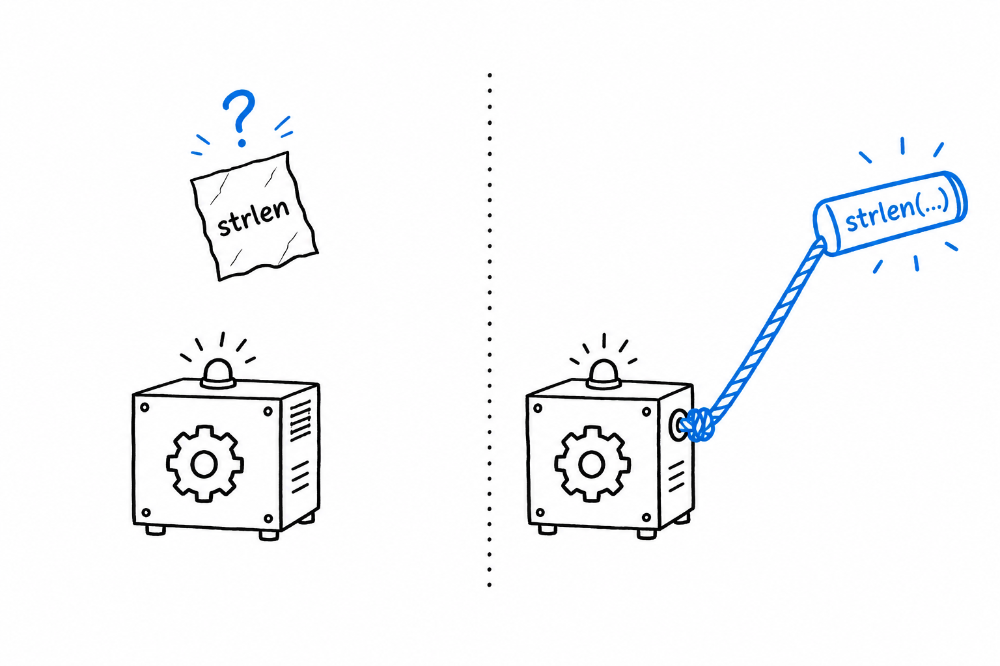
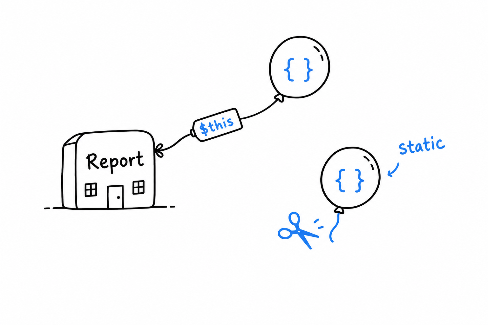

# First-Class Callable Syntax and Advanced Closures

`array_map('strlen', ...)`. That string has been the way to pass a function around since PHP's early days, and it always had a smell: to your editor, it is a string that happens to contain a function name. **PHP 8.1 gave functions and methods a proper way to travel as values.** This section shows it, along with two `Closure` tricks for more deliberate code. Closures and arrow functions themselves are in [Chapter 15](ch15-01-closures.md).

## The old way of passing a function around

Before PHP 8.1, passing an existing function or method to `array_map()` meant a string or an array:

```php
<?php

$lengths = array_map('strlen', ['a', 'bb', 'ccc']);

class Greeter
{
    public function greet(string $name): string
    {
        return "Hello, {$name}!";
    }
}

$greeter = new Greeter();
$greetCallable = [$greeter, 'greet'];

echo $greetCallable('Sam'), "\n"; // Hello, Sam!
```

It works, and you will see it in plenty of existing code. But `$greetCallable` is just an array holding an object and a string. Your editor cannot jump from `'greet'` to the method, and a typo in the name is only caught on the line that calls it.



## First-class callable syntax

**Write the function or method name followed by `(...)`, three literal dots, and PHP hands you a `Closure` pointing at it.**

```php
<?php

$lengths = array_map(strlen(...), ['a', 'bb', 'ccc']);

class Greeter
{
    public function greet(string $name): string
    {
        return "Hello, {$name}!";
    }
}

$greeter = new Greeter();
$greetCallable = $greeter->greet(...);

echo $greetCallable('Sam'), "\n"; // Hello, Sam!
```

Same behavior, one difference that matters: `strlen(...)` and `$greeter->greet(...)` are real references, and your tooling understands them. Go-to-definition works. Static analysis checks the signature. Rename `greet()` and the stale reference is caught at once instead of failing at runtime. It reads better too: `$greeter->greet(...)` says "the `greet` method, as a value", which is exactly what happens.

> A string is a name written on a note. `strlen(...)` is a handle on the function itself.

Try it: misspell `greet` in both versions. The old one fails at the call. The new one fails on the line that creates the closure, before anything else can go wrong.

## `Closure::fromCallable()`

Sometimes the callable comes from outside your control: a configuration value, a string read from a file. You are handed one of the traditional shapes and want a real `Closure` object, so you can call methods like `bindTo()` on it. **`Closure::fromCallable()` converts any callable shape into a `Closure`.**

```php
<?php

$callableFromConfig = 'strtoupper';

$closure = Closure::fromCallable($callableFromConfig);

echo $closure('hello'), "\n"; // HELLO
```

In new code, first-class callable syntax covers most of the reasons you would reach for this. You will still see `Closure::fromCallable()` in library code that has to accept a callable in any of its historical forms and normalize it.

## Static closures

A closure defined inside a method quietly captures `$this`. Most of the time that is convenient: the closure can call back into the object that made it. Occasionally you want the opposite guarantee, because the closure is about to be handed off elsewhere and must stay self-contained. **Mark it `static`, and it cannot touch the object it was born in.**

```php
<?php

class Report
{
    private string $secret = 'internal data';

    public function makeFormatter(): Closure
    {
        return static function (string $line): string {
            return strtoupper($line);
        };
    }
}

$formatter = (new Report())->makeFormatter();

echo $formatter('quarterly summary'), "\n"; // QUARTERLY SUMMARY
```



A `static function` closure behaves exactly like an ordinary one, except that `$this` is unavailable inside it: trying to use it is a compile-time error, not a runtime surprise. A small guarantee, but a real one. It tells the reader, and PHP itself, that the formatter carries no hidden thread back to the `Report` that created it.
