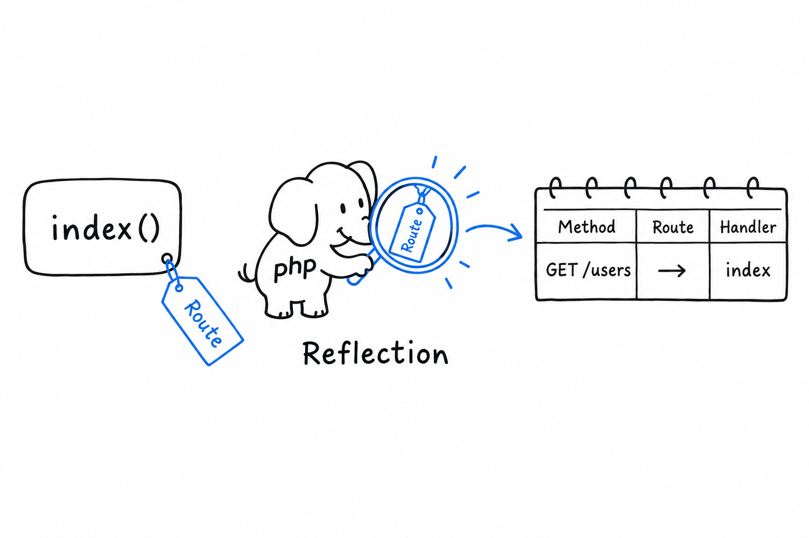

# Attributes

"This method is a test." "This property maps to a database column." "This route handles `GET /users`." For years, PHP had exactly one place for that kind of note: a specially formatted comment, a docblock, that a framework parsed at runtime with a regular expression. It worked, and it was always a little uneasy. The language did not read the comment, did not check it, and a typo in it failed without a sound.

**PHP 8 made the note part of the language: an attribute, written `#[SomethingLikeThis]` right above the thing it describes.**

## Defining and attaching an attribute

An attribute is a plain class. What turns it into an attribute is PHP's own `#[Attribute]` marker above it:

```php
<?php

#[Attribute]
class Route
{
    public function __construct(
        public readonly string $method,
        public readonly string $path,
    ) {
    }
}
```

Once defined, hang it on a method with the `#[...]` syntax:

```php
<?php

class UserController
{
    #[Route(method: 'GET', path: '/users')]
    public function index(): string
    {
        return 'List of users';
    }

    #[Route(method: 'POST', path: '/users')]
    public function store(): string
    {
        return 'User created';
    }
}
```

Run this file and nothing happens. **`#[Route(...)]` calls nothing on its own.** It is inert metadata, a tag hanging on the method, waiting for someone to come and read it.



## Reading attributes back with Reflection

That someone is Reflection, from earlier in this chapter. **`ReflectionMethod`, like `ReflectionClass` and `ReflectionProperty`, lists the attributes attached to whatever it reflects, and builds the attribute object on demand.**

```php
<?php

$reflection = new ReflectionClass(UserController::class);

foreach ($reflection->getMethods() as $method) {
    foreach ($method->getAttributes(Route::class) as $attribute) {
        $route = $attribute->newInstance();
        echo "{$route->method} {$route->path} -> {$method->getName()}()\n";
    }
}
```

```console
$ php routes.php
GET /users -> index()
POST /users -> store()
```

`getAttributes(Route::class)` finds every `Route` attribute on a method. `newInstance()` constructs it, running the constructor with the arguments you wrote in `#[Route(...)]`, and hands back a real `Route` object with `method` and `path` properties. This is how simple routing systems are built: scan a controller's methods, read off their `Route` attributes, fill a routing table with what you find. No separate configuration file to keep in sync.

> An attribute is a plain object, parked next to your code, that Reflection can pick up.

## Where you have already seen this

If you have read [Chapter 12](ch12-00-testing.md), this pattern is familiar. PHPUnit's `#[Test]` marks a method as a test case the way `#[Route]` marks one as a handler here: a plain class, read back through Reflection, driving real behavior. Frameworks lean on attributes constantly. Symfony uses them for routes and dependency injection configuration, Doctrine to map properties to database columns, PHPUnit for test metadata of every kind.

You may not write many attributes of your own. You will read `#[...]` above methods and classes every day in modern PHP code, and now you know exactly what is happening when you do: a plain object, waiting to be read back through Reflection.
