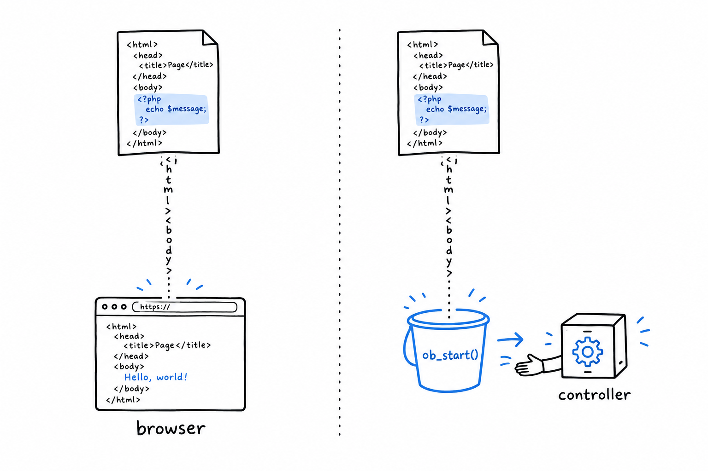
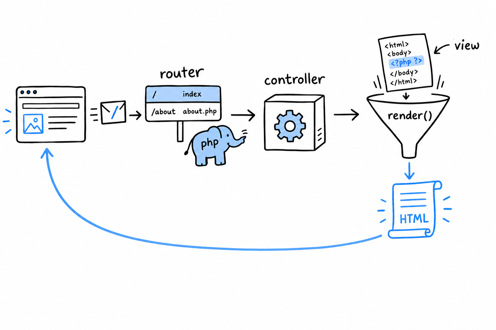

# Structuring a Small MVC-Style App

Two routes, two closures, one file: the router from the previous section works. Add ten more routes and it stops being readable, because what each route *does* is tangled up with how it was *found*. Real applications pull those two apart. The classic split is **Model, View, Controller**, MVC for short, and even at our scale the shape is worth having: **a controller decides what should happen for a request, and a view decides how the result turns into HTML.** There is no model yet, because there is no data to hold. Two or three routes are enough to see the pattern.

## Controllers

A controller, at this size, is a class whose methods each handle one route and return the response body as a string:

```php
<?php

class HomeController
{
    public function index(): string
    {
        return render('home', ['title' => 'Welcome']);
    }
}

class AboutController
{
    public function show(): string
    {
        return render('about', [
            'title' => 'About',
            'description' => 'A tiny PHP application, built without a framework.',
        ]);
    }
}
```

Notice what is missing. Nothing here reads `$_SERVER`, nothing knows which URI led to it. That is the router's business. **A controller method has one job: produce a response.** That keeps it easy to read, and easy to test: call `(new HomeController())->index()` and look at the string that comes back.

## Views: PHP's original superpower

`render()` is where the view layer lives, and it leans on something PHP has been good at from day one. **PHP is a templating language underneath the programming language.** That was its original purpose, before it grew everything else. A view is an ordinary file with HTML in it and small islands of PHP for the moving parts, the same `<?php ... ?>`-in-HTML style as the very first pages this book showed you.

Create `views/home.php`. Unlike the other code samples in this book, this one is an HTML file with islands of PHP in it, not a PHP file in its own right, so it does not open with `<?php`:

```html
<!DOCTYPE html>
<html>
<head><title><?= htmlspecialchars($title) ?></title></head>
<body>
    <h1><?= htmlspecialchars($title) ?></h1>
    <p>This page was rendered from views/home.php.</p>
</body>
</html>
```

And a small helper that includes a view file with data made available to it:

```php
<?php

function render(string $view, array $data = []): string
{
    extract($data);
    ob_start();
    include __DIR__ . "/views/{$view}.php";
    return ob_get_clean();
}
```

Four lines, each with a job. **`extract()` turns each key of `$data` into a local variable**: `'title' => 'Welcome'` becomes `$title`, visible inside the included file. **`ob_start()` and `ob_get_clean()` are output buffering.** Without them, the included file's HTML would print straight to the browser. With them, it is caught in a buffer and handed back as a string, so the controller can return it like any other value.



Back in the view, `<?= ... ?>` is shorthand for `<?php echo ... ?>`, and `$title` goes through `htmlspecialchars()` before it is printed. That one call is what stops text that came from a user from being rendered as raw HTML. Make it a reflex.

## Wiring the router to controllers

Update `router.php` to dispatch to controller methods instead of inline closures:

```php
<?php

require __DIR__ . '/render.php';
require __DIR__ . '/controllers.php';

$uri = parse_url($_SERVER['REQUEST_URI'], PHP_URL_PATH);

$routes = [
    '/' => [HomeController::class, 'index'],
    '/about' => [AboutController::class, 'show'],
];

if (isset($routes[$uri])) {
    [$class, $method] = $routes[$uri];
    echo (new $class())->{$method}();
} else {
    http_response_code(404);
    echo "404 Not Found: {$uri}";
}
```

`$routes` now maps each path to a `[class, method]` pair instead of a closure. The pair is destructured on the spot with `[$class, $method] = $routes[$uri]`, the syntax from [Chapter 19](ch19-02-destructuring.md); `new $class()` builds the controller, and `->{$method}()` calls the method on it.

Follow one request all the way through.



The browser asks for `/`. The router finds `HomeController` and `index` in its table, builds the controller, calls the method. The method calls `render('home', ...)`, which includes `views/home.php` with its output captured and returns the HTML as a string. The string travels back to the router, which echoes it. Response sent.

**That round trip is what every framework's router is built on**: look at the request, find the class and method responsible for it, call them, return what they give you. The machinery is small, and it is the whole idea.

Try it: `/about` has a controller but no view. Write `views/about.php` on the model of `home.php`, with `$description` in it, and ask `curl` for `/about`.
