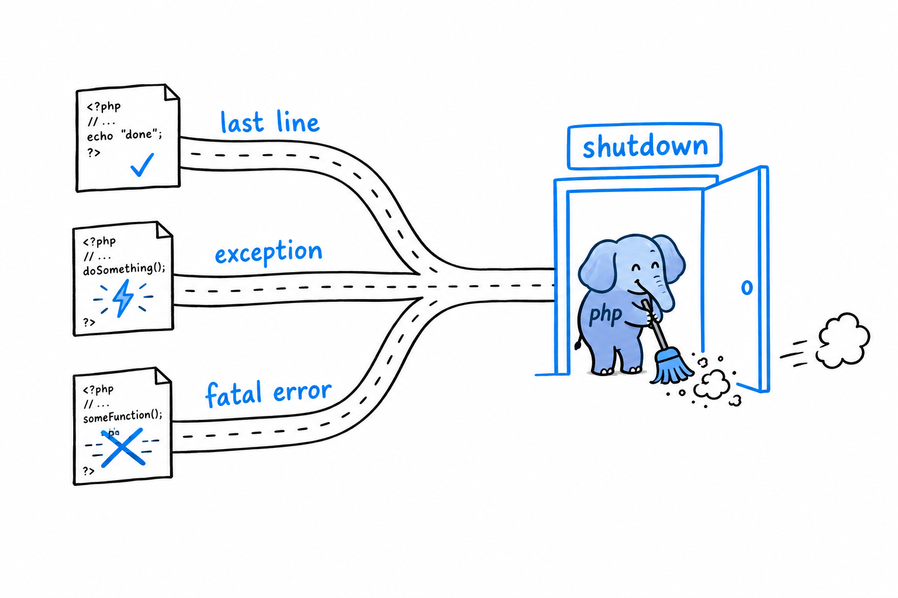

# Handling Shutdown and Cleanup

Every PHP script ends. Most of the time it ends by running its last line. Sometimes it ends on a fatal error nobody planned for. Either way, there is often something you want to be sure happens on the way out: closing a file handle, logging that the request finished, flushing a write to a database. `try`/`finally`, from [Chapter 9](ch09-00-error-handling.md), covers the ordinary cases. It cannot cover a genuine fatal error, the kind that stops execution dead with no exception to catch. **For that, PHP gives you a hook into the very last moment of the script's life.**

## `register_shutdown_function()`

```php
<?php

register_shutdown_function(function (): void {
    echo "Cleaning up before the script ends.\n";
});

echo "Doing regular work.\n";

// Simulate something going badly wrong.
strlen(); // fatal error: too few arguments
```

```console
$ php shutdown_demo.php
Doing regular work.
Cleaning up before the script ends.
Fatal error: Uncaught ArgumentCountError: strlen() expects exactly 1 argument, 0 given...
```

Look at the order in that output: the cleanup message comes before the fatal error. **The shutdown function runs at the true end of the request, whatever way the script got there**: after a normal return, after an uncaught exception, after most fatal errors. You register the callback once, near the top of your application (in real life, inside a framework's bootstrap code), and PHP promises to run it on the way out. It is the closest thing PHP has to "no matter what happens, run this last."

Try it: replace the `strlen();` line with `exit;`, then with `throw new RuntimeException('boom');`. The cleanup line shows up every time.



## Where a script's life actually ends

This is [Chapter 18](ch18-01-request-model.md)'s shared-nothing request model, seen from the end. In the traditional PHP lifecycle, a script's "end" is a precise moment: the response has been sent, and the process (or thread) that handled this one request is about to be recycled or torn down for the next one. Everything the script allocated (variables, objects, the file handles PHP itself manages) is cleaned up in that teardown, shutdown functions included. There is no long-lived process to leak memory into, the way a Node.js server that runs for weeks can. **Each request gets a clean slate, and each request's mess, cleaned up or not, dies with it.**

That is also why `register_shutdown_function()` means more in PHP than "runs at the end" suggests. It is not a background job, and it is not deferred to some later point the way a queued job from Chapter 18 is. It runs synchronously, inline, before this exact request's story is over. That makes it the right place for "log that this request completed" or "release the lock this request was holding," and the wrong place for anything that should happen independently of this request at all.

> A shutdown function is the last thing this request does. Not something that happens later.

## Where you've landed

Look back at what the project used: a router built from an array and a handful of `if` statements, controllers that are plain classes with methods, a view layer in the same PHP-in-HTML style you saw on page one, and a shutdown hook that closes the loop on a request's life. None of it needed a framework. **All of it is, in miniature, what a framework provides at scale.**

You started this book with `echo "Hello, world!\n";`, about as small as a program gets. You are ending it by wiring classes, namespaces, interfaces, error handling, and a request lifecycle into something that serves web pages. The syntax in between was never the point. The point was the judgment to reach for the right piece at the right moment, and that judgment is the one part no book can finish for you. It comes from writing more PHP than you have written so far.

Go write some.
