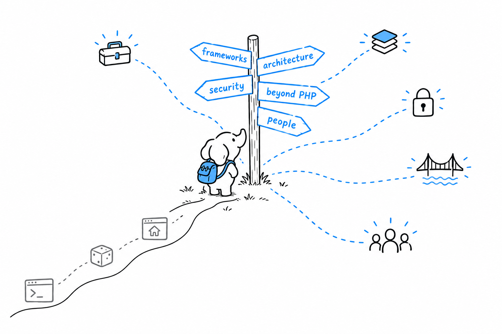

# Where to Go from There

You started this book by making PHP print one sentence. You are closing it with a web application built from nothing: a router, controllers, views, a database behind them, tests around them. That is fluency in the language, and it is not a small thing.

It is also not everything the job involves. **Most of what remains is not PHP the language but PHP in context**: the tools that carry your code from your laptop to a server, the habits that keep a team's codebase sane, the other systems your programs talk to, and the people who built all of it.

What follows is a map, not a tutorial, in the spirit of the tour [Chapter 18](ch18-00-concurrency.md) gave of concurrency. For each destination you get enough to recognize it by name, know what it is for, and know what to search for the day you need it. None of it is required to write good PHP. All of it becomes relevant as your software grows bigger, lives longer, or gains a second contributor, which is to say, sooner or later, most of it.

There are five destinations. [Frameworks and tooling](ch22-01-frameworks-and-tooling.md) is the ready-made version of what [Chapter 21](ch21-00-final-project-web-app.md) built by hand, and the toolchain around it. [Architecture and process](ch22-02-architecture-and-process.md) is about organizing code, and the team habits that keep changes to it safe. [Security and performance](ch22-03-security-and-performance.md) hardens what [Chapter 10](ch10-00-web-development-basics.md) started and keeps it fast once real traffic shows up. [Beyond PHP](ch22-04-beyond-php.md) looks at other languages, other technologies, and the engine PHP itself runs on. [The community](ch22-05-community.md) is the people who built everything above, and how to find them.

Read whichever one matches what you are about to do next. None of them assumes you read the others first.
