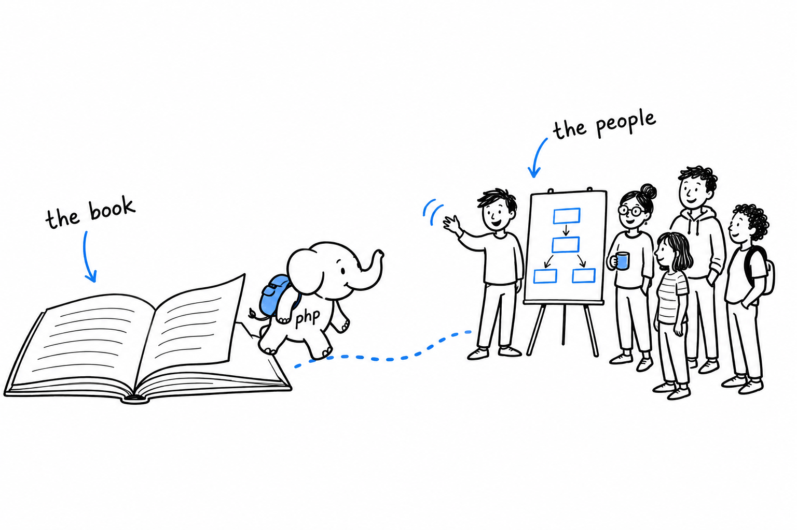

# The PHP Community

Everything in this chapter, and most of this book, exists because other people did their work in public: extensions, frameworks, standards, RFCs. **Finding those people is less a next step than a shortcut through all the others.**

The nearest way in is a user group: local, often monthly meetups, typically listed on sites like php.ug. Low effort, and the fastest way to meet other PHP developers in person and hear what problems they are actually solving.

Conferences come next. PHP UK, phpDay, SymfonyCon, Laracon and many more, worldwide. The talks matter less than the hallway conversations between them. Either way, they are a reminder that the language has an active present and not only the history [the foreword](foreword.md) faced head-on.

Some of those people write the standards you have been using without noticing. **PHP-FIG, the Framework Interop Group, is behind the PSRs this book leaned on silently throughout**: PSR-4 autoloading from [Chapter 7](ch07-06-psr4.md), PSR-12 style from [Appendix D](appendix-04-useful-development-tools.md). Its proposals and meetings are public.

Others change PHP itself. [Appendix G](appendix-07-rfc-process.md) covered the RFC process. The discussions behind every RFC, on `internals@lists.php.net`, are open to read and, eventually, open to join.

And you can contribute. To PHP's own source or documentation, or to any of the open source packages this community's projects rest on, a great many of which live on Packagist, from [Chapter 16](ch16-02-publishing-to-packagist.md). Fixing a typo in a documentation page is a small, legitimate, genuinely welcomed first contribution, and a good way to find out how a codebase much larger than any in this book is actually organized.

The fastest way to grow past this book is to talk to people who already have. Every destination in this chapter has someone standing at it, happy to explain what they found there. Go and ask.
