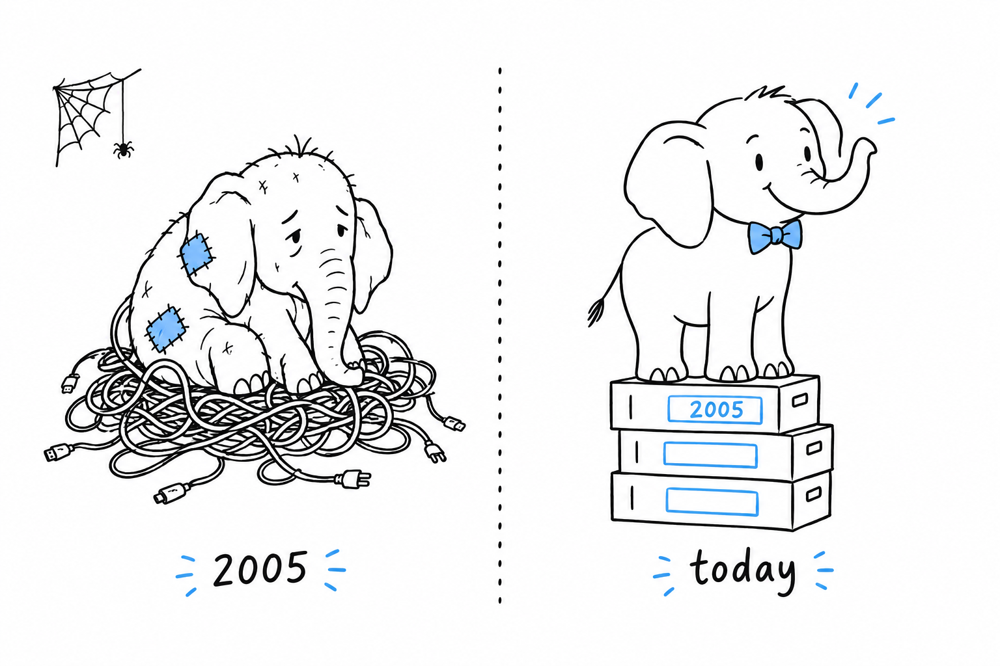

# Introduction

You have been handed a PHP codebase. Maybe you asked for it, more likely you did not. You open the first file, you see `$this->` and `->` and `::` and a function called `htmlspecialchars`, and a thought forms: is this going to be the language everyone warned me about?

Here is the short answer. **The PHP people warned you about was real, and it is mostly gone.** What is left is a typed, object-oriented, garbage-collected language with a package manager, a standard coding style, a serious static analysis ecosystem, a release every November, and a runtime model that is unlike anything you have used, which is the one thing you actually need to learn.

## What was true

PHP started in 1995 as a set of templates with a bit of logic in them. For its first decade it was permissive to a fault. Variables appeared out of nowhere, `"abc" == 0` was true, errors were printed to the page and execution continued, database queries were built by string concatenation, and the standard library was assembled one function at a time by whoever needed it that week, which is why `strpos` sits next to `str_replace` and `array_key_exists` sits next to `in_array`.

A whole generation learned to program on that PHP, wrote a great deal of it, and much of it still runs. That is the PHP of the jokes.

## What changed

PHP 7 (2015) doubled performance and added scalar type declarations. PHP 8 (2020) added a real type system with union types, `match`, named arguments, attributes, enums, `readonly`, first-class callables and a JIT compiler. PHP 8.4 added property hooks and asymmetric visibility. PHP 8.5 added a pipe operator. The comparison rules were fixed, dynamic properties were deprecated, the old `mysql_*` functions were removed, and the interpreter now throws a `TypeError` where it used to guess.

Around the language, the community built Composer, the package manager every project uses; the PHP-FIG standards, so that libraries from different authors fit together; PHPUnit and Pest for testing; PHPStan and Psalm, two static analysers that give you most of what a compiler would; and Rector, which rewrites old code to new syntax. Since 2021 the PHP Foundation employs core developers so the language has a future that does not depend on volunteers' evenings.

## What still bites

Not everything was fixed, and a book for busy people should say so up front. Strings are byte sequences, so `strlen('é')` is 2 and you want the `mb_` functions for text. The standard library still has its inconsistent names and argument orders. `==` still coerces, though far less wildly than before. Strict typing is a per-file switch you must turn on. Arrays copy when you assign them. There are no generics in the language itself. Each of these has a modern practice that neutralises it, and each is covered where you will meet it.

> The reputation stayed in 2010. The language did not.

## The one idea to get first

**A PHP web request starts with nothing, runs your code top to bottom, sends its answer, and throws everything away.** No shared memory between requests, no application object that stays alive, no event loop, no threads. The web server hands a request to PHP, PHP produces a response, PHP forgets.

If you come from Node, Java, Go or an ASGI Python server, this is the single largest difference, and most PHP idioms follow from it: why there is no connection pool by default, why "global state" is a per-request thing, why a crash affects one visitor, why scaling is a matter of adding processes, why OPcache exists, and why long-running PHP servers like FrankenPHP or RoadRunner are a topic in their own right. [How PHP Runs](ch01-how-php-runs.md) covers it, and it is the one chapter not to skip.

## How to read this book

Each chapter answers one question and stands on its own. The bold sentences carry the story: read only those and you get the delta between PHP and what you already know. Read the code blocks and you get the syntax. Read the rest when a detail matters to you.

The comparisons to Python, JavaScript, Java and a few other languages are anchors, not translations. Skip the ones for languages you do not know. Nothing depends on them.

Every example runs on a bare PHP install with `php file.php`. No framework, no library, so that the lesson is about PHP itself. Install PHP first: your package manager has it, php.net lists official builds, and the official Docker image is `php:8.5-cli`. Then keep a terminal open and run what you read.

Three chapters serve a particular reader. [Returning to PHP After Years Away](ch14-returning-developer.md) maps old habits to modern practice, for developers returning to the language. [Coming from Python, JavaScript, or Java](appendix-01-cheat-sheet.md) is a lookup table. [PHP 8.0 to 8.5 at a Glance](appendix-02-versions.md) tells you what your project's PHP version can do.

Two to three hours from now, the codebase you opened will look different. Not simpler, necessarily. Just legible.
