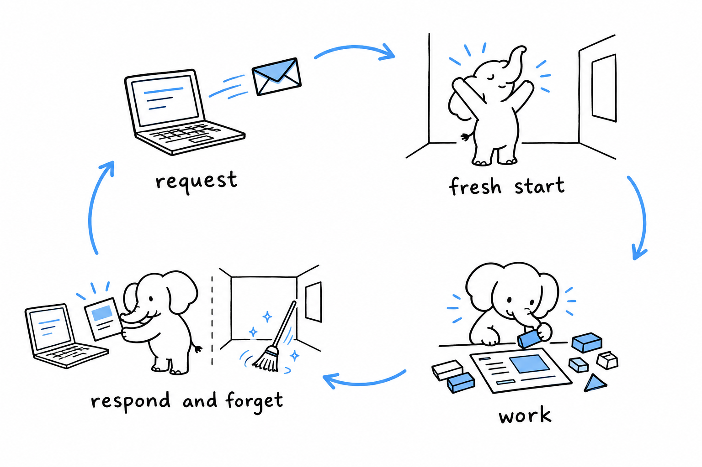
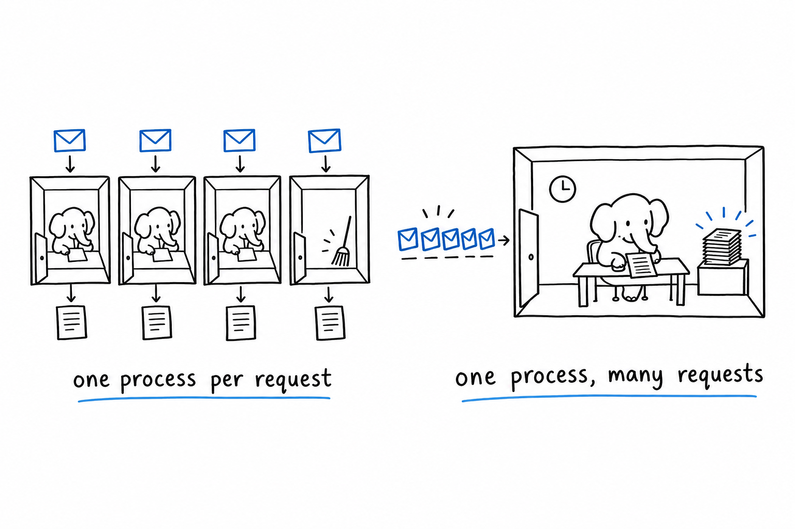

# How PHP Runs

**PHP does not run your application. It runs your script, once, for one request, and then exits.** There is no server object you instantiate, no `listen()` call, no event loop. Something outside PHP (a web server, or you at a terminal) starts the interpreter, the interpreter runs a file from top to bottom, and everything it allocated is freed when the file ends.

Every other chapter in this book is easier once this one has sunk in.

## Two ways in

From a terminal, PHP behaves like Python or Ruby:

```bash
php hello.php
php -r 'echo PHP_VERSION, PHP_EOL;'
php -a          # interactive shell
php -l file.php # syntax check only
php -S localhost:8000   # development web server, current folder as document root
```

On the web, PHP is not the server. **The web server receives the HTTP request and hands it to PHP**, most often through PHP-FPM, a pool of PHP processes waiting behind nginx, Apache or Caddy. One process takes the request, runs the script the URL maps to, writes the response, cleans up, and goes back to waiting for the next one. The pool has as many processes as you configure, which is also how PHP uses all your cores: not with threads, with processes.



The layer that connects the interpreter to the outside world is called a SAPI (server API). The command line is a SAPI. FPM is a SAPI. Apache's `mod_php` is a SAPI. The engine is the same; only the plumbing differs.

## Shared nothing

This is the part that changes how you write code. **Nothing survives from one request to the next inside PHP.** A static property you set, a global you assign, a connection you open, an object you cache in an array: all of it exists for one request and is gone.

```php
<?php
declare(strict_types=1);

final class Counter
{
    public static int $hits = 0;
}

Counter::$hits++;
echo Counter::$hits; // 1, on every single request, forever
```

Run that under a web server, refresh the page a hundred times, and it prints 1 a hundred times. In Node or Java the same code would count to 100. Neither is a bug. They are different models.

The consequences follow one from another:

- **A bug affects one request.** A memory leak, an infinite loop, an uncaught exception: the process handling that request dies or is recycled, and the next request gets a fresh one.
- **Scaling is horizontal by construction.** More traffic, more FPM processes, more machines. Nothing in the application needs to be thread-safe, because nothing is shared.
- **State lives outside PHP.** Sessions go to files, a database, or a key-value store. Caches go to OPcache and APCu (memory shared between the processes of one machine) or to an external store like Redis or Memcached. The database connection is opened at the start of a request and closed at the end; pooling, if you need it, happens in a pooler in front of the database, not in PHP.
- **Startup cost is paid on every request.** Which is why PHP is fast at starting and why the ecosystem cares about autoloading, OPcache, and preloading.

> If you find yourself designing a singleton to "keep the connection open between requests", stop. There is no between.

## The bytecode cache

Reading and compiling every file on every request would be slow, so PHP does not. **OPcache keeps the compiled form of each file in shared memory**, and the next request reuses it. It ships with PHP and is on by default in every serious setup.

In development, OPcache checks file timestamps and recompiles what changed, so the edit-refresh loop just works, with no build step and no watcher. In production, timestamp checks are usually disabled for speed, which means **a deployment must reset the cache**: restart FPM, or call `opcache_reset()`. Forgetting this is the classic "I deployed and nothing changed" moment.

OPcache also hosts the JIT compiler (PHP 8.0). It helps CPU-bound scripts, mostly, and is not what makes a typical web application fast. Treat it as a flag to try, not as a foundation.

## Long-running PHP

The shared-nothing model is the default, not a law. **Several runtimes keep your application in memory across requests**, the way a Node or Java server does: FrankenPHP in worker mode, RoadRunner, and Swoole or OpenSwoole. Your bootstrap runs once, then a loop hands you requests.



The gain is real: no bootstrap cost per request, and connections can actually be kept open. The cost is the one you already know from other languages: state now leaks unless you clean it, a memory leak grows, and a static counter really does count. Frameworks that support these runtimes reset their containers between requests for exactly this reason. Start with FPM. Move to a worker runtime when you have measured a reason to.

## What is in the box

The interpreter is a C core plus extensions, some bundled and always on, some compiled in at build time, some installed separately. `php -m` lists what your build has. The ones you will notice missing on a fresh install are usually `pdo_mysql` or `pdo_pgsql` (database drivers), `intl` (Unicode collation, formatting), `mbstring` (multibyte strings), `curl`, `gd` or `imagick` (images), and `xdebug` (debugger, development only).

Your package manager provides them as separate packages (`php-intl`, `php-mbstring`, and so on). The official Docker image provides `docker-php-ext-install`. Extensions not shipped with PHP come from PECL, or from PIE, the newer Composer-style installer for extensions.

Configuration lives in `php.ini`. **The command line and FPM read different ini files**, which is why a script behaves one way in a terminal and another under the web server. `php --ini` shows which files the CLI loads; `phpinfo()` in a page shows what FPM loads. Two settings matter from day one: `memory_limit` (128 MB by default under FPM, unlimited in the CLI) and `max_execution_time` (30 seconds under FPM, unlimited in the CLI).

## The trap

Coming from a long-running runtime, the first mistake is to expect memory to persist: a cache in a static array, a "connection pool" class, a counter for rate limiting. Under FPM these silently do nothing useful. The second mistake is the mirror image: after moving to a worker runtime, a request-scoped value stored in a static ends up shared between users.

Ask one question about any piece of state: does it need to outlive this request? If yes, it does not belong in PHP memory. Put it in the database, a cache store, or the session.

With the model in place, the syntax is the easy part. [Syntax](ch02-syntax.md) is exactly that.
