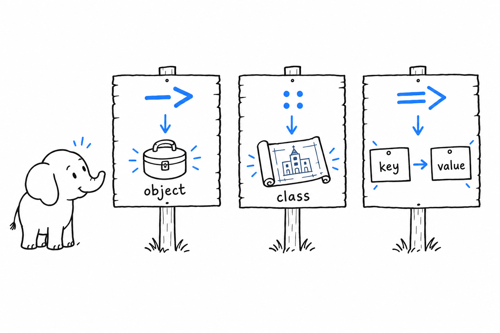
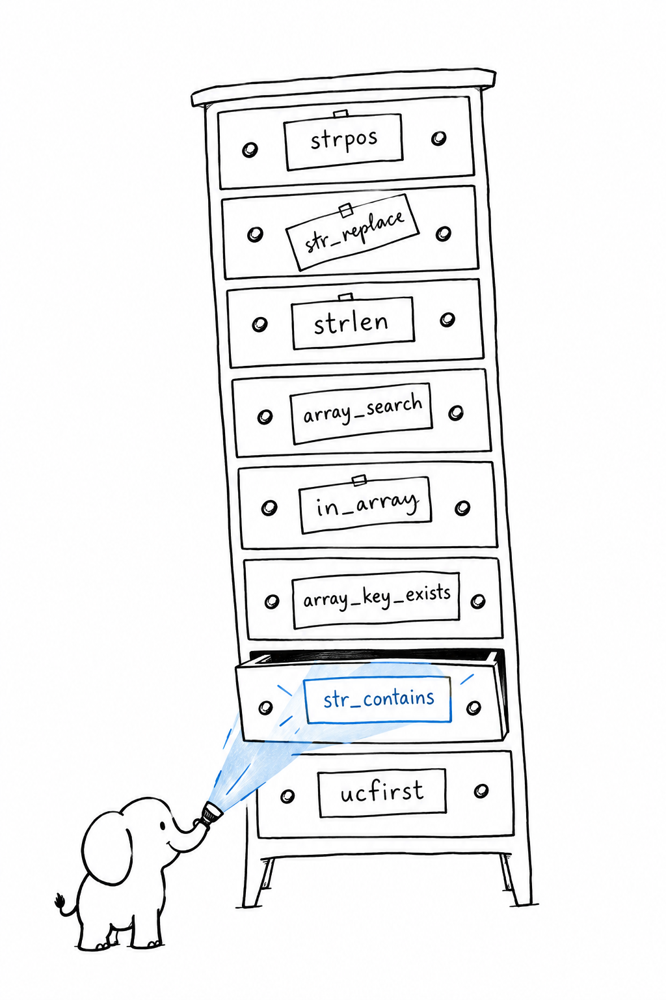

# Syntax

**PHP looks like C with a `$` in front of every variable, `->` for members, and `.` for string concatenation.** If you read Java, JavaScript or C#, you already read PHP. The rest of this chapter is the list of places where your fingers will type the wrong thing.

## One file, top to bottom

```php
<?php
declare(strict_types=1);

$name = 'world';
$count = 3;

echo "Hello, {$name}!", PHP_EOL;
echo 'Hello, ' . $name . '! Count: ' . $count . PHP_EOL;
```

The file opens with `<?php`. Everything before that tag, even a blank line, is sent to the output as-is, because PHP began life as a template language. **A file that contains only code opens with `<?php` and never closes the tag**: a `?>` at the end followed by a stray newline would leak that newline into your HTTP response.

`declare(strict_types=1);` comes next, on its own line. It turns off automatic conversion of scalar arguments in calls made from this file. [Types](ch03-types.md) explains exactly what it does and does not cover. For now: put it in every file, and think of a file without it as a file with a warning sign on it.

Variables start with `$` and are never declared. Assign, and the variable exists. There is no `let`, no `var`, no type in front. Variable names are case-sensitive; function and class names are not, though nobody relies on that.

Statements end with a semicolon. `echo` takes a comma-separated list and prints it; `print` does the same with one argument and is rarely seen. `PHP_EOL` is the platform's newline.

## Strings

**The concatenation operator is `.`, not `+`.** Writing `$a + $b` with two strings makes PHP try to add them as numbers, which is a `TypeError` for non-numeric strings under PHP 8.

Single quotes give you the bytes you typed. Double quotes interpolate variables and translate escapes like `\n`. Wrap anything beyond a plain variable in braces:

```php
<?php
declare(strict_types=1);

$user = ['name' => 'Ada'];
$items = 3;

echo "Hi {$user['name']}, you have {$items} items\n";
echo 'Hi {$user[name]}\n'; // printed literally, backslash included
```

For multi-line text, a heredoc interpolates and a nowdoc does not. The closing marker may be indented (since PHP 7.3), and that indentation is removed from every line:

```php
<?php
declare(strict_types=1);

$title = 'Report';

$html = <<<HTML
    <h1>{$title}</h1>
    <p>Generated by PHP</p>
    HTML;

$raw = <<<'TXT'
    No {$interpolation} in here.
    TXT;

echo $html, PHP_EOL, $raw, PHP_EOL;
```

## Three arrows

PHP has three arrow-shaped tokens, and they never overlap.

`->` reaches into an instance: `$user->name`, `$user->save()`. `::` reaches into a class: `User::create()`, `User::MAX_AGE`, `self::$count`. `=>` pairs a key with a value inside an array literal or a `match` arm: `['id' => 1]`.

```php
<?php
declare(strict_types=1);

final class Money
{
    public const string CURRENCY = 'EUR'; // typed constant, PHP 8.3

    public function __construct(public readonly int $cents)
    {
    }

    public static function zero(): self
    {
        return new self(0);
    }
}

$price = new Money(1999);
echo $price->cents, ' ', Money::CURRENCY, ' ', Money::zero()->cents, PHP_EOL;
// 1999 EUR 0
```

Inside a method, the current instance is `$this`. Classes and objects get their own chapter, [Classes](ch06-classes.md); this example only shows which arrow goes where.

## Equality

**Use `===`. Treat `==` as a legacy operator.** The double equals converts both sides to a common type before comparing, which produced the famous absurdities of old PHP. Since PHP 8 a number compared to a non-numeric string is compared as strings, so `0 == 'foo'` is `false` and `'1' == '01'` is still `true`. Saner, but still a guessing game. Triple equals compares value and type, with no guessing.

The same rule applies to `!==` versus `!=`, and to `in_array()` and `array_search()`, which take a third `true` argument to compare strictly.

`<=>` is the spaceship: it returns `-1`, `0` or `1`, and exists for sort callbacks.

## Null, in three operators

```php
<?php
declare(strict_types=1);

$config = ['debug' => null, 'owner' => null];

$debug = $config['debug'] ?? false;      // false: ?? treats null like missing
$config['level'] ??= 'info';             // assign only if null or missing
$length = $config['owner']?->name;       // null, no error: nullsafe chain
$mode = $config['debug'] ? 'on' : 'off'; // plain ternary, same as everywhere

var_dump($debug, $config['level'], $length, $mode);
```

`??` is null coalescing and also swallows "undefined key" and "undefined variable", which makes it the idiomatic way to read an optional array entry. `??=` assigns only when the left side is null or missing. `?->` (PHP 8.0) stops a chain at the first null and yields null. The shorthand ternary `?:` exists too (`$a ?: $b` returns `$a` if truthy), and is fine with booleans, misleading with anything else.

## Control flow, all at once

```php
<?php
declare(strict_types=1);

$scores = ['ada' => 92, 'linus' => 71, 'grace' => 85];

foreach ($scores as $who => $score) {
    if ($score >= 90) {
        $grade = 'A';
    } elseif ($score >= 80) {
        $grade = 'B';
    } else {
        $grade = 'C';
    }
    echo "{$who}: {$grade}", PHP_EOL;
}

for ($i = 0; $i < 3; $i++) {
    echo $i;
}
echo PHP_EOL;

$attempts = 0;
while ($attempts < 3) {
    $attempts++;
}

$label = match (true) {
    $attempts === 0 => 'never tried',
    $attempts < 3 => 'a few tries',
    default => 'gave it everything',
};
echo $label, PHP_EOL;
```

Nothing here needs explaining except two details. `foreach` is the loop for arrays and any iterable, and it gives you the key and the value together with `as $key => $value`. `match` is an expression, compares with `===`, has no fall-through, and throws if nothing matches; `switch` still exists, compares with `==`, falls through, and is what you find in older code. [Enums and match](ch07-enums-and-match.md) shows what `match` is for.

 pointing at a single object, an arrow labelled :: pointing at a blueprint of a class, and a double arrow labelled => joining a key card to a value card" width="560">

## Everything else on one screen

```php
<?php
declare(strict_types=1);

namespace App\Billing;         // one per file, mirrors the folder

use App\Money;                 // import a class from another namespace
use function App\format_cents; // functions and constants can be imported too

const TAX_RATE = 0.2;          // compile-time constant, namespaced
define('LEGACY', true);        // runtime constant, global, older style

// one-line comment
# also a one-line comment, rarer
/* block
   comment */

/**
 * Docblock: read by editors, PHPStan and Psalm, not by PHP itself.
 */
function total(int ...$cents): int
{
    return array_sum($cents);
}

$parts = [100, 250];
echo total(...$parts), PHP_EOL; // 350: ... unpacks on both sides
```

`...` unpacks an array into arguments and, in a parameter list, collects the rest into an array. Named arguments (`total(cents: 5)`) have existed since 8.0. `null` is a value, lowercase by convention, with `true` and `false`. Namespaces and `use` do exactly what you expect from Java packages or ES imports; [Namespaces, Composer, and Autoloading](ch09-composer-and-namespaces.md) covers how files get found.

## Side by side

| | Python | JavaScript | Java | PHP |
|---|---|---|---|---|
| Concatenate | `a + b` | `a + b` | `a + b` | `$a . $b` |
| Strict equality | `a == b` | `a === b` | `a.equals(b)` | `$a === $b` |
| Null coalescing | `a or b` | `a ?? b` | (none) | `$a ?? $b` |
| Null-safe member | (none) | `a?.b` | (none) | `$a?->b` |
| Lambda | `lambda x: x * 2` | `x => x * 2` | `x -> x * 2` | `fn($x) => $x * 2` |
| Map literal | `{'k': 1}` | `{k: 1}` | `Map.of("k", 1)` | `['k' => 1]` |
| Interpolation | `f"{x}"` | `` `${x}` `` | (none) | `"{$x}"` |
| Instance member | `obj.name` | `obj.name` | `obj.name` | `$obj->name` |
| Static member | `Cls.name` | `Cls.name` | `Cls.name` | `Cls::$name` |
| Ternary | `a if c else b` | `c ? a : b` | `c ? a : b` | `$c ? $a : $b` |

## The trap

Two things trip every newcomer in the first hour. The first is `==`: a comparison that looks right, passes the obvious tests, and then decides that `'1e1' == '10'` and `null == false`. Type `===` until it is a reflex, and let `strict_types` catch the rest.

The second is the standard library. `strpos($haystack, $needle)` but `array_search($needle, $haystack)`. `str_replace` with underscores, `strlen` without. `array_key_exists` next to `in_array`. **The naming was never designed; it accumulated.** Newer functions are consistent (`str_contains`, `array_is_list`, `array_find`), the old ones will not change, and the fix is not memory but an editor with completion and a static analyser that flags the wrong argument order.



With the syntax out of the way, the interesting questions start. What does `int` actually enforce? [Types](ch03-types.md) answers that with more nuance than you might like.
