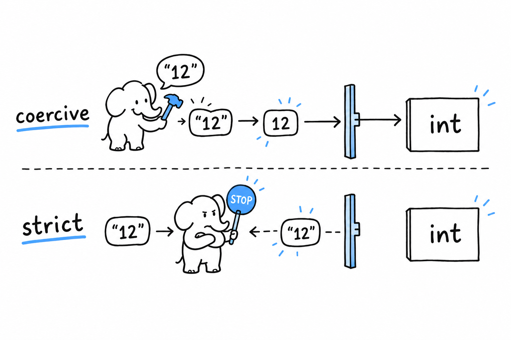
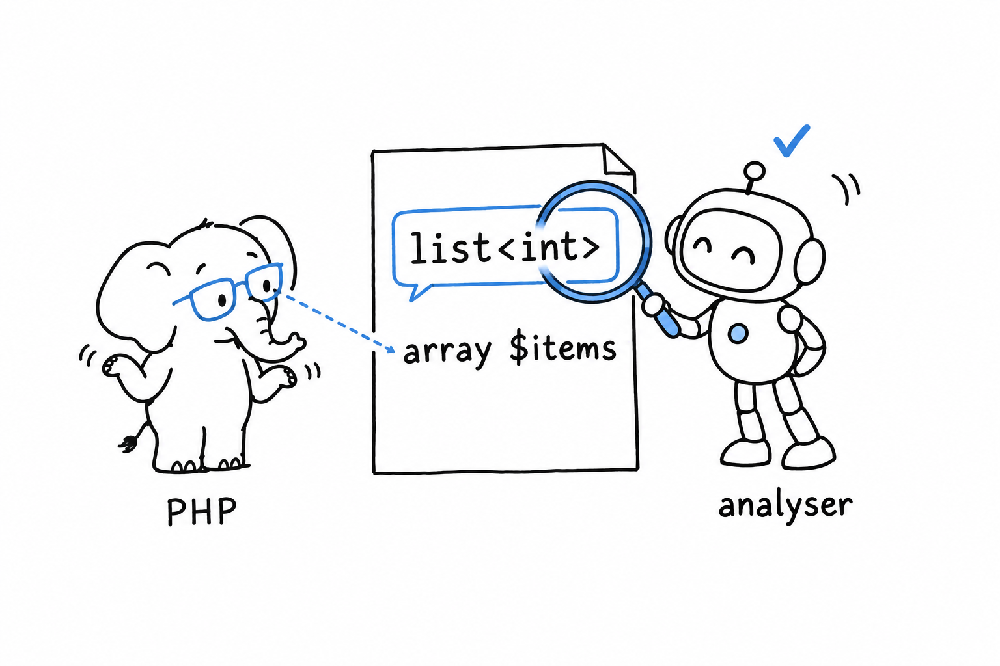

# Types

**PHP is dynamically typed, and every type you write down is checked at runtime.** Not at compile time like Java, not erased like TypeScript. A parameter declared `int` receives an `int` or the call throws a `TypeError`, every time, in production. That is the whole model; the nuance is in what "receives an `int`" means, and that nuance is a switch.

## The types you can write

```php
<?php
declare(strict_types=1);

function describe(int|float $n, ?string $label, bool $verbose = false): string
{
    return ($label ?? 'value') . ': ' . $n . ($verbose ? ' (verbose)' : '');
}

echo describe(3, null), PHP_EOL;          // value: 3
echo describe(2.5, 'pi-ish', true), PHP_EOL; // pi-ish: 2.5 (verbose)
```

Scalars are `int`, `float`, `string`, `bool`. Compound types are `array`, `object`, `callable`, `iterable`, and any class or interface name. On top of those, PHP has a handful of types that only make sense in one position: `void` and `never` as return types (`never` means the function throws or exits), `static` as the return type of a fluent method, `self` for the current class, `mixed` when you really accept anything, and `null`, `true`, `false` as standalone types since PHP 8.2.

They combine. `?string` is `string|null`. `int|string` is a union (PHP 8.0). `Countable&Traversable` is an intersection (PHP 8.1): the object must implement both. `(Countable&Traversable)|null` mixes the two (PHP 8.2), and that is as far as the grammar goes. No generics, no tuples, no structural types.

Types go on parameters, return values, properties, and since PHP 8.3 on class constants:

```php
<?php
declare(strict_types=1);

final class Temperature
{
    public const string UNIT = 'C';

    public function __construct(
        public readonly float $degrees,
    ) {
    }
}

$t = new Temperature(21.5);
var_dump($t->degrees); // float(21.5)
```

Untyped parameters and properties still exist and mean `mixed`. Modern code does not leave them out.

## What `int` really accepts

Here is where PHP differs from everything else. **Without `strict_types`, PHP coerces scalar arguments to the declared type when it can.** Pass the string `"12"` to an `int` parameter and the function receives the integer `12`. Pass `"12abc"` and you get a `TypeError`. Pass `1.5` and you get `1` with a deprecation notice.

| You pass | `int` parameter, coercive mode | `int` parameter, strict mode |
|---|---|---|
| `12` | `12` | `12` |
| `"12"` | `12` | `TypeError` |
| `"12abc"` | `TypeError` | `TypeError` |
| `12.0` | `12` | `TypeError` |
| `1.5` | `1`, deprecated since 8.1 | `TypeError` |
| `true` | `1` | `TypeError` |
| `null` | `TypeError` (`?int` accepts it) | `TypeError` (`?int` accepts it) |

Coercion only concerns scalars. An array is never turned into a string, an object never into an int. And one conversion is always allowed, even in strict mode: an `int` where a `float` is expected, because that never loses information.



## The switch is per file, and per caller

```php
<?php
declare(strict_types=1);

function double(int $n): int
{
    return $n * 2;
}

echo double(21), PHP_EOL;    // 42
echo double('21'), PHP_EOL;  // TypeError: must be of type int, string given
```

Delete the `declare` line and the second call prints 42. The way the switch works surprises almost everyone on at least one point:

**It is per file.** There is no global setting, no `php.ini` flag, no project-wide option. Each file states its own mode, and a file without the line is in coercive mode.

**It applies to calls made from the file, not to functions defined in it.** If `double()` lives in a strict file and is called from a coercive file, `double('21')` coerces. The caller decides. This is deliberate: a library author cannot force strictness on code that calls it, and legacy code keeps working when it calls a modern library.

**It covers return values too.** A strict-mode function that declares `: int` and returns `"42"` throws.

The practical rule is short. Put `declare(strict_types=1);` at the top of every file you write, let your code-style tool enforce it, and stop thinking about it.

> `strict_types` is not "PHP with types on". PHP always checks types. The switch decides whether a string that looks like a number counts as a number.

## Converting on purpose

When you want a conversion, say so:

```php
<?php
declare(strict_types=1);

var_dump((int) '42');        // int(42)
var_dump((int) '42 apples'); // int(42): a cast takes the leading digits
var_dump((int) 'apples');    // int(0)
var_dump((string) 3.0);      // string(1) "3"
var_dump((bool) '0');        // bool(false): "0" is falsy, "0.0" is not
var_dump(intval('0x1A', 16)); // int(26)
```

Casts never throw and never warn; they do their best with what they get. That makes them the right tool for user input you have already validated, and the wrong tool for anything you have not. To check before converting, `is_int()`, `is_string()`, `is_numeric()` and their siblings return booleans, and `filter_var($x, FILTER_VALIDATE_INT)` returns the integer or `false`.

To see what you are holding, `var_dump()` prints the type and value. `get_debug_type()` (PHP 8.0) returns the name you would write in a declaration (`int`, `string`, `App\User`), where the older `gettype()` returns `integer` and `object`.

## Null and the standard library

Your own functions reject `null` for a non-nullable parameter in both modes. **Built-in functions are more forgiving, and that forgiveness is on its way out.** `strlen(null)` returns `0` today with a deprecation notice (since PHP 8.1), and the next major version is expected to throw. Code that reads `strlen($_GET['q'])` on a missing parameter is living on borrowed time; `strlen($_GET['q'] ?? '')` is not.

The same tolerance shows up in the other direction. Where a function used to return `false` on failure, newer ones throw a `ValueError` (PHP 8.0), and the ones that still return `false` are documented that way. When the documentation says `string|false`, check for `false` with `===`, never with `if (!$result)`, because `"0"` and `""` are falsy too.

## Numbers, briefly

An `int` is 64 bits on every platform you will meet. Overflow does not wrap; **an integer that overflows becomes a float**, silently:

```php
<?php
declare(strict_types=1);

var_dump(PHP_INT_MAX + 1); // float(9.223372036854776E+18)
var_dump(0.1 + 0.2 === 0.3); // bool(false), as in every IEEE 754 language
var_dump(intdiv(7, 2), 7 / 2); // int(3), float(3.5)
```

Division always produces a float unless both operands are integers and the result is exact. `intdiv()` gives integer division; `%` is the integer modulo; `fmod()` the float one. For money or anything decimal, the `bcmath` extension and its `BcMath\Number` class (PHP 8.4) do arbitrary-precision arithmetic.

## Where the generics went

There are none in the language. `array` is the type of every array, whatever it contains, and a `Collection` class cannot say what it collects. **The ecosystem answered with docblocks read by static analysers**, and on a maintained project that answer is as binding as a compiler:

```php
<?php
declare(strict_types=1);

/**
 * @template T
 * @param list<T> $items
 * @param callable(T): bool $keep
 * @return list<T>
 */
function keep(array $items, callable $keep): array
{
    return array_values(array_filter($items, $keep));
}

/** @var list<int> $evens */
$evens = keep([1, 2, 3, 4], fn (int $n) => $n % 2 === 0);
```

PHP reads `array` and `callable`. PHPStan and Psalm read `list<T>` and `callable(T): bool`, infer that `$evens` holds integers, and fail the build if you pass strings. `list<int>`, `array<string, User>`, `non-empty-string`, `int<1, max>`: the vocabulary is richer than the language, and the two tools agree on most of it. [Tests, Static Analysis, and Tooling](ch12-tooling.md) shows how to set one up.



## The trap

The first mistake is to write `function f(int $n)` in a file without `strict_types`, pass `"12"` in a test, watch it work, and conclude that PHP checks nothing. It checked; it also converted. The second is the reverse: adding `declare(strict_types=1)` to one file and expecting the whole application to become strict. Only the calls in that file changed.

Both have the same cure. The line goes in every file, a code-style rule enforces it, and a static analyser catches at build time the cases the runtime would catch in production.

Arrays were mentioned three times in this chapter without a word about what they are. That is because they are not what your language calls an array. [Arrays](ch04-arrays.md) sets that straight.
