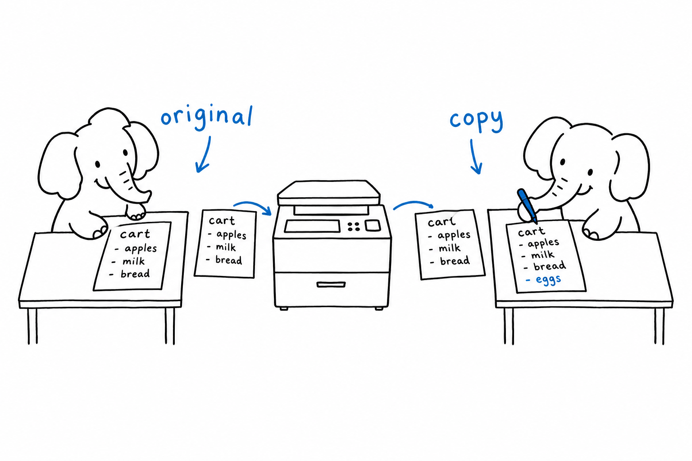
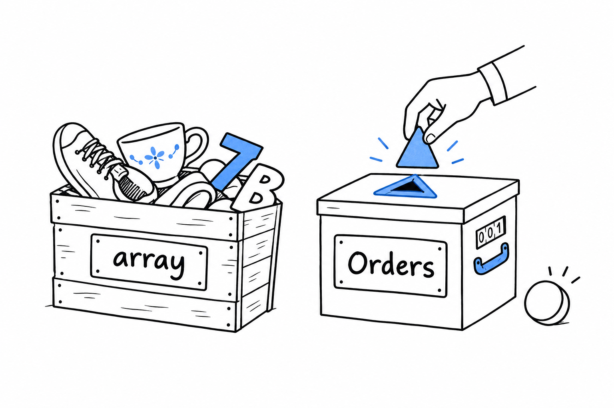

# Arrays

**A PHP array is an ordered hash map, and it is the only built-in collection.** It plays the role of Python's list and dict at once, of a JavaScript array and object at once, of Java's `ArrayList` and `LinkedHashMap` at once. Keys are integers or strings, values are anything, and insertion order is always preserved.

```php
<?php
declare(strict_types=1);

$list = ['apple', 'pear'];                  // keys 0, 1
$map  = ['name' => 'Ada', 'born' => 1815];  // string keys
$mixed = [5 => 'five', 'six', 'x' => 'ex']; // keys 5, 6, 'x'

$list[] = 'plum';          // append, key 2
$map['died'] = 1852;       // insert, at the end

var_dump(array_is_list($list)); // true
var_dump(array_is_list($map));  // false
```

There is no separate list type. A "list" is an array whose keys happen to be 0, 1, 2 and so on, in that order, and `array_is_list()` (PHP 8.1) tells you whether that holds. The distinction matters when the array leaves PHP: `json_encode()` emits `[...]` for a list and `{...}` for anything else.

## Keys are normalised

**A key is either an `int` or a `string`, and PHP converts everything else on the way in.** A numeric string becomes the integer it names, a float loses its decimals, a boolean becomes 0 or 1, and `null` becomes the empty string:

```php
<?php
declare(strict_types=1);

$a = [];
$a['1'] = 'a';   // key 1, not '1'
$a[1.7] = 'b';   // key 1, overwrites (and a deprecation notice since 8.1)
$a[true] = 'c';  // key 1, overwrites again
$a[null] = 'd';  // key ''

var_dump($a); // [1 => 'c', '' => 'd']
```

Three writes, one key. The rule is convenient when a database returns ids as strings, and a trap when you expected `'1'` and `1` to be two entries. They never are.

## Reading a key that is not there

Reading a missing key emits a warning and yields `null`. Two functions tell you whether a key exists, and they disagree about `null`:

```php
<?php
declare(strict_types=1);

$user = ['name' => 'Ada', 'email' => null];

var_dump(isset($user['email']));            // false: the value is null
var_dump(array_key_exists('email', $user)); // true: the key is there
var_dump(isset($user['phone']));            // false, no warning

$phone = $user['phone'] ?? 'unknown';       // no warning, default applied
```

**`isset()` answers "is there a non-null value here?", `array_key_exists()` answers "is the key present?".** For almost everything, `??` is what you want: it reads the key if it exists and is not `null`, and falls back otherwise, silently.

## Arrays are values

This is the one to remember. **Assigning an array copies it. Passing an array to a function copies it. Returning one copies it.** The original never sees what happens to the copy.

```php
<?php
declare(strict_types=1);

function addItem(array $cart, string $item): array
{
    $cart[] = $item;
    return $cart;
}

$cart = ['book'];
$bigger = addItem($cart, 'pen');

var_dump(count($cart));   // 1
var_dump(count($bigger)); // 2
```

In JavaScript, Python or Java, `cart` would now hold two items, because those languages hand around a reference to one shared structure. In PHP the function got its own array, and to give you the result it must return it.



The cost is smaller than it sounds. Under the hood PHP shares the memory and only duplicates the data at the first write, a scheme called copy-on-write. Passing a ten-thousand-element array to a function that only reads it costs nothing.

You can opt out with a reference, `&`, on the parameter:

```php
function addItemInPlace(array &$cart, string $item): void
{
    $cart[] = $item;
}
```

Reserve it for the rare hot loop where the copy is measurable. A function that returns a new array is easier to read, to test and to type, and the `sort()` family, which mutates in place through references, is the legacy exception, not the model.

Objects behave the other way round: **an object variable is a handle, and copies of the handle point at the same object**, as in every language you know. When you need reference semantics for a collection, wrap it in a class. [Classes](ch06-classes.md) covers that.

## foreach, by value and by reference

`foreach` iterates over a copy, so mutating `$item` inside the loop changes nothing:

```php
<?php
declare(strict_types=1);

$prices = [10, 20, 30];

foreach ($prices as $price) {
    $price *= 2; // local copy, the array is untouched
}

foreach ($prices as &$price) {
    $price *= 2; // writes through
}
unset($price); // break the reference

var_dump($prices); // [20, 40, 60]
```

The `unset()` after a by-reference loop is not decoration. Without it, `$price` still points at the last element, and the next innocent `$price = 0;` overwrites `$prices[2]`. Most PHP developers have been bitten by this once. A `foreach` with `$key => $value` and a write to `$prices[$key]` avoids the whole question, and so does `array_map()`.

## Taking arrays apart and putting them together

Destructuring works on lists and on maps:

```php
<?php
declare(strict_types=1);

[$x, $y] = [3, 4];
['id' => $id, 'name' => $name] = ['id' => 7, 'name' => 'Ada'];
[, $second] = ['skip', 'keep']; // holes are allowed

$defaults = ['color' => 'blue', 'size' => 'M'];
$order = [...$defaults, 'size' => 'L']; // string keys spread since 8.1

var_dump($order); // ['color' => 'blue', 'size' => 'L']
```

The spread with string keys behaves like JavaScript's `{...defaults, size: 'L'}`: later entries win. With integer keys, spreading renumbers, so `[...[1, 2], ...[3]]` is `[1, 2, 3]`, not a map with duplicate keys.

## The functional trio and its cousins

`array_map()`, `array_filter()` and `array_reduce()` do what their names say, with a wrinkle each:

```php
<?php
declare(strict_types=1);

$orders = [
    ['id' => 1, 'total' => 40, 'paid' => true],
    ['id' => 2, 'total' => 15, 'paid' => false],
    ['id' => 3, 'total' => 90, 'paid' => true],
];

$totals = array_map(fn(array $o) => $o['total'], $orders);       // [40, 15, 90]
$paid   = array_filter($orders, fn(array $o) => $o['paid']);      // keys 0 and 2
$sum    = array_reduce($totals, fn(int $carry, int $t) => $carry + $t, 0); // 145

echo json_encode($paid);                // {"0":{...},"2":{...}}  an object!
echo json_encode(array_values($paid));  // [{...},{...}]          a list
```

**`array_filter()` keeps the original keys.** After filtering a list, the keys have holes, `array_is_list()` says false, and `json_encode()` produces an object. `array_values()` renumbers. Note also the argument order: the array comes first for `array_filter()` and `array_reduce()`, the callback first for `array_map()`. That inconsistency is thirty years old, and your editor's autocomplete is the cure.

PHP 8.4 added the searches you kept writing by hand: `array_find()` returns the first matching element, `array_find_key()` its key, `array_any()` and `array_all()` return booleans. PHP 8.5 added `array_first()` and `array_last()`, which return the first and last values regardless of keys, next to the older `array_key_first()` and `array_key_last()`.

```php
// PHP 8.4
$firstBig = array_find($orders, fn(array $o) => $o['total'] > 50);
$allPaid  = array_all($orders, fn(array $o) => $o['paid']);   // false
```

Sorting mutates in place and, since PHP 8.0, is stable. `usort()` with the spaceship operator is the idiom:

```php
usort($orders, fn(array $a, array $b) => $b['total'] <=> $a['total']);
```

`sort()` and `usort()` renumber the keys; `asort()` and `uasort()` keep them; `ksort()` sorts by key. `array_column($orders, 'total', 'id')` pulls one field out of a list of rows and, given the third argument, indexes the result by another. `array_combine()`, `array_flip()`, `array_unique()`, `array_slice()` and `array_splice()` are there too, with `count()` for the length.

You will also meet `compact()` and `extract()`, which turn local variables into an array and back. Recognise them, do not write them: they defeat static analysis and your editor.

## Iterating anything

`foreach` is not limited to arrays. **Anything `iterable` works: arrays, generators, and objects implementing `Iterator` or `IteratorAggregate`.** A function that accepts `iterable` can be fed a million-row generator without loading the million rows, which [Functions and Closures](ch05-functions-and-closures.md) picks up.

```php
<?php
declare(strict_types=1);

function total(iterable $amounts): int
{
    $sum = 0;
    foreach ($amounts as $amount) {
        $sum += $amount;
    }
    return $sum;
}

echo total([1, 2, 3]); // 6
```

## When an array is not enough

An array cannot say what it contains. `array $orders` tells the reader nothing, and the language has no `array<Order>`. Two answers coexist. The lightweight one is a docblock, `@param list<Order> $orders`, which PHPStan and Psalm enforce as if it were a real type and your editor uses for completion. The heavier one is a small class: a `final class Orders` holding a private array, exposing exactly the operations you need, and implementing the interfaces that let it behave like an array where useful: `Countable` for `count()`, `ArrayAccess` for `$orders[0]`, `IteratorAggregate` for `foreach`.



Two built-in classes cover cases arrays cannot. `SplObjectStorage` maps objects to data using the object itself as key. `WeakMap` (PHP 8.0) does the same without keeping the object alive, which is how caches keyed by entity avoid leaking.

> Two habits to break: expecting a function to mutate the array you pass it, and forgetting that `array_filter()` leaves holes. Return the new array, and wrap in `array_values()` before encoding.

Arrays are what most PHP code passes around. Functions are what it passes them to, and PHP's closures capture differently from the ones you know. That is [Functions and Closures](ch05-functions-and-closures.md).
