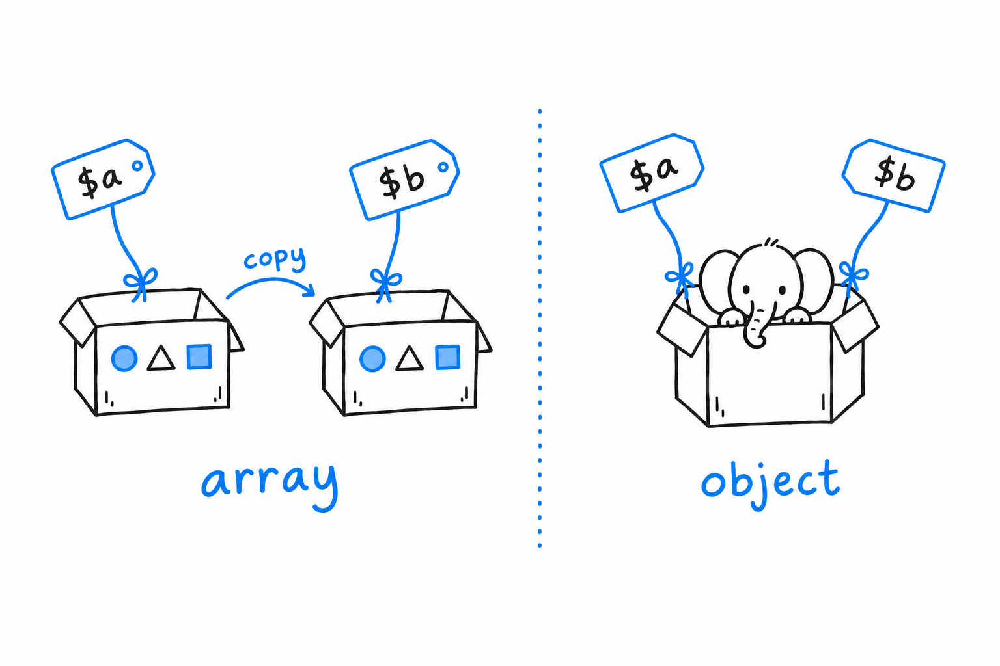

# Classes

**A modern PHP class is short, typed, and mostly immutable.** The constructor declares the properties, the types are checked at runtime, and most of the boilerplate you remember from Java, or from PHP 5, is gone. Here is one, whole:

```php
<?php
declare(strict_types=1);

namespace App\Billing;

final class Invoice
{
    private array $lines = [];

    public function __construct(
        public readonly string $number,
        public readonly \DateTimeImmutable $issuedAt,
    ) {
    }

    public function addLine(string $label, int $cents): static
    {
        $this->lines[] = ['label' => $label, 'cents' => $cents];

        return $this;
    }

    public function total(): int
    {
        return array_sum(array_column($this->lines, 'cents'));
    }
}

$invoice = new Invoice('2026-0042', new \DateTimeImmutable('2026-09-14'));
$invoice->addLine('Hosting', 1200)->addLine('Support', 800);

echo $invoice->number, ': ', $invoice->total(), PHP_EOL; // 2026-0042: 2000
```

Read it top to bottom. `namespace` puts the class in `App\Billing`, so its full name is `App\Billing\Invoice` (the [Composer chapter](ch09-composer-and-namespaces.md) explains how that maps to a file). `final` forbids subclassing; modern PHP code makes classes `final` by default and opens them on purpose. The constructor has no body: **writing `public readonly string $number` in the parameter list declares the property, types it, and assigns it**, all in one line. This is constructor promotion (PHP 8.0), and it removed most of the ceremony from PHP classes. `readonly` (PHP 8.1) makes the property assignable once, in the constructor, and never again. `static` as a return type means "the class of the object this was called on", which is what a fluent method wants.

Two symbols do all the member access. `->` reaches an instance member, `::` reaches a static one or a constant. `$this` is the current object, and you always write it: there is no implicit `this`.

## Objects travel by handle

Arrays copy when you assign them (the [Arrays chapter](ch04-arrays.md) has the details). Objects do not. **Assigning or passing an object copies a handle to the same object**, the way Java, Python and JavaScript do it:

```php
<?php
declare(strict_types=1);

final class Cart
{
    public array $items = [];
}

function addApple(Cart $cart): void
{
    $cart->items[] = 'apple';
}

$cart = new Cart();
addApple($cart);
echo count($cart->items), PHP_EOL; // 1, the caller sees the change
```

No `&` is involved: reference parameters (`&$x`) are a different mechanism, for variables, and you almost never need them with objects.

`clone $cart` makes a shallow copy: a new object whose properties hold the same values, so an object stored inside is shared between the two copies. Define `__clone()` if the copy needs its own inner objects.

Two comparisons exist. `==` compares state, property by property; `===` asks whether both sides are the same object. `$a === clone $a` is `false`.



## Immutability without getters

The classic PHP 5 class had a private property, a getter, and sometimes a setter. Three modern features replace that pattern, and you will see all three in codebases written after 2024.

`readonly` you have met. When every property is readonly, mark the class instead (PHP 8.2):

```php
<?php
declare(strict_types=1);

final readonly class Money
{
    public function __construct(
        public int $amount,
        public string $currency,
    ) {
    }

    public function add(Money $other): self
    {
        return new self($this->amount + $other->amount, $this->currency);
    }
}
```

Every property is public and nobody can change it. You get a value object with no getters at all.

**Asymmetric visibility (PHP 8.4) lets the outside read a property that only the class can write:**

```php
// PHP 8.4
final class Counter
{
    public private(set) int $count = 0;

    public function increment(): void
    {
        $this->count++;
    }
}

$c = new Counter();
$c->increment();
echo $c->count; // 1
$c->count = 5;  // Error: Cannot modify private(set) property Counter::$count
```

That is the getter, gone. Where you need logic on read or write, property hooks (PHP 8.4) attach it to the property itself, like a C# property or Python's `@property`:

```php
// PHP 8.4
final class User
{
    public string $email {
        set(string $value) {
            if (!filter_var($value, FILTER_VALIDATE_EMAIL)) {
                throw new \InvalidArgumentException("Invalid email: $value");
            }
            $this->email = strtolower($value);
        }
    }

    public string $domain {
        get => substr($this->email, strpos($this->email, '@') + 1);
    }
}

$u = new User();
$u->email = 'Ada@Example.org';
echo $u->domain; // example.org
```

To the caller these are plain properties. Inside, `set` validates and normalises, and `get` computes. A property with only a `get` hook and no backing store is a computed property.

## Interfaces, abstract classes, traits

Interfaces and abstract classes work as they do in Java and C#: an interface lists method signatures and constants, an abstract class may carry implementation, a class implements many interfaces and extends one parent. `#[\Override]` (PHP 8.3) on a method makes PHP check that the parent really has it, which catches typos in overrides.

Traits are the part with no exact equivalent in most languages. **A trait is a block of methods and properties that the compiler copies into every class that `use`s it.** Ruby's mixins are the closest anchor; Rust's traits are not, despite the name.

```php
<?php
declare(strict_types=1);

trait HasTimestamps
{
    private ?\DateTimeImmutable $createdAt = null;

    public function touch(): void
    {
        $this->createdAt ??= new \DateTimeImmutable();
    }
}

final class Article
{
    use HasTimestamps;
}

$a = new Article();
$a->touch();
```

Traits are handy for cross-cutting helpers and easy to overuse. A class that `use`s five traits is five files you have to read to know what it does. Prefer composition where you can.

`static` versus `self` is a one-paragraph subject. `self` names the class where the code is written; `static` names the class of the object at runtime. In a static factory method inside a parent class, `new static()` builds the subclass that was actually called; `new self()` always builds the parent.

## Construction

PHP has one constructor per class and no method overloading. Two idioms fill the gap: named arguments (PHP 8.0) for optional parameters, and static factory methods for alternative ways to build:

```php
<?php
declare(strict_types=1);

final readonly class Period
{
    private function __construct(
        public \DateTimeImmutable $start,
        public \DateTimeImmutable $end,
    ) {
    }

    public static function fromStrings(string $start, string $end): self
    {
        return new self(new \DateTimeImmutable($start), new \DateTimeImmutable($end));
    }

    public static function year(int $year): self
    {
        return self::fromStrings("$year-01-01", "$year-12-31");
    }
}

$fy = Period::year(2026);
echo $fy->end->format('Y-m-d'), PHP_EOL; // 2026-12-31
```

A private constructor plus public factories reads as well as a set of overloaded constructors, and it names each variant.

Since PHP 8.4 you can chain a call on a fresh object without wrapping it in parentheses: `new Period(...)->start` used to need `(new Period(...))->start`.

For immutable objects, "change" means "make a modified copy". PHP 8.5 gives that its own syntax: `clone($money, ['amount' => 500])` returns a copy with the listed properties replaced. The usual visibility rules apply, and a `readonly` property can only be written from inside its class, so the call lives in a `withAmount()` method rather than at the call site. Before 8.5, that same method cloned and assigned inside `__clone()`, which PHP 8.3 permitted for readonly properties.

## Strings, magic, and metadata

Any object can print itself by implementing `__toString()`. Declaring it makes the class implement `Stringable` (PHP 8.0) automatically, so you can type a parameter as `string|Stringable` and accept both.

The other double-underscore methods are hooks the engine calls: `__get` and `__set` run when code touches a property that does not exist, `__call` when it calls a method that does not exist. Frameworks and ORMs use them to build fluent APIs and lazy models. Recognise them; do not reach for them in application code. Related: creating a property that was never declared (`$obj->foo = 1` with no `$foo` in the class) has been deprecated since PHP 8.2 and is planned to become an error in the next major version. Declare your properties.

**Attributes (PHP 8.0) are structured metadata on a class, method, property or parameter, read through reflection.** Java annotations and C# attributes are the direct anchor:

```php
<?php
declare(strict_types=1);

#[\Attribute(\Attribute::TARGET_METHOD)]
final readonly class Route
{
    public function __construct(public string $path) {}
}

final class HomeController
{
    #[Route('/')]
    public function index(): string
    {
        return 'Hello';
    }
}

$method = new \ReflectionMethod(HomeController::class, 'index');
foreach ($method->getAttributes(Route::class) as $attribute) {
    echo $attribute->newInstance()->path, PHP_EOL; // /
}
```

An attribute is itself a class marked `#[\Attribute]`. Nothing happens at runtime until something calls `getAttributes()`; the metadata is inert until read. Routing, validation, serialisation and test frameworks all build on this.

`Invoice::class` yields the fully qualified name as a string, which is what you pass around instead of hardcoding `'App\Billing\Invoice'`. `$x instanceof Invoice` checks type at runtime and is `false` rather than an error when `$x` is not an object. Lazy objects (PHP 8.4) let a class be instantiated without running its constructor until a property is first touched, a tool for dependency injection containers and ORMs rather than everyday code.

There are no generics. A `Collection` class holds `mixed` as far as the engine is concerned; the `@template` docblocks described in [Types](ch03-types.md) give PHPStan and Psalm what the engine lacks.

## The trap

A function that receives an object and "just tweaks it a bit" tweaks the caller's object too. If you meant a local modification, `clone` first, or design the class as readonly and return a new instance.

And `readonly` is shallow. It freezes the property slot, not what the slot points to. A `readonly array $items` cannot be reassigned, but a `readonly Cart $cart` still lets anyone holding `$cart` push items into it. Immutability of the whole graph is a design decision, not a keyword.

With classes in hand, the question is how PHP represents a fixed set of choices. [Enums and match](ch07-enums-and-match.md) answers it.
