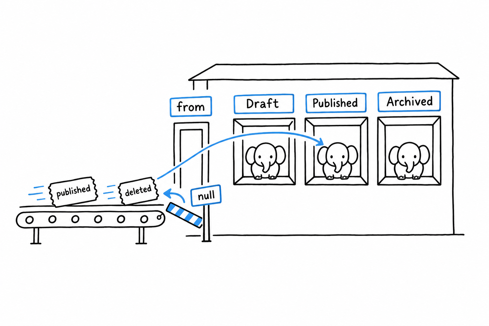

# Enums and match

**A PHP enum is a class with a fixed set of instances, and `match` is the expression that picks one branch per instance.** Together they replace the class-constants-and-`switch` pattern that older PHP code is full of. If you know Java enums, you know most of this already; if you come from Python's `Enum` or from TypeScript's string literal unions, the shape will look familiar and the checks will be stricter.

```php
<?php
declare(strict_types=1);

enum Status: string
{
    case Draft = 'draft';
    case Published = 'published';
    case Archived = 'archived';

    public function label(): string
    {
        return match ($this) {
            self::Draft => 'Draft',
            self::Published => 'Live',
            self::Archived => 'Archived',
        };
    }

    public function canEdit(): bool
    {
        return $this !== self::Archived;
    }
}

$status = Status::from('published');   // Status::Published
echo $status->label(), PHP_EOL;         // Live
echo $status->value, PHP_EOL;           // published
var_dump($status->canEdit());           // bool(true)
var_dump(Status::tryFrom('deleted'));   // NULL
```

## Cases, values, and methods

An enum (PHP 8.1) declares its `case`s and nothing else can be one. `Status::Draft` is an object, the only object of its kind, so **two references to the same case are the same object and `===` is the comparison to use**. Enums cannot be instantiated with `new`, cannot be extended, and cannot hold state: no properties, no per-instance data. What they can have is methods, constants, static methods, and interfaces to implement.

The `: string` after the name makes this a backed enum: each case carries a scalar (`string` or `int`) reachable through `->value`. `from()` turns a scalar back into a case and throws a `ValueError` when nothing matches; `tryFrom()` returns `null` instead. That pair is how an enum crosses a boundary: a database column, a JSON field, a query string. A pure enum, declared without a backing type, has cases and no `->value`; use it when the choice never leaves your code.

`cases()` returns every case in declaration order, which is what a dropdown or a validation rule wants:

```php
$allowed = array_map(fn (Status $s) => $s->value, Status::cases());
// ['draft', 'published', 'archived']
```

Every case also has `->name` (`'Draft'`), useful for logging.

Because `$this` inside an enum method is a case, behaviour that depends on the case belongs on the enum, not in `if` chains scattered across the code. `label()` and `canEdit()` above are the pattern: the enum knows what each of its cases means.

Since PHP 8.2 enum cases are allowed in constant expressions, so they can be default parameter values, class constants, and attribute arguments: `public function __construct(private Status $status = Status::Draft)`.



## match

`match` (PHP 8.0) looks like `switch` and behaves like an expression in Rust or a `when` in Kotlin. Four rules define it.

**It returns a value.** `$label = match ($status) { ... };` and `return match (...)` are the normal uses. There is no `break`, because there is no fallthrough: exactly one arm runs.

**It compares with `===`.** `match ('1') { 1 => 'int', '1' => 'string' }` picks the second arm. `switch` would have picked the first.

**It must be exhaustive.** If no arm matches and there is no `default`, PHP throws `UnhandledMatchError`. Add a case to an enum, forget to update a `match` on it, and the first time that case reaches the `match` you get an exception naming the exact line, rather than a silent `null`.

**One arm can list several values**, separated by commas:

```php
<?php
declare(strict_types=1);

enum Status: string
{
    case Draft = 'draft';
    case Published = 'published';
    case Archived = 'archived';
}

function isVisible(Status $status): bool
{
    return match ($status) {
        Status::Published => true,
        Status::Draft, Status::Archived => false,
    };
}
```

Static analysers understand this: PHPStan and Psalm both report a `match` over an enum that leaves a case unhandled, before it ever runs.

The subject of a `match` does not have to be an enum. Any value works, and the `match (true)` idiom turns it into a condition ladder that yields a value:

```php
$size = match (true) {
    $bytes < 1024 => 'small',
    $bytes < 1024 * 1024 => 'medium',
    default => 'large',
};
```

Each arm is compared with `===` against `true`, so each arm is a boolean expression. It reads better than a nested ternary and cannot fall through.

`switch` still exists, with loose comparison, fallthrough, and `break`. You will meet it in older code. In new code, `match` is the right default, and `switch` is for the rare case where you actually want several labels to share a block of statements.

## Nulls and throws as expressions

Two operators pair naturally with `match` and enums.

The nullsafe operator `?->` (PHP 8.0) short-circuits a chain when the left side is `null`: `$order?->customer?->email` is `null` if any link is `null`, instead of an error. Combined with `??` it gives a default in one line: `$email = $order?->customer?->email ?? 'nobody@example.org';`.

`throw` is an expression (PHP 8.0), so it can sit on the right of `??`, in a ternary, or in a `match` arm:

```php
$status = Status::tryFrom($input) ?? throw new \InvalidArgumentException("Unknown status: $input");

$handler = match ($status) {
    Status::Draft => $this->saveDraft(...),
    Status::Published => $this->publish(...),
    Status::Archived => throw new \LogicException('Archived items are read-only'),
};
```

The second example also shows the pattern for dispatching: a `match` that returns a callable, then `$handler($item)`.

## Persistence and behaviour in one place

Here is the full shape, the way it appears in an application: a backed enum for storage, methods for behaviour, `match` where the branches live.

```php
<?php
declare(strict_types=1);

interface HasColor
{
    public function color(): string;
}

enum Priority: int implements HasColor
{
    case Low = 1;
    case Normal = 2;
    case High = 3;

    public const DEFAULT = self::Normal;

    public static function fromLabel(string $label): self
    {
        return match (strtolower($label)) {
            'low' => self::Low,
            'normal', 'medium' => self::Normal,
            'high', 'urgent' => self::High,
            default => throw new \ValueError("Unknown priority: $label"),
        };
    }

    public function color(): string
    {
        return match ($this) {
            self::Low => 'grey',
            self::Normal => 'blue',
            self::High => 'red',
        };
    }

    public function escalate(): self
    {
        return match ($this) {
            self::Low => self::Normal,
            self::Normal, self::High => self::High,
        };
    }
}

$p = Priority::fromLabel('medium');
echo $p->color(), PHP_EOL;              // blue
echo $p->escalate()->name, PHP_EOL;     // High
echo Priority::DEFAULT->value, PHP_EOL; // 2
```

The integer goes in the database. The enum goes everywhere else. There is no `PRIORITY_HIGH = 3` constant to keep in sync with a lookup table of colors somewhere, because the case and its behaviour live in one file.

Compared to the older pattern, class constants plus string flags plus a `switch`, an enum gives you a real type to put in a signature (`function assign(Priority $p)`), which the engine checks, and a closed set the analyser can reason about.

## The trap

Two habits from other languages, and from old PHP, cause the same bug.

Reaching for `switch`: it compares loosely, so `switch (Status::Draft)` with `case 'draft':` never matches (an enum is not equal to its value, under either comparison), and with a plain string subject a `case 0:` matches more than you expect.

Comparing an enum to its backing value: `$status == 'published'` is always `false`. The enum is an object; the string is what it stores. Compare cases to cases (`$status === Status::Published`), or convert first (`$status->value === 'published'`).

The next question a polyglot asks is what happens when something goes wrong. [Errors and Exceptions](ch08-errors-and-exceptions.md) covers a model that has both.
