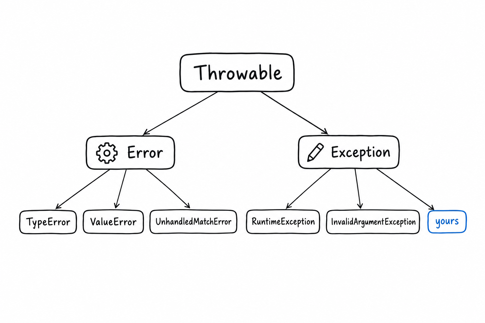

# Errors and Exceptions

**PHP has exceptions, and they work the way Python's or Java's do. It also has an older mechanism, engine errors, that predates exceptions and still exists.** Modern practice is to route everything through the first one. This chapter shows the exception model, then the three lines of configuration that make the old mechanism behave.

## Two hierarchies, one root

Everything you can `throw` and `catch` implements `Throwable`. Under it sit two families.

`Error` is what the engine throws when your code is wrong: `TypeError` for a bad argument, `ValueError` for a right type with an impossible value, `ArgumentCountError`, `DivisionByZeroError`, `UnhandledMatchError` when a `match` finds no arm. You do not throw these yourself, and you rarely catch them, because they mean a bug rather than a condition.

`Exception` is yours. PHP ships a small set in the SPL, and the names are the whole documentation: `InvalidArgumentException`, `RuntimeException`, `LogicException`, `DomainException`, `OutOfRangeException`, `UnexpectedValueException`. Extend one of these rather than `Exception` directly, and callers get a meaningful family to catch.



The syntax has no surprises:

```php
<?php
declare(strict_types=1);

function parsePort(string $raw): int
{
    if (!ctype_digit($raw)) {
        throw new InvalidArgumentException("Not a port: $raw");
    }

    return (int) $raw;
}

try {
    $port = parsePort('80a');
} catch (InvalidArgumentException|ValueError $e) {
    echo 'Bad input: ', $e->getMessage(), PHP_EOL;
} finally {
    echo 'Done.', PHP_EOL;
}
```

`|` catches several types in one block (PHP 7.1). `finally` runs whether or not something was thrown. Catch `Throwable` when you truly mean everything, for instance at the top of a worker loop.

## No checked exceptions, no error values

**A PHP function signals failure by throwing or by returning `null`.** Nothing forces the caller to handle either, and nothing in the signature lists what may be thrown. If you come from Java, there is no `throws` clause and no compile-time check; a `@throws` docblock is a courtesy read by your IDE and by PHPStan or Psalm, not by the engine. If you come from Go or Rust, there is no error return value and no `Result` type in the language. A handful of libraries offer one, but idiomatic PHP does not use them.

The nullable return type plus `??` is the idiom for "maybe":

```php
<?php
declare(strict_types=1);

function findUser(int $id): ?array
{
    return $id === 1 ? ['name' => 'Ada'] : null;
}

$name = findUser(2)['name'] ?? 'anonymous';
echo $name, PHP_EOL; // anonymous
```

The rule of thumb: return `null` when absence is normal, throw when it is not. And since `throw` is an expression (PHP 8.0), the two combine in one line:

```php
$user = findUser($id) ?? throw new RuntimeException("No user $id");
```

## Custom exceptions carry data

A custom exception is a class, so it can hold typed context and offer a named constructor that builds the message for you:

```php
<?php
declare(strict_types=1);

final class InsufficientFunds extends DomainException
{
    public function __construct(
        public readonly int $requested,
        public readonly int $available,
        ?Throwable $previous = null,
    ) {
        parent::__construct(
            "Requested $requested, only $available available",
            previous: $previous,
        );
    }

    public static function forWithdrawal(int $requested, int $available): self
    {
        return new self($requested, $available);
    }
}

try {
    throw InsufficientFunds::forWithdrawal(100, 40);
} catch (InsufficientFunds $e) {
    echo $e->available, PHP_EOL; // 40
}
```

The `previous` argument is how you chain. **Catch a low-level exception, wrap it in one that means something to your caller, and pass the original as `previous`.** `getPrevious()` walks the chain back, and every logger prints it, so nothing is lost.

```php
try {
    $pdo->query($sql);
} catch (PDOException $e) {
    throw new RuntimeException('Order lookup failed', previous: $e);
}
```

## The other mechanism

Before exceptions existed, PHP reported problems by emitting an error of a given level (notice, warning, fatal) and, for anything short of fatal, carrying on. Most of that machinery has been folded into `Error` exceptions over the years: division by zero throws, a wrong argument type throws, calling a method on `null` throws. **A few conditions still emit a warning and continue**: reading an undefined variable, an undefined array key, an undefined property, and every deprecation notice.

```php
<?php
declare(strict_types=1);

$config = [];
echo $config['debug']; // Warning: Undefined array key "debug"
echo 'still running', PHP_EOL;
```

That "still running" is what a polyglot does not expect. The fix is one handler, installed at bootstrap, that turns every engine error into an exception. Every framework does exactly this:

```php
<?php
declare(strict_types=1);

error_reporting(E_ALL);

set_error_handler(function (int $severity, string $message, string $file, int $line): bool {
    throw new ErrorException($message, 0, $severity, $file, $line);
});

$config = [];
echo $config['debug']; // ErrorException: Undefined array key "debug"
```


`ErrorException` is a built-in exception that remembers the severity. From that point on there is only one failure path, and `try` catches all of it.

Three settings complete the picture. `error_reporting(E_ALL)` makes sure nothing is filtered out. `display_errors` is `On` in development and `Off` in production, where errors go to the log instead: an uncaught exception on a public page must never print a stack trace. `set_exception_handler()` receives whatever reaches the top without being caught, which is where you log it and render a generic error page. PHP 8.5 adds `get_error_handler()` and `get_exception_handler()` so that libraries can inspect what is installed before wrapping it.

## What cannot be caught

Fatal errors end the request: running out of memory, exceeding `max_execution_time`, declaring the same class twice. No `catch` sees them. (A parse error in an included file, on the other hand, is a `ParseError` you can catch since PHP 7.) If you must react, `register_shutdown_function()` runs after the script stops, and `error_get_last()` tells you whether the stop was clean. Since PHP 8.5, a fatal error prints a backtrace, so an out-of-memory in production finally points at a line.

## Two operators to recognise

You will meet `@` in older code: `@file_get_contents($url)`. **It silences any warning the expression emits.** Your error handler is still called, but `error_reporting()` returns a reduced mask inside it, which is how a handler can tell that `@` was used. Treat the operator as a smell. The one defensible use is around a function that warns and returns `false` on failure, immediately followed by a check on that return value. Even there, a `try` around an exception-throwing alternative reads better.

`assert()` is the other one. It is a development-time check, stripped from production when `zend.assertions` is set to `-1` in `php.ini`, which is the recommended production value. Use it for invariants that document intent, never for input validation.

## The trap

Two mistakes, both silent. The first is catching `Exception` in a top-level handler and believing you caught everything. A `TypeError` is an `Error`, not an `Exception`, and it walks straight past that block. Catch `Throwable` at the boundary.

The second is the empty catch:

```php
try {
    $cache->delete($key);
} catch (Throwable) {
}
```

The variable can be omitted (PHP 8.0), which makes the block honest about ignoring the exception, and there are cases where ignoring is right. But an empty catch around anything that matters is how a bug hides for a year. Log it, at least.

> Everything that goes wrong should reach you as one exception, in one place. PHP will do that, once you ask.

That handler, and every class you throw, live in files that PHP has to find. [Namespaces, Composer, and Autoloading](ch09-composer-and-namespaces.md) explains how it finds them.
