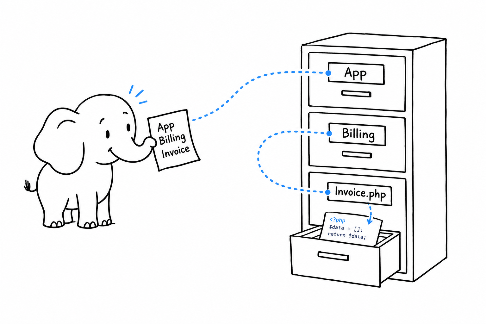
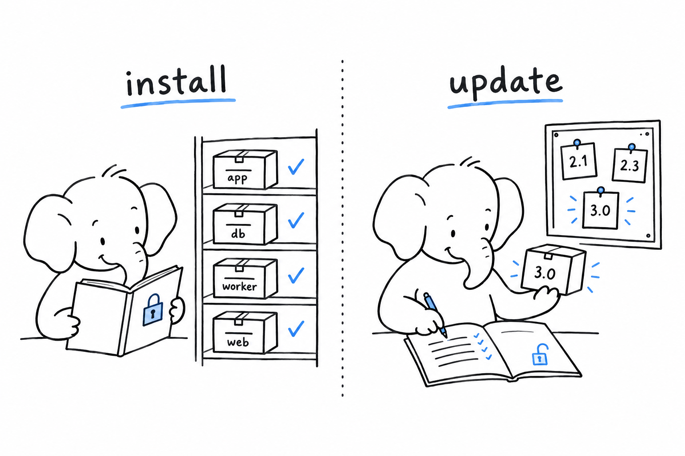

# Namespaces, Composer, and Autoloading

**PHP has no module system. It has three smaller things, `require`, namespaces, and an autoload hook, and Composer assembles them into a package manager** that behaves like npm, pip, Maven or Cargo. You will never write a `require` for one of your own classes again, but it helps to know what Composer does on your behalf.

## The three primitives

`require 'file.php';` reads and runs a file, once per call. That was how code was shared in 2005, and it is still how the whole thing bootstraps: a single `require` of `vendor/autoload.php` at the top of your entry point.

A namespace is a prefix on a class name. `namespace App\Billing;` at the top of a file makes every class declared in it `App\Billing\Something`. Nothing else: no hierarchy, no visibility, no folder. `App\Billing` is not "inside" `App`; they are two strings that happen to share a prefix.

The autoload hook is the piece that makes the first two useful. **When PHP meets a class it has not seen, it calls a function you registered, passing the class name, and that function is expected to `require` the right file.** After that PHP retries.

```php
<?php
declare(strict_types=1);

spl_autoload_register(function (string $class): void {
    $file = __DIR__ . '/src/' . str_replace('\\', '/', $class) . '.php';
    if (is_file($file)) {
        require $file;
    }
});

$invoice = new App\Billing\Invoice(); // loads src/App/Billing/Invoice.php
```

That is the entire mechanism. Composer writes a better version of that closure, with a cache, and hands it to you.



## PSR-4: name to path

The rule the closure above follows has a name, PSR-4, and Composer implements it from a block in `composer.json`:

```json
{
    "name": "acme/shop",
    "type": "project",
    "require": {
        "php": "^8.4",
        "ext-intl": "*"
    },
    "require-dev": {
        "phpunit/phpunit": "^12.0"
    },
    "autoload": {
        "psr-4": { "App\\": "src/" }
    },
    "autoload-dev": {
        "psr-4": { "App\\Tests\\": "tests/" }
    }
}
```

`App\Billing\Invoice` lives in `src/Billing/Invoice.php`. One class per file, file name equal to class name, folders equal to namespace segments after the prefix. The layout that results is the same on every modern PHP project you will open:

```text
shop/
├── composer.json
├── composer.lock
├── public/
│   └── index.php        # require __DIR__ . '/../vendor/autoload.php';
├── src/
│   └── Billing/
│       └── Invoice.php  # namespace App\Billing;
├── tests/
│   └── Billing/
│       └── InvoiceTest.php
└── vendor/              # generated, not committed
```

Add a class under `src/`, and it is found on the next request with no command to run. PSR-4 resolves by path at call time. The older `classmap` strategy scans folders into a generated array and needs `composer dump-autoload` after every new file; you will meet it in legacy projects.

## Composer, in the vocabulary you know

`composer.json` is your `package.json`. `composer.lock` is the lockfile. `vendor/` is `node_modules`, generated and ignored by Git. Packagist is the registry.

```bash
composer init                          # interactive composer.json
composer require monolog/monolog       # add and install, updates the lock
composer require --dev phpstan/phpstan # development-only dependency
composer install                       # reproduce exactly what the lock says
composer update                        # resolve anew, rewrite the lock
composer update monolog/monolog        # ... for one package only
composer show                          # what is installed, with versions
composer outdated                      # what has a newer release
composer audit                         # known vulnerabilities in the lock
composer dump-autoload -o              # regenerate the autoloader, optimised
```

**`install` obeys the lock; `update` rewrites it.** In CI and in production you run `install`, and you get the exact versions your colleague tested. Commit the lock for an application. For a library, most authors do not, so that the library is tested against whatever its users resolve; the debate is the same one you have had in every other ecosystem.

Version constraints follow semver, and `^8.4` means "8.4 or any later 8.x". The `php` entry in `require` is a constraint too; with `config.platform.php` you can pin the version Composer resolves against, so a developer on PHP 8.5 does not pull a package your production 8.4 cannot run.

Scripts live under a `scripts` key and run with `composer run name` or as lifecycle hooks (`post-install-cmd`), the way npm scripts do. Extensions are not packages: `ext-intl` in `require` only checks that the extension is present, and installing it is the job of your package manager, PECL, or PIE. Tools you would install globally elsewhere (linters, analysers) go in `require-dev` instead, so every developer and CI runs the same version; `composer global require` exists and is best left alone. A monorepo declares its inner packages as `path` repositories, and Composer symlinks them.



## Living with namespaces

Inside a file, a `use` statement imports a name so you can write it short. Aliases resolve collisions, and functions and constants can be imported too:

```php
<?php
declare(strict_types=1);

namespace App\Billing;

use App\Customer\Customer;
use DateTimeImmutable as Date;
use function App\Support\money;
use const App\Support\CURRENCY;

final class Invoice
{
    public function __construct(
        public readonly Customer $customer,
        public readonly Date $issuedOn,
    ) {
    }

    public function total(): string
    {
        return money(1999, CURRENCY);
    }
}

echo Invoice::class, PHP_EOL; // App\Billing\Invoice
```

`Invoice::class` gives the fully qualified name as a string, which is what you pass to a container, a mock, or `instanceof` checks that take a string. A leading backslash, `\DateTimeImmutable`, names a class from the global namespace without a `use`.

**Functions fall back to the global namespace; classes do not.** Calling `strlen()` inside `App\Billing` looks for `App\Billing\strlen` first, then `strlen`. Calling `new DateTimeImmutable()` without a `use` or a leading backslash fails. You will see `\strlen()` in some libraries: the backslash skips the lookup and lets OPcache inline a few built-ins. It is a micro-optimisation, not a convention you need to adopt.

## The standards worth knowing

The PHP-FIG is the group where framework and library authors agree on interfaces, published as PSRs. **A PSR is a contract, not a library**: implementations come from many vendors, and you can swap one for another because your code only sees the interface. The ones you will meet in the first week:

- **PSR-4** autoloading, above.
- **PER Coding Style**, the successor of PSR-12: brace placement, indentation, naming. PHP-CS-Fixer or PHP_CodeSniffer enforces it.
- **PSR-3** `LoggerInterface`. Every library logs through it; you plug in the logger you like.
- **PSR-7**, **PSR-15** and **PSR-17**: HTTP request and response objects, middleware, and their factories. The language's own `$_GET` and `header()` are covered in [A Web Request, Without a Framework](ch11-web-request.md); PSR-7 is the object model libraries share on top.
- **PSR-11** `ContainerInterface`, so a library can ask any container for a service.
- **PSR-14** event dispatching, **PSR-6** and **PSR-16** caching.

A library that types its constructor against `Psr\Log\LoggerInterface` works in every framework listed in this book. That interoperability is why the ecosystem has fewer forks and rewrites than its size would suggest.

## The trap

Never edit a file in `vendor/`. The next `composer install` on any machine erases the change, and nobody will know why production differs from your laptop. Fork the package, or override the class through your own autoload entry, or send the patch upstream.

The second trap is quieter. You add a class, PHP says it does not exist, and you spend twenty minutes on a typo that is not there. Check the namespace against the folder: `App\Billing\Invoice` must be `src/Billing/Invoice.php`, letter for letter, case included on Linux. If the project uses `classmap` rather than `psr-4`, run `composer dump-autoload` and move on.

> Composer is not a build step. There is nothing to compile, bundle or transpile. `composer install`, then run the code.

With classes found and packages installed, what remains is the standard library you will lean on every day. [Strings, Numbers, Dates, and JSON](ch10-standard-library.md) is the tour.
