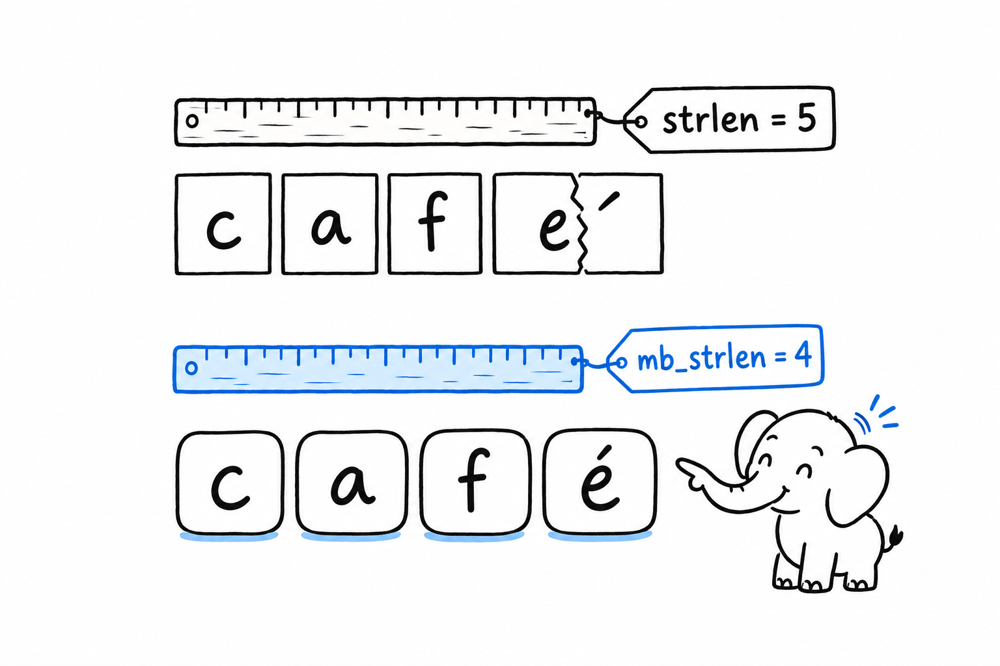
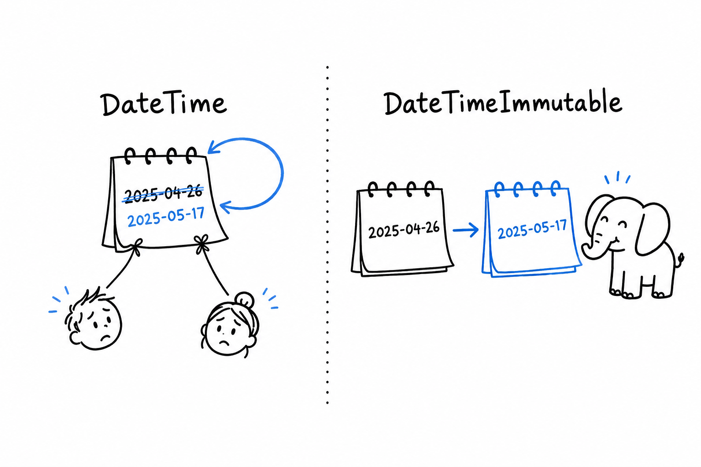

# Strings, Numbers, Dates, and JSON

**PHP ships with a large standard library, and most of it is functions, not methods.** You do not call `$s.upper()`. You call `strtoupper($s)`. There is no string class, no number class, no receiver: values go in as arguments, results come out as return values. Once you accept that, the library is wide, fast, and documented function by function on php.net, where each page has the signature, the changelog by version, and examples worth reading.

The names are inconsistent. `strlen` sits next to `str_replace`, `array_key_exists` takes the key first and `in_array` takes the needle first, `strpos` returns `false` on failure, and so does `array_search`, but `preg_match` returns 0. This is the residue of thirty years of growth, and it is not going away. **Your editor's autocomplete and the php.net page are the fix**, not memorisation. After a week you stop noticing.

## Strings are bytes

A PHP string is a sequence of bytes. Not code points, not grapheme clusters, bytes. `strlen('é')` is 2. `strrev('héllo')` scrambles the accent. `substr` can cut a multibyte character in half.

```php
<?php
declare(strict_types=1);

$word = 'café';

echo strlen($word), PHP_EOL;      // 5
echo mb_strlen($word), PHP_EOL;   // 4
echo strtoupper($word), PHP_EOL;  // CAFé
echo mb_strtoupper($word), PHP_EOL; // CAFÉ
```

**For any text a human will read, use the `mb_` family**: `mb_strlen`, `mb_substr`, `mb_strtoupper`, `mb_str_pad`, and since PHP 8.4 `mb_trim`, `mb_ucfirst` and `mb_lcfirst`. They assume UTF-8 by default. The plain functions stay useful for what they were made for: binary data, ASCII protocols, hashes, and anything where a byte really is the unit.

For anything locale-aware, the `intl` extension wraps ICU: `Normalizer` to canonicalise composed and decomposed forms, `Collator` to sort "é" next to "e" in the user's language, `NumberFormatter` for currencies and plurals, `IntlDateFormatter` for dates spelled out the way a French or Japanese reader expects.

The everyday helpers are what you expect from any language, with PHP names:

```php
<?php
declare(strict_types=1);

$path = '/var/log/app.log';

var_dump(str_contains($path, 'log'));      // true (PHP 8.0)
var_dump(str_starts_with($path, '/var'));  // true
var_dump(str_ends_with($path, '.log'));    // true

echo implode(', ', ['a', 'b', 'c']), PHP_EOL;    // a, b, c
print_r(explode('/', trim($path, '/')));         // ['var', 'log', 'app.log']
echo str_pad('7', 3, '0', STR_PAD_LEFT), PHP_EOL; // 007
echo ucfirst('php'), PHP_EOL;                    // Php
echo sprintf('%05.2f|%-6s|%03d', 3.14159, 'ok', 7), PHP_EOL; // 03.14|ok    |007
echo number_format(1234567.891, 2), PHP_EOL;     // 1,234,567.89
```

`sprintf` is C's, `printf` prints instead of returning, and `number_format` is what you reach for before you discover `NumberFormatter`.

Two syntaxes handle multi-line text. **Heredoc interpolates, nowdoc does not**, and both strip the indentation of the closing marker:

```php
<?php
declare(strict_types=1);

$name = 'Ada';

$greeting = <<<TXT
    Hello, {$name}.
    Welcome back.
    TXT;

$raw = <<<'TXT'
    Hello, {$name}. This stays literal.
    TXT;

echo $greeting, PHP_EOL, $raw, PHP_EOL;
```



## Regular expressions

PHP uses PCRE, the same dialect as Perl and close to what Python's `re` and JavaScript accept. The pattern is a string with delimiters, usually `/` or `~`, followed by modifiers. **Add the `u` modifier whenever the text is UTF-8**, or `.` matches single bytes and `\w` ignores accented letters.

```php
<?php
declare(strict_types=1);

$line = 'Order #4521 shipped to Zoé on 2026-03-14';

if (preg_match('/#(?<id>\d+).*on (?<date>\d{4}-\d{2}-\d{2})/u', $line, $m)) {
    echo $m['id'], ' ', $m['date'], PHP_EOL; // 4521 2026-03-14
}

echo preg_replace('/\s+/u', ' ', "too   many\n\nspaces"), PHP_EOL;

echo preg_replace_callback(
    '/\d+/',
    fn (array $m): string => (string) ($m[0] * 2),
    'a1 b22 c333',
), PHP_EOL; // a2 b44 c666
```

`preg_match` returns 1, 0, or `false` on a malformed pattern. Named groups land in the match array under their name. `preg_split`, `preg_quote` and `preg_match_all` round out the family.

## Numbers

**`int` is a signed 64-bit integer, and when it overflows PHP silently switches to `float`.** No exception, no wrap-around, a float. That is fine for a counter and wrong for an ID or a money amount.

```php
<?php
declare(strict_types=1);

var_dump(PHP_INT_MAX + 1);    // float(9.223372036854776E+18)
var_dump(intdiv(7, 2));       // int(3)
var_dump(7 / 2);              // float(3.5), division always yields float unless exact
var_dump(7 % 2);              // int(1)
var_dump(2 ** 10);            // int(1024)
var_dump(fdiv(1, 0));         // float(INF), where 1 / 0 throws DivisionByZeroError

var_dump(0.1 + 0.2 === 0.3);                             // false
var_dump(abs(0.1 + 0.2 - 0.3) < PHP_FLOAT_EPSILON);      // true
var_dump(round(2.5), round(3.5), round(-2.5));           // 3, 4, -3: half away from zero
```

Floats are IEEE 754 doubles with the usual caveats. `round` defaults to rounding half away from zero and takes a mode constant for bankers' rounding. **Money is either integers in the smallest unit (cents) or arbitrary precision**: `bcadd`, `bcmul` and friends work on strings, and PHP 8.4 wraps them in `BcMath\Number`, an immutable object with operator support.

```php
// PHP 8.4
$price = new BcMath\Number('19.99');
$total = $price * 3;
echo $total, PHP_EOL; // 59.97
```

For randomness, `rand()` and `mt_rand()` are fast and predictable. **Anything security-related uses `random_int`, `random_bytes`, or the `Random\Randomizer` class** (PHP 8.2), which are backed by the operating system's CSPRNG.

```php
<?php
declare(strict_types=1);

echo random_int(1, 6), PHP_EOL;                 // a fair die
echo bin2hex(random_bytes(16)), PHP_EOL;        // 32 hex chars, a fine token

$r = new Random\Randomizer();
echo $r->getInt(1, 100), PHP_EOL;
print_r($r->shuffleArray([1, 2, 3, 4]));
echo $r->getBytesFromString('abcdef0123456789', 8), PHP_EOL; // PHP 8.3
```

## Dates

**Use `DateTimeImmutable` and never `DateTime`.** Both exist, they share an interface, and the mutable one is a trap: `$date->modify('+1 day')` changes `$date` in place and returns it, so every reference to that object shifts with it. The immutable version returns a new object and leaves the original alone, the way you would expect from Java's `java.time` or Python's `datetime`.

```php
<?php
declare(strict_types=1);

date_default_timezone_set('UTC');

$start = new DateTimeImmutable('2026-03-14 09:30', new DateTimeZone('Europe/Paris'));
$end = $start->modify('+2 weeks')->setTime(18, 0);

echo $start->format(DateTimeInterface::ATOM), PHP_EOL; // 2026-03-14T09:30:00+01:00
echo $end->format('D, d M Y H:i'), PHP_EOL;            // Sat, 28 Mar 2026 18:00

$diff = $start->diff($end);
echo $diff->days, ' days, ', $diff->h, ' hours', PHP_EOL; // 14 days, 8 hours

$parsed = DateTimeImmutable::createFromFormat('d/m/Y', '01/07/2026');
echo $parsed->getTimestamp(), PHP_EOL;

$inTokyo = $start->setTimezone(new DateTimeZone('Asia/Tokyo'));
echo $inTokyo->format('H:i T'), PHP_EOL; // 17:30 JST

foreach (new DatePeriod($start, new DateInterval('P1D'), 3) as $day) {
    echo $day->format('l'), PHP_EOL; // Saturday, Sunday, Monday, Tuesday
}
```

The parser behind `new DateTimeImmutable('...')` and `modify()` accepts English phrases (`'next monday'`, `'first day of last month'`) and every common ISO layout. `DateInterval` uses ISO 8601 durations (`P1Y2M3DT4H`). The default timezone comes from `php.ini`; setting it to UTC at the top of your entry point and converting at the edges is the usual practice. Format codes are PHP's own (`Y-m-d H:i:s`), not `strftime`'s, which was deprecated in 8.1.



## JSON

`json_encode` and `json_decode` are built in and fast. **Pass `JSON_THROW_ON_ERROR` every time**, otherwise a failure returns `false` or `null` and you find out three functions later.

```php
<?php
declare(strict_types=1);

$payload = ['id' => 4521, 'tags' => ['php', 'json'], 'total' => 59.97, 'note' => null];

$json = json_encode($payload, JSON_THROW_ON_ERROR | JSON_PRETTY_PRINT | JSON_UNESCAPED_UNICODE);
echo $json, PHP_EOL;

$asArray = json_decode($json, true, flags: JSON_THROW_ON_ERROR);   // nested arrays
$asObject = json_decode($json, flags: JSON_THROW_ON_ERROR);        // stdClass objects
echo $asArray['tags'][0], ' ', $asObject->tags[1], PHP_EOL;         // php json

var_dump(json_validate('{"ok": true}')); // true (PHP 8.3), without building the tree
```

The second argument of `json_decode` decides between associative arrays and `stdClass`. Arrays are what most code wants. Objects of your own classes serialise through the `JsonSerializable` interface: implement `jsonSerialize(): mixed` and return the array shape you want. The reverse direction, JSON to typed object, is not in the language; libraries and frameworks provide it.

One pitfall deserves its own sentence, and [Arrays](ch04-arrays.md) explains why: **an array whose keys are not `0, 1, 2...` encodes as a JSON object, not a list.** `array_filter` leaves holes, `json_encode` sees holes, your API returns `{"0": ..., "2": ...}`. Wrap it in `array_values()` first.

Large integers survive a round trip only while they fit in 64 bits; beyond that, decode with `JSON_BIGINT_AS_STRING`. Floats print with up to 17 significant digits by default (`serialize_precision`), so `0.1` stays `0.1`.

## Files and streams

`file_get_contents` and `file_put_contents` read or write a whole file in one call, and they accept URLs and stream wrappers as well as paths. For line-by-line work there is the C-style `fopen`/`fgets`/`fclose` trio, or `SplFileObject`, which is iterable:

```php
<?php
declare(strict_types=1);

$path = __DIR__ . '/notes.txt';
file_put_contents($path, "one\ntwo\nthree\n");

foreach (new SplFileObject($path) as $n => $line) {
    if ($line !== '') {
        echo $n, ': ', rtrim($line), PHP_EOL;
    }
}

$stdin = fopen('php://stdin', 'r');
$buffer = fopen('php://memory', 'r+');
fwrite($buffer, 'scratch');
rewind($buffer);
echo fread($buffer, 100), PHP_EOL;
```

`__DIR__` is the folder of the current file, and relative paths otherwise resolve against the working directory, which under a web server is rarely what you think. The `php://` wrappers expose standard streams, memory buffers and temp files through the same functions as real files, and `file_get_contents('https://...')` works when `allow_url_fopen` is on, though for real HTTP work you want `curl` or a PSR-18 client.

## Validation, hashing, URIs

`filter_var` validates and sanitises scalars against a set of built-in filters, with no dependency:

```php
<?php
declare(strict_types=1);

var_dump(filter_var('ada@example.org', FILTER_VALIDATE_EMAIL)); // the string, or false
var_dump(filter_var('42', FILTER_VALIDATE_INT));                // int(42)
var_dump(filter_var('yes', FILTER_VALIDATE_BOOL, FILTER_NULL_ON_FAILURE)); // true

$hash = password_hash('correct horse battery staple', PASSWORD_DEFAULT);
var_dump(password_verify('correct horse battery staple', $hash)); // true
echo hash('sha256', 'payload'), PHP_EOL;
```

**`password_hash` picks the algorithm, generates the salt, and encodes everything into one string**; `password_verify` reads it back. That is the whole password story, and `PASSWORD_DEFAULT` moves to stronger algorithms across versions without you changing code. `hash` covers everything else, from `sha256` to `xxh3`, and `hash_hmac` signs.

Since PHP 8.5, URLs are parsed by a real parser rather than the loose `parse_url`:

```php
// PHP 8.5
$uri = new Uri\Rfc3986\Uri('https://example.org:8443/docs/intro?lang=fr#top');
echo $uri->getHost(), ' ', $uri->getPort(), ' ', $uri->getPath(), PHP_EOL;
// example.org 8443 /docs/intro
```

`Uri\WhatWg\Url` in the same extension applies the browser rules instead of the RFC ones, for when you need to agree with what an `<a href>` will do.

That is the standard library you will touch in a normal week. The next question is what PHP gives you when the input is not a string in a variable but an HTTP request. [A Web Request, Without a Framework](ch11-web-request.md) answers it with no library at all.
