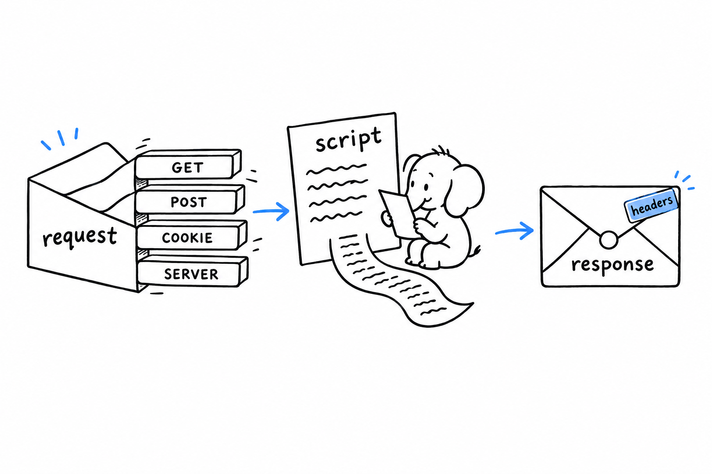
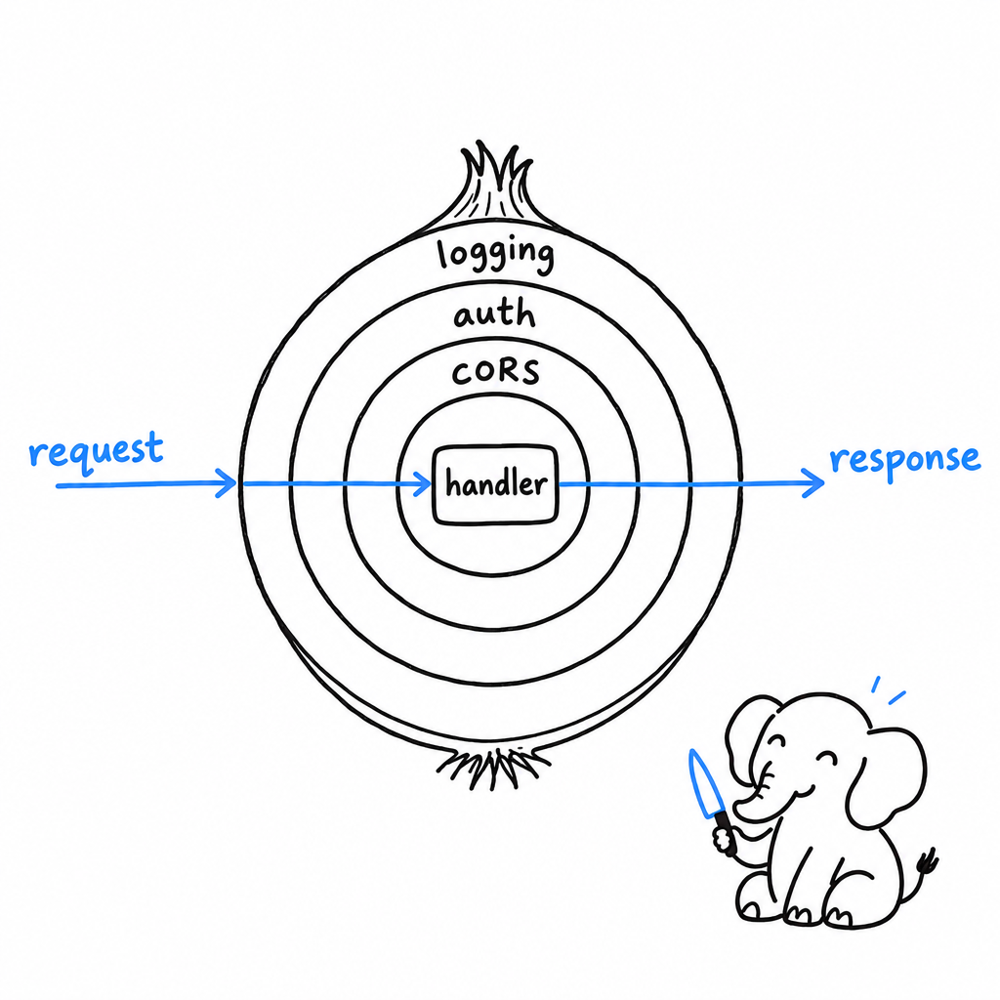

# A Web Request, Without a Framework

**PHP can serve a web page with no library, no server code, and no configuration, because handling an HTTP request is what the language was built for.** The request is already parsed when your script starts. The response is whatever you print. A framework adds structure on top of that; it does not add the capability.

Seeing the raw layer once makes every framework legible, because they all sit on exactly these primitives.

## The front controller

Point PHP's development server at a single file and every URL goes through it:

```bash
php -S localhost:8000 public/index.php
```

That file is the front controller. In production the web server does the same thing with a rewrite rule (or FrankenPHP and RoadRunner do it for you, as [How PHP Runs](ch01-how-php-runs.md) describes). With the development server, one detail matters: **if the script returns `false`, the server serves the requested file from disk instead**, which is how static assets get through.

```php
<?php
declare(strict_types=1);

$path = parse_url($_SERVER['REQUEST_URI'], PHP_URL_PATH);

if ($path !== '/' && is_file(__DIR__ . $path)) {
    return false; // let the built-in server send the CSS or image
}

echo 'Every other URL lands here: ', htmlspecialchars($path, ENT_QUOTES);
```

## Reading the request

The request lives in superglobals, arrays that PHP fills before the first line of your code runs. `$_GET` holds the query string, `$_POST` the fields of a submitted form, `$_COOKIE` the cookies, `$_FILES` the uploads, and `$_SERVER` everything else: `REQUEST_METHOD`, `REQUEST_URI`, and each HTTP header as `HTTP_` plus its upper-cased name, so `Accept-Language` becomes `$_SERVER['HTTP_ACCEPT_LANGUAGE']`.

```php
<?php
declare(strict_types=1);

$method = $_SERVER['REQUEST_METHOD'];
$page = filter_input(INPUT_GET, 'page', FILTER_VALIDATE_INT) ?: 1;
$name = trim($_POST['name'] ?? '');
$lang = $_SERVER['HTTP_ACCEPT_LANGUAGE'] ?? 'en';

$body = json_decode(file_get_contents('php://input'), true, flags: JSON_THROW_ON_ERROR);
```

`$_POST` is only filled for `application/x-www-form-urlencoded` and `multipart/form-data` bodies on POST. A JSON body, whatever the method, is read raw from `php://input`. A form sent with PUT or PATCH is not parsed at all unless you ask: `request_parse_body()` (PHP 8.4) returns the fields and files for those methods too.

**Nothing in these arrays is trustworthy.** `HTTP_HOST` is whatever the client sent. `REQUEST_URI` can contain anything. A field you expected as a string arrives as an array if the client writes `name[]=x`. Treat every value as untyped user input, validate it with `filter_var` or your own checks, and only then let it near your logic.



## Writing the response

**Whatever your script outputs is the response body.** `echo`, `print`, and any text outside `<?php ?>` tags go to the client. Status and headers are set with two functions, and they must be called before the first byte of output, because the headers travel first:

```php
<?php
declare(strict_types=1);

http_response_code(201);
header('Content-Type: application/json; charset=utf-8');
header('Cache-Control: no-store');
setcookie('theme', 'dark', [
    'expires' => time() + 86400 * 30,
    'path' => '/',
    'secure' => true,
    'httponly' => true,
    'samesite' => 'Lax',
]);

echo json_encode(['created' => true], JSON_THROW_ON_ERROR);
```

Print something first, even a stray newline before `<?php`, and `header()` fails with "headers already sent". Output buffering (`ob_start()` at the top, `ob_end_flush()` at the end) holds the body in memory until the script finishes and makes the order irrelevant, which is what frameworks do.

## Templates are PHP

PHP started as a templating language, and it still is one. An HTML file with `<?= $expr ?>` in it is a template; `include` it and it prints. The one rule is on output: **escape every value with `htmlspecialchars` before it lands in HTML**, or the first user named `<script>` owns your page.

```php
<?php
declare(strict_types=1);

function e(string $value): string
{
    return htmlspecialchars($value, ENT_QUOTES | ENT_SUBSTITUTE, 'UTF-8');
}

$todos = ['Write the chapter', 'Escape <everything>'];
?>
<ul>
<?php foreach ($todos as $todo): ?>
    <li><?= e($todo) ?></li>
<?php endforeach; ?>
</ul>
```

The `foreach (...): ... endforeach;` form exists for exactly this interleaving. A two-line `e()` helper is the whole escaping story for HTML; attributes, URLs and JavaScript contexts each need their own encoding, which is the part template engines automate.

## A complete application

Here is a working application in one file: a list of notes, stored in SQLite, with a form to add one. It runs with `php -S localhost:8000 index.php` and nothing else.

```php
<?php
declare(strict_types=1);

$db = new PDO('sqlite:' . __DIR__ . '/notes.db', options: [
    PDO::ATTR_ERRMODE => PDO::ERRMODE_EXCEPTION,
    PDO::ATTR_DEFAULT_FETCH_MODE => PDO::FETCH_ASSOC,
]);
$db->exec('CREATE TABLE IF NOT EXISTS notes (id INTEGER PRIMARY KEY, body TEXT NOT NULL)');

function e(string $value): string
{
    return htmlspecialchars($value, ENT_QUOTES | ENT_SUBSTITUTE, 'UTF-8');
}

$route = $_SERVER['REQUEST_METHOD'] . ' ' . parse_url($_SERVER['REQUEST_URI'], PHP_URL_PATH);

match ($route) {
    'GET /' => (function () use ($db): void {
        $notes = $db->query('SELECT id, body FROM notes ORDER BY id DESC')->fetchAll();
        echo '<h1>Notes</h1><form method="post" action="/notes">',
            '<input name="body" required> <button>Add</button></form><ul>';
        foreach ($notes as $note) {
            echo '<li>', e($note['body']), '</li>';
        }
        echo '</ul>';
    })(),
    'POST /notes' => (function () use ($db): void {
        $body = trim($_POST['body'] ?? '');
        if ($body === '') {
            http_response_code(422);
            echo 'A note needs a body.';
            return;
        }
        $stmt = $db->prepare('INSERT INTO notes (body) VALUES (:body)');
        $stmt->execute(['body' => $body]);
        http_response_code(303);
        header('Location: /');
    })(),
    default => (function (): void {
        http_response_code(404);
        echo 'Not found';
    })(),
};
```

Three things to take from it. **The router is a `match` on method and path**, which scales to about ten routes before you want a real one. **PDO is the database API**, one interface for SQLite, MySQL, PostgreSQL and others, and `ERRMODE_EXCEPTION` turns every failure into a thrown `PDOException` instead of a `false` you forget to check. **The query uses a named placeholder and `execute()` binds the value**; the SQL text and the data never meet as a string, so there is no injection to worry about. PHP 8.4 adds driver-specific subclasses (`Pdo\Sqlite`, `Pdo\Mysql`, `Pdo\Pgsql`) through `Pdo::connect()`, exposing each driver's extras with proper types.

Building the SQL with interpolation, `"WHERE id = $id"`, is the one habit from old PHP tutorials that the language still lets you keep. Do not.

## Sessions and passwords

A session is server-side storage keyed by a cookie. Call `session_start()` before any output, and `$_SESSION` becomes an array that survives across requests for that visitor. By default the data lives in files on the server; frameworks swap in a database or a cache store through `session_set_save_handler()`. Nothing but the session id travels in the cookie.

```php
<?php
declare(strict_types=1);

session_start();

if ($_SERVER['REQUEST_METHOD'] === 'POST') {
    $ok = password_verify($_POST['password'] ?? '', $storedHash ?? '');
    if ($ok) {
        session_regenerate_id(true);
        $_SESSION['user_id'] = 42;
    }
}

$csrf = $_SESSION['csrf'] ??= bin2hex(random_bytes(32));
```

`password_hash` and `password_verify` from [Strings, Numbers, Dates, and JSON](ch10-standard-library.md) are the entire password story. Regenerate the session id on login. Put a random token in the session, print it as a hidden field in every form, and compare on submit with `hash_equals()`: that is CSRF protection in four lines, and every framework does the same under a nicer name.

## The standards layer

Superglobals and `header()` work, but they are global state, which makes code hard to test and impossible to compose. The PHP-FIG answered with interfaces:

- **PSR-7** defines immutable `RequestInterface` and `ResponseInterface` objects, so a request is a value you pass around and a response is a value you return.
- **PSR-15** defines middleware: a handler takes a request and returns a response, and middleware wraps handlers. Authentication, CORS, logging, rate limiting are each one class.
- **PSR-17** defines the factories that create those objects, so a library never depends on a specific implementation.
- **PSR-18** defines an HTTP client, the outgoing side of the same objects.

**A library written against PSR-7 and PSR-15 runs in any framework that speaks them**, which today is most of them. CakePHP, Laminas, Laravel, Symfony and Yii, and the micro-frameworks Mezzio and Slim, each add routing, dependency injection, templating and a database layer on top of these primitives; the primitives underneath are the ones you have just seen.



In production, the front controller stays the same. What changes is who calls it: PHP-FPM behind nginx, Apache or Caddy, or a long-running runtime such as FrankenPHP or RoadRunner. Nothing in this chapter needs to change for either.

The application above has no tests and no static analysis. [Tests, Static Analysis, and Tooling](ch12-tooling.md) fixes that.
