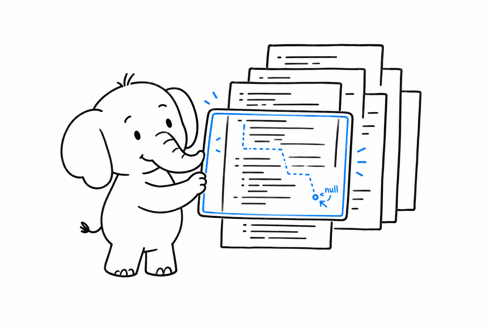

# Tests, Static Analysis, and Tooling

**A maintained PHP project runs four tools on every commit: a test runner, a static analyser, a code style fixer, and Composer's own audit.** None of them ship with the language. All of them install with one `composer require --dev` and run from `vendor/bin/`. If you have used pytest with mypy, or Jest with tsc and Prettier, you already know the shape. Only the names change.

This chapter names two tools for each job. That is not indecision. Both are widely used, both are good, and the project you just joined has already picked one.

## Tests

Two test runners dominate. **PHPUnit is the xUnit-style runner every other PHP test tool builds on. Pest is a describe-and-it layer on top of PHPUnit's engine.** They share assertions, mocks, configuration and the coverage machinery; they differ in how a test reads.

The function under test:

```php
<?php
declare(strict_types=1);

namespace App;

function slugify(string $title): string
{
    $slug = strtolower(trim($title));
    $slug = preg_replace('/[^a-z0-9]+/', '-', $slug);

    return trim($slug, '-');
}
```

A namespaced function is not a class, so PSR-4 cannot find it: the file goes in a `files` entry of the `autoload` block in `composer.json`, and Composer requires it on every run.

The same test, PHPUnit first:

```php
<?php
declare(strict_types=1);

namespace App\Tests;

use PHPUnit\Framework\Attributes\DataProvider;
use PHPUnit\Framework\Attributes\Test;
use PHPUnit\Framework\TestCase;
use function App\slugify;

final class SlugifyTest extends TestCase
{
    #[Test]
    public function itLowercasesAndJoinsWithDashes(): void
    {
        self::assertSame('hello-world', slugify('Hello World'));
    }

    #[Test]
    #[DataProvider('edgeCases')]
    public function itHandlesEdgeCases(string $input, string $expected): void
    {
        self::assertSame($expected, slugify($input));
    }

    public static function edgeCases(): iterable
    {
        yield 'leading punctuation' => ['!!Hi', 'hi'];
        yield 'empty' => ['', ''];
        yield 'unicode is stripped' => ['café', 'caf'];
    }
}
```

Then Pest:

```php
<?php
declare(strict_types=1);

use function App\slugify;

it('lowercases and joins with dashes', function () {
    expect(slugify('Hello World'))->toBe('hello-world');
});

it('handles edge cases', function (string $input, string $expected) {
    expect(slugify($input))->toBe($expected);
})->with([
    'leading punctuation' => ['!!Hi', 'hi'],
    'empty' => ['', ''],
    'unicode is stripped' => ['café', 'caf'],
]);
```

Run them with `vendor/bin/phpunit` or `vendor/bin/pest`. Configuration lives in `phpunit.xml` at the project root: which folders hold tests, whether to fail on warnings, which environment variables to set. Pest reads the same file.

The PHPUnit conventions worth knowing on day one: a test class ends in `Test` and extends `TestCase`, a test method carries the `#[Test]` attribute or starts with `test`, `setUp()` runs before each test, `self::assertSame()` is the strict assertion (there is an `assertEquals()`, and it juggles types the way `==` does, so prefer `assertSame()`), and `$this->createMock(SomeInterface::class)` returns a test double you configure with `->method('name')->willReturn($value)`.

Coverage is not built in. It needs an extension that watches which lines execute: Xdebug (with `xdebug.mode=coverage`) or PCOV, which does only coverage and does it faster. Either way, `vendor/bin/phpunit --coverage-text` prints the report.

> The unicode test above documents a bug: `slugify('café')` drops the `é` instead of transliterating it. A test that pins down current behaviour is still a test. Fix the function later with `intl`'s `Transliterator`.

## Static analysis

PHP checks types at runtime, one call at a time. It will not tell you that a function three files away can return `null` and you never handle it. **PHPStan and Psalm are the compiler PHP does not have.** They read the whole codebase, follow every type through every call, and report what would fail before anything runs. Think mypy for Python, or the type checker inside TypeScript's `tsc`.

```php
<?php
declare(strict_types=1);

function findUser(int $id): ?User
{
    return $id === 1 ? new User('Ada') : null;
}

echo findUser(2)->name;
```

PHP runs this and crashes on the second line with "Attempt to read property on null". Both analysers refuse it before that:

```text
Cannot access property $name on User|null.
```

Both tools have levels. PHPStan goes from 0 (obvious mistakes only) to 10 (every `mixed` must be narrowed). Psalm goes the other way, from 8 (lenient) to 1 (strict). New projects start at the strictest level they can bear and never go down. Legacy projects generate a baseline, a file listing every current error so that only new errors fail the build, and then shrink the baseline over time.

A minimal `phpstan.neon`:

```yaml
parameters:
    level: 8
    paths:
        - src
        - tests
```

Both tools read docblocks for what the language cannot express: `@param list<int> $ids`, `@return array<string, User>`, and the `@template` generics that [Types](ch03-types.md) introduced. This is where generics live in PHP. The runtime ignores the docblock; the analyser enforces it.



## Code style

**PER Coding Style, published by the PHP-FIG, is the style guide.** It succeeded PSR-12, which succeeded PSR-2, and every framework and most libraries follow it: four spaces, braces on their own line for classes and functions, on the same line for control structures, one class per file. You do not have to learn it. You run a tool.

PHP-CS-Fixer rewrites files to match a rule set. PHP_CodeSniffer reports violations with `phpcs` and fixes what it can with `phpcbf`. Both accept PER as a one-line configuration. For PHP-CS-Fixer, `.php-cs-fixer.dist.php`:

```php
<?php
declare(strict_types=1);

$finder = PhpCsFixer\Finder::create()->in([__DIR__ . '/src', __DIR__ . '/tests']);

return (new PhpCsFixer\Config())
    ->setRules(['@PER-CS' => true])
    ->setFinder($finder);
```

For PHP_CodeSniffer, `phpcs.xml`:

```xml
<?xml version="1.0"?>
<ruleset name="project">
    <rule ref="PSR12"/>
    <file>src</file>
    <file>tests</file>
</ruleset>
```

Pick one, run it in CI, and stop discussing brace placement in code review.

## Upgrades

**Rector rewrites your code to a newer PHP version, or to a newer version of a framework, automatically.** It knows that `Foo $x = null` must become `?Foo $x = null`, that a `switch` returning a value is a `match`, that a constructor assigning promoted-looking properties can be promoted. Point it at a target version and it does the mechanical part of a migration:

```php
<?php
declare(strict_types=1);

use Rector\Config\RectorConfig;
use Rector\ValueObject\PhpVersion;

return RectorConfig::configure()
    ->withPaths([__DIR__ . '/src', __DIR__ . '/tests'])
    ->withPhpVersion(PhpVersion::PHP_84)
    ->withPreparedSets(deadCode: true, codeQuality: true);
```

`vendor/bin/rector --dry-run` shows the diff. Without the flag it applies it. The chapter [Returning to PHP After Years Away](ch14-returning-developer.md) is, in effect, a list of what Rector will do to the code you left behind.

## Debugging

`var_dump($value)` prints a value with its type and stops nothing. `var_dump($value); exit;` is the fastest debugger there is. Frameworks add a nicer `dump()` and `dd()` (dump and die), but the language one works everywhere.

**Xdebug is the step debugger, and the only one.** Install the extension, set `xdebug.mode=debug` in `php.ini`, and your editor stops on breakpoints, shows the stack and lets you inspect variables, in web requests and in CLI scripts alike. It is a development-only extension: it slows everything down, so production builds leave it out, and when you need speed locally, `php -d xdebug.mode=off script.php` turns it off for one run.

Editors: PhpStorm has the language built in. VS Code needs a PHP extension. Both read the same docblocks the analysers do, so the generics you write for PHPStan or Psalm also drive autocomplete.

## Tying it together

Composer scripts give the project one vocabulary regardless of which tools it picked. In `composer.json`:

```json
{
    "scripts": {
        "test": "phpunit",
        "lint": "php-cs-fixer fix --dry-run --diff",
        "lint:fix": "php-cs-fixer fix",
        "analyse": "phpstan analyse",
        "check": ["@lint", "@analyse", "@test"]
    }
}
```

`composer check` runs the three. Composer puts `vendor/bin` on the path for scripts, so tool names need no prefix. A new team member reads `composer.json` and knows how the project is checked without opening a README.

CI runs the same commands, on every PHP version the project supports (the `php` constraint in `composer.json` says which), plus `composer audit`, which checks the lock file against the known vulnerability database and fails on a hit. `composer outdated` lists what has newer releases; a dependency update bot can open the pull requests for you.

For a local runtime, `php -S localhost:8000 -t public` serves the project as [A Web Request, Without a Framework](ch11-web-request.md) showed, and the official `php:8.5-cli` Docker image gives everyone the same interpreter. Any `php.ini` setting can be overridden for one command with `php -d memory_limit=1G`. One thing to know: `.env` files are a library convention (several packages parse them into the environment), not something PHP reads on its own.

## The trap

Two mistakes, both about timing.

The first is tests that hit the database by default. They pass on the author's machine, take minutes in CI, and stop being run. Test the function, pass the dependency through the constructor, and keep the integration tests in their own folder with their own `phpunit.xml` test suite so they run on purpose.

The second is running static analysis at the end. A codebase that reaches level 8 from day one stays there for free. A codebase that first meets PHPStan after two years greets it with four thousand errors and a baseline that nobody shrinks. Add the analyser to the first commit, at the highest level that passes, and raise it when it does.

The tools are in place. What remains is the question every polyglot asks in the first week: where is the async? [Concurrency and Performance](ch13-concurrency-and-performance.md) answers it.
