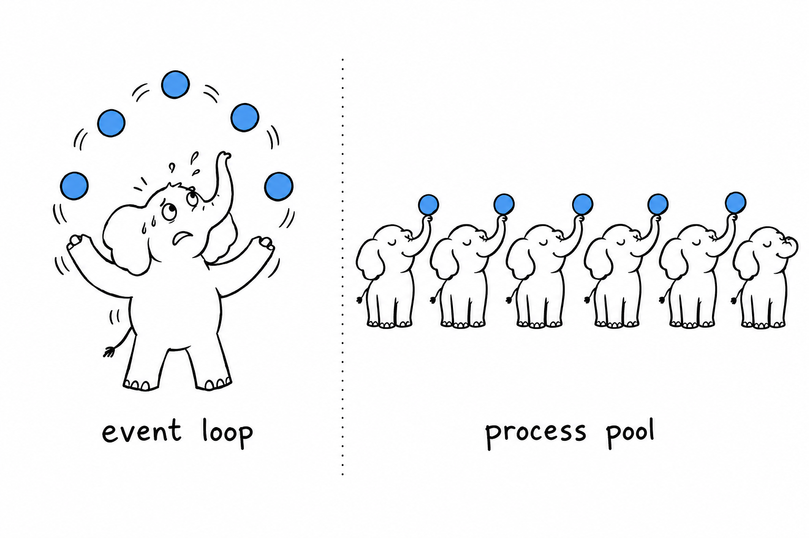
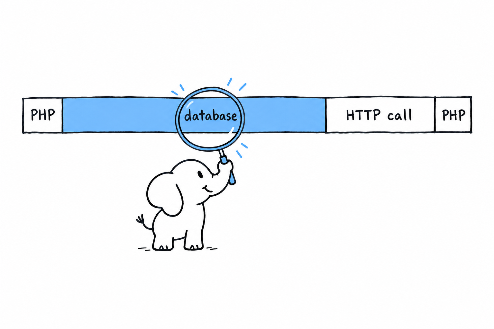

# Concurrency and Performance

**PHP is synchronous. One process runs one request, blocks on every I/O call, and that is the design.** There is no event loop to feed, no `async` keyword to sprinkle, no goroutine to spawn. Concurrency comes from outside the process: the FPM pool runs as many copies of your script as you have configured, each one alone in its own memory, and the operating system schedules them across cores.

If you come from Node, this feels like a step backward. It is not. Node needs an event loop because one process serves every connection, so one blocking call would freeze them all. PHP gave each request its own process, so blocking costs nothing that anyone else can see. A database query that takes 40 milliseconds holds one worker for 40 milliseconds. The other workers do not notice.



## What you do not get

There are no threads in userland. A `parallel` extension exists for thread-safe (ZTS) builds, and almost nobody uses it. The standard build is NTS, non-thread-safe, because the shared-nothing model never needed threads.

There is also no built-in scheduler. **Fibers (PHP 8.1) are stackful coroutines: a function can suspend itself, and whoever holds the fiber can resume it later.** That is all. Nothing decides when to resume, nothing multiplexes sockets. A fiber is a building block, and async libraries build on it so that ordinary-looking code can yield in the middle of a blocking call.

```php
<?php
declare(strict_types=1);

$fiber = new Fiber(function (string $greeting): string {
    $name = Fiber::suspend('who is there?');

    return "$greeting, $name";
});

$question = $fiber->start('Hello');   // runs until suspend()
echo $question, PHP_EOL;              // who is there?

$fiber->resume('Ada');                // runs to the return
echo $fiber->getReturn(), PHP_EOL;    // Hello, Ada
```

You will read code like this inside a library. You will not write it in an application. The Python equivalent is a generator-based coroutine before `asyncio` existed: the mechanism without the runtime.

## When you do need async

Some workloads do not fit one-request-one-process: a websocket server holding ten thousand idle connections, long polling, a crawler making a hundred outbound HTTP calls at once. **For those, PHP has async runtimes, and they are libraries, not language features.** Alphabetically: AMPHP, ReactPHP, and Swoole or its fork OpenSwoole, which is an extension. The first two are pure PHP built on fibers and stream selection; Swoole brings its own event loop in C.

The worker runtimes from [How PHP Runs](ch01-how-php-runs.md), FrankenPHP and RoadRunner, are a different answer to a different question: they keep your application booted between requests, still one request at a time per worker. They cut startup cost. They do not make your code concurrent.

Before reaching for any of these, ask whether the problem is actually concurrency. A typical web application never needs them. Ten more FPM workers cost a configuration line.

## Background work

The request has thirty seconds and a response to send. Anything longer, or anything the user does not wait for, leaves the request.

**The idiom is a queue and a worker.** The request pushes a job (a row in a table, a message in a broker) and returns. A CLI script, started by a process supervisor, loops forever pulling jobs and running them. It has no time limit and no memory limit unless you set them, so set them: `memory_limit` in the ini, and a counter that exits cleanly after a few thousand jobs so the supervisor restarts a fresh process. Leaking memory in a loop that never ends is the one place PHP's per-request cleanup does not save you.

Cron covers the scheduled case. The CLI has the rest of the toolbox: `proc_open()` runs a subprocess with pipes, `pcntl_fork()` forks the current one (CLI only, never under FPM), and `curl_multi_exec()` performs parallel HTTP requests with no library at all:

```php
<?php
declare(strict_types=1);

$urls = ['https://example.com/a', 'https://example.com/b', 'https://example.com/c'];
$multi = curl_multi_init();
$handles = [];

foreach ($urls as $url) {
    $handle = curl_init($url);
    curl_setopt($handle, CURLOPT_RETURNTRANSFER, true);
    curl_multi_add_handle($multi, $handle);
    $handles[$url] = $handle;
}

do {
    $status = curl_multi_exec($multi, $running);
    if ($running) {
        curl_multi_select($multi);
    }
} while ($running && $status === CURLM_OK);

foreach ($handles as $url => $handle) {
    echo $url, ': ', strlen((string) curl_multi_getcontent($handle)), " bytes\n";
    curl_multi_remove_handle($multi, $handle);
}
```

Three requests, one wait. That is as much parallelism as most scripts ever need.

## Where the time goes

**The interpreter is rarely the bottleneck.** A request spends its time waiting on the database, the cache, the filesystem and other services. Optimising a loop that runs in two milliseconds while a query takes eighty is the classic mistake, and it is language-independent.

The one setting that matters is OPcache, described in [How PHP Runs](ch01-how-php-runs.md). Make sure it is on and that `opcache.memory_consumption` is large enough for the whole codebase (`opcache_get_status()` tells you). Two refinements sit on top:

- **Preloading** (`opcache.preload=preload.php`) compiles a list of files once at FPM startup and keeps them linked in memory, so classes need no autoloading at all. It requires a restart to pick up changes, which is why it is a production setting.
- **The JIT** compiles hot code paths to machine code. It makes CPU-bound work faster, sometimes a lot, and makes a typical web request faster by very little. Enable it (`opcache.jit=tracing`, `opcache.jit_buffer_size=64M`), measure, keep it if it helped.

Autoloading has a cost, and Composer can remove most of it. `composer dump-autoload -o` generates a class map so no filesystem lookup happens per class; `--classmap-authoritative` goes further and never touches the filesystem for a class that is not in the map. Both belong in the deployment script. `realpath_cache_size` in the ini, a few megabytes, keeps PHP from re-resolving paths on every request.

## Measuring

Nothing above is worth doing before a measurement. The language provides the two primitives:

```php
<?php
declare(strict_types=1);

$numbers = range(1, 1_000_000);

$start = hrtime(true);
$doubled = array_map(fn (int $n): int => $n * 2, $numbers);
$mapTime = hrtime(true) - $start;

$start = hrtime(true);
$doubled = [];
foreach ($numbers as $n) {
    $doubled[] = $n * 2;
}
$loopTime = hrtime(true) - $start;

printf("array_map: %.1f ms\n", $mapTime / 1e6);
printf("foreach:   %.1f ms\n", $loopTime / 1e6);
printf("peak memory: %.1f MB\n", memory_get_peak_usage() / 1e6);
```

Both lines land in the tens of milliseconds for a million elements. The gap between them is small and depends on the PHP version. The lesson is not which one wins; it is that a million iterations cost less than one slow query, so write the readable one.

For a real profile, Xdebug has a profiler mode (`xdebug.mode=profile`) that writes call graphs your editor can open, and sampling profilers exist as extensions for production, where Xdebug's overhead is unacceptable. Point either at one slow request and read the top of the list.

Memory follows the same rule. A request that builds a hundred-thousand-row array and dies at `memory_limit` needs a generator, as [Functions and Closures](ch05-functions-and-closures.md) showed, not a bigger limit. `unset()` releases a variable, and the garbage collector handles reference cycles on its own; `gc_collect_cycles()` forces a pass, which a long-running worker may call between jobs.



## The trap

The first mistake is importing a concurrency model because the last language needed it. An async runtime under a CRUD application adds a layer, a set of libraries that must be fiber-aware, and a class of bugs (shared state between requests) that FPM made impossible. The gain is nothing, because the requests were never waiting on each other.

The second is optimising without a number. The JIT flag, the class map, the rewritten loop: each is a hypothesis. `hrtime()` on the slow path, before and after, turns it into a result.

With the runtime, the language and the tools covered, one reader is left. [Returning to PHP After Years Away](ch14-returning-developer.md) is for the developer whose last PHP had `mysql_query` in it.
