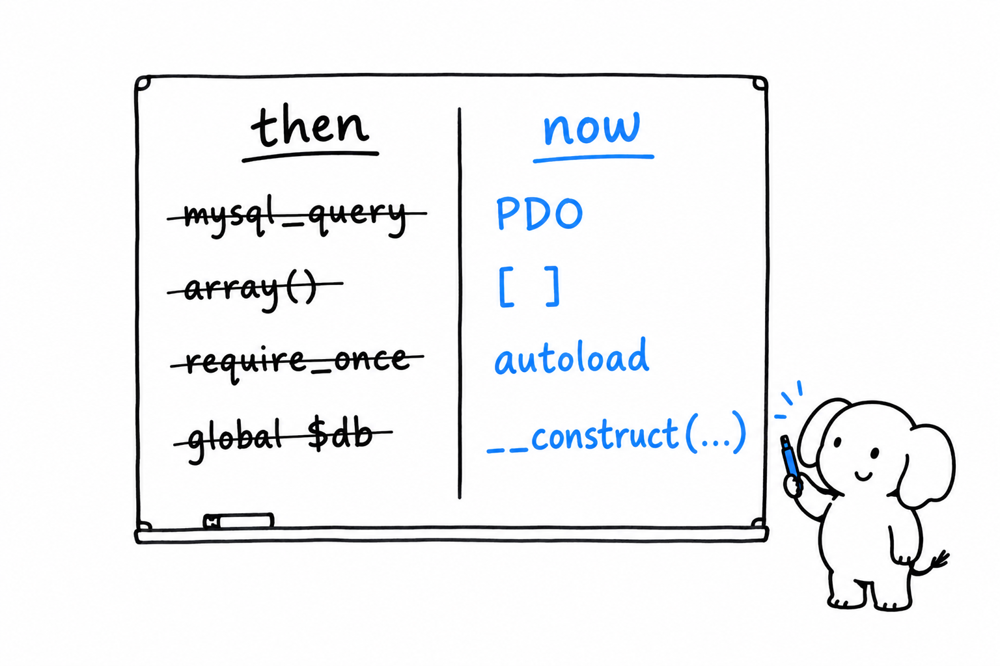

# Returning to PHP After Years Away

You wrote PHP once. Maybe a lot of it, maybe in 2008, maybe in 2015 on a project that was already old. You remember `mysql_query`, `array()`, `require_once` at the top of every file, and a language that let you get away with anything. Now you are back, and the first thing to know is this: **almost every habit you remember has a modern replacement, and most of the old forms are deprecated or gone.**

This chapter is a list of pairs. On the left, what you remember. On the right, what you write today. The rest of the book explains each replacement in depth; this is the map.



## The database

You remember building SQL by hand and passing it to `mysql_query()`. **The `mysql_*` functions were removed in PHP 7.0.** Code that calls them does not run on any supported version of PHP. The replacement is PDO with prepared statements, which also closes the injection hole the old style opened:

```php
<?php
declare(strict_types=1);

// then
// $result = mysql_query("SELECT * FROM users WHERE id = " . $_GET['id']);

// now
$pdo = new PDO('sqlite::memory:', options: [PDO::ATTR_ERRMODE => PDO::ERRMODE_EXCEPTION]);
$stmt = $pdo->prepare('SELECT * FROM users WHERE id = :id');
$stmt->execute(['id' => (int) ($_GET['id'] ?? 0)]);
$user = $stmt->fetch(PDO::FETCH_ASSOC);
```

`mysqli` still exists and is fine, but PDO speaks to every database with one API. [A Web Request, Without a Framework](ch11-web-request.md) shows it in context.

## Loading code

You remember a wall of `require_once` lines, or a home-made `__autoload()` function. **Today one line loads everything: `require __DIR__ . '/vendor/autoload.php';`.** Composer generates that file from a namespace-to-folder map in `composer.json`, and `__autoload()` itself was removed in 8.0. Classes live one per file, named after the class, and are found on first use. [Namespaces, Composer, and Autoloading](ch09-composer-and-namespaces.md) covers the setup, which takes five minutes.

Composer also replaced the habit of copying a library into your project. Since 2012, `composer require vendor/package` fetches it from Packagist, pins the version in a lockfile, and updates it when you ask.

## Syntax that got shorter

Small changes, but you will see them on every line.

```php
// then
$list = array(1, 2, 3);
$name = isset($_GET['n']) ? $_GET['n'] : 'anon';
$double = function ($x) use ($factor) {
    return $x * $factor;
};
$callback = array($obj, 'method');
call_user_func_array($callback, array(1));
```

```php
// now
$list = [1, 2, 3];
$name = $_GET['n'] ?? 'anon';
$double = fn($x) => $x * $factor;
$callback = $obj->method(...);
$callback(1);
```

`[]` arrived in 5.4, `??` in 7.0, arrow functions `fn` in 7.4, and the first-class callable syntax `$obj->method(...)` in 8.1. String callables like `'Class::method'` and `call_user_func()` still work; nobody writes them anymore because the new form is checked by the editor and the analyser, and a callable is simply called with parentheses.

## Types

You remember functions that accepted anything and returned whatever. **Today functions declare their types, and one line per file makes PHP enforce them.**

```php
<?php
declare(strict_types=1);

// then
// function total($items, $rate) { ... }

// now
function total(array $items, float $rate): float
{
    return array_sum($items) * $rate;
}

total([10, 20], '1.2'); // TypeError: must be of type float, string given
```

Scalar types came in 7.0, return types with them, nullable `?int` in 7.1, union types in 8.0, and typed properties in 7.4. `declare(strict_types=1)` switches off silent coercion for calls made from that file. [Types](ch03-types.md) has the precise rules.

## Control flow and constants

You remember `switch` with its fallthrough and loose comparison, and a class full of `const STATUS_ACTIVE = 'active';`. **`match` replaced the first, enums the second.**

```php
<?php
declare(strict_types=1);

enum Status: string
{
    case Active = 'active';
    case Archived = 'archived';
}

function label(Status $status): string
{
    return match ($status) {
        Status::Active => 'In use',
        Status::Archived => 'Put away',
    };
}
```

`match` (8.0) compares with `===`, does not fall through, and throws if no arm fits. Enums (8.1) are real types: a function typed `Status` cannot receive the string `'deleted'`. [Enums and match](ch07-enums-and-match.md) goes further.

## Classes

You remember a private property, a getter, and a setter, times ten per class. **Constructor promotion and `readonly` collapse that to one line per property.**

```php
<?php
declare(strict_types=1);

final class Money
{
    public function __construct(
        public readonly int $cents,
        public readonly string $currency,
    ) {
    }
}

$price = new Money(1999, 'EUR');
echo $price->cents; // 1999
$price->cents = 0;  // Error: Cannot modify readonly property
```

Promotion arrived in 8.0, `readonly` in 8.1. Property hooks (PHP 8.4) handle the case where a getter really did compute something, by attaching `get` and `set` blocks to the property itself. [Classes](ch06-classes.md) shows all of it.

Two things you remember are now removed or deprecated. PHP 4 style constructors, where the method was named after the class, were removed in 8.0. Dynamic properties, assigning `$obj->whatever` without declaring it, are deprecated since 8.2 and are planned to become an error in the next major version.

## Errors

You remember `@mysql_connect(...) or die('no db')`, and warnings printed into the middle of the page. **Today errors are exceptions, and you catch them.** Internal functions throw `TypeError` and `ValueError` instead of returning `false` with a warning, division by zero throws, and frameworks convert the remaining warnings into exceptions with an error handler. `@` still exists. Treat it as a smell. [Errors and Exceptions](ch08-errors-and-exceptions.md) explains the hierarchy.

## Globals

You remember `global $db;` at the top of every function. **Today the dependency comes in through the constructor.**

```php
<?php
declare(strict_types=1);

final class UserRepository
{
    public function __construct(private readonly PDO $pdo)
    {
    }
}
```

The object that needs a database receives one. It can be tested with a different one. Frameworks automate the wiring with a container; the idea needs none.

`register_globals`, which turned every request parameter into a variable, was removed in 5.4. `$_REQUEST` still exists and nobody uses it: read `$_GET` or `$_POST` and say which you mean. `extract()` and variable variables (`$$name`) are still legal and appear in no modern codebase.

## Text and dates

You remember `date('Y-m-d', $timestamp)` and `utf8_encode()`. **Dates are `DateTimeImmutable` objects, and text is UTF-8 everywhere.**

```php
<?php
declare(strict_types=1);

$due = new DateTimeImmutable('2026-03-01', new DateTimeZone('UTC'));
echo $due->modify('+30 days')->format('Y-m-d'); // 2026-03-31
```

`utf8_encode()` and `utf8_decode()` only ever handled Latin-1 and are deprecated since 8.2; `mb_convert_encoding()` does the job for any encoding. `ereg_*` was removed in 7.0, `preg_*` stayed. The `${var}` form of string interpolation is deprecated since 8.2; write `{$var}`. [Strings, Numbers, Dates, and JSON](ch10-standard-library.md) has the rest.

## Small things that are gone

- `each()` and `create_function()`, removed in 8.0. Use `foreach` and closures.
- The `(unset)` cast, removed in 8.0.
- Implicit nullable parameters, `Foo $x = null` without the `?`, deprecated in 8.4. Write `?Foo $x = null`.
- `split()`, removed in 7.0. Use `explode()` or `preg_split()`.
- `mb_internal_encoding('UTF-8')` at the top of files. The default has been UTF-8 since 5.6.

## Getting a PHP 5 codebase onto PHP 8

It will not run as is. The `mysql_*` calls alone guarantee that. The good news is that the mechanical part is automated: **Rector rewrites old syntax to new syntax**, version by version, from a config that names your target. Point it at the code, review the diff, run the tests you hopefully have, and repeat. PHPStan or Psalm then find what Rector could not. [Tests, Static Analysis, and Tooling](ch12-tooling.md) introduces both.

Plan for the work. A site still running PHP 5 today is running a version that stopped receiving security fixes in 2018. It is a liability before it is a codebase.

## The rhythm of releases

PHP now ships one minor version every November: 8.0 in 2020, 8.1 in 2021, and so on to 8.5 in 2025. Each version gets two years of active support and two more of security fixes; [php.net/supported-versions](https://www.php.net/supported-versions) has the dates. A yearly release means a yearly, small, deprecation list to read, and a codebase that never drifts far from current.

> Judge the language by its release notes, not by the codebase you are returning to. The codebase is a snapshot of when it was written. The language kept moving.

[Where to Go from Here](ch15-where-to-go.md) lists the places to keep up.
