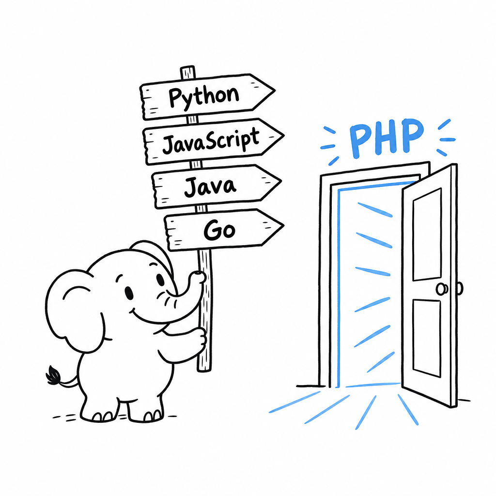

# 🐘 And Now, PHP

**A two-to-three-hour guide to modern PHP, for developers coming from another language.**

You know how to code. You have just been handed a PHP project, or you are coming back to PHP after years away. You do not need a tutorial. You need the delta: how PHP runs, how it types, how it packages code, where it will surprise you, and what today's PHP looks like once the old reputation is set aside.

This book takes two to three hours to read. Each chapter answers one question, "how does PHP do this?", and moves on.

The PHP described here is PHP 8.5. Features younger than PHP 8.2 carry their version number so you know what your project can use.
