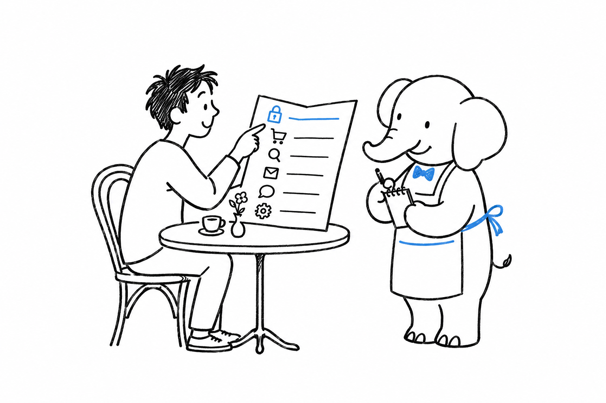

# How This Book Works

"Add a login screen." "We need a blog." "Make search feel instant." **Every chapter after the first is a request like that, something a client or a product manager would say**, never a piece of syntax. Open the chapter you were asked for and skip the rest. Nobody expects you to read this cover to cover.

## The shape of a chapter

A feature chapter opens with a short page that lays out the decision: what the feature really involves, and the two to four ecosystems that can ship it well. Then each ecosystem gets a page of its own, with the same three parts:

- What the tool or platform does for you, in a paragraph.
- A minimal, working example: the command you would run or the code you would write.
- When to reach for this option, and when it is the wrong fit.

Ecosystems come roughly in order, from "fastest to a working demo" to "best fit for something that needs to last." Treat that order as a guideline, not a ranking. The right pick depends on your client's budget, on the stack your team already runs, and on how long the thing has to survive after you ship it.

## The `$` marker

Most of this book is free, open-source software. A few names carry a **`$`** in their title: paid products or software-as-a-service, not open source. They are here because they are often the fastest or the most reliable path to a specific feature, not because anyone paid to be in this book. Every `$` option sits next to at least one open-source alternative in the same chapter, so you can weigh a subscription against your own time.

## "Under the hood" boxes

Most ecosystem pages end with a short aside like this one:

> **Under the hood:** A one- or two-paragraph note on the language feature or engine behavior that makes the convenience above possible. Always optional. Always skippable.

You will ship everything in this book without opening one of these. They exist for the moment your curiosity gets the better of you, and for that moment [Appendix C](appendix-03-under-the-hood-index.md) indexes every one of them by chapter.

## If you get stuck on vocabulary

[Appendix B](appendix-02-glossary.md) defines the recurring ecosystem terms (ORM, service container, hook, bundle, resource) by what they do for you, not by their textbook definition. A term you don't recognize is a reason to look there, not to stop reading.

The first decision comes before any feature: what kind of thing are you building?
