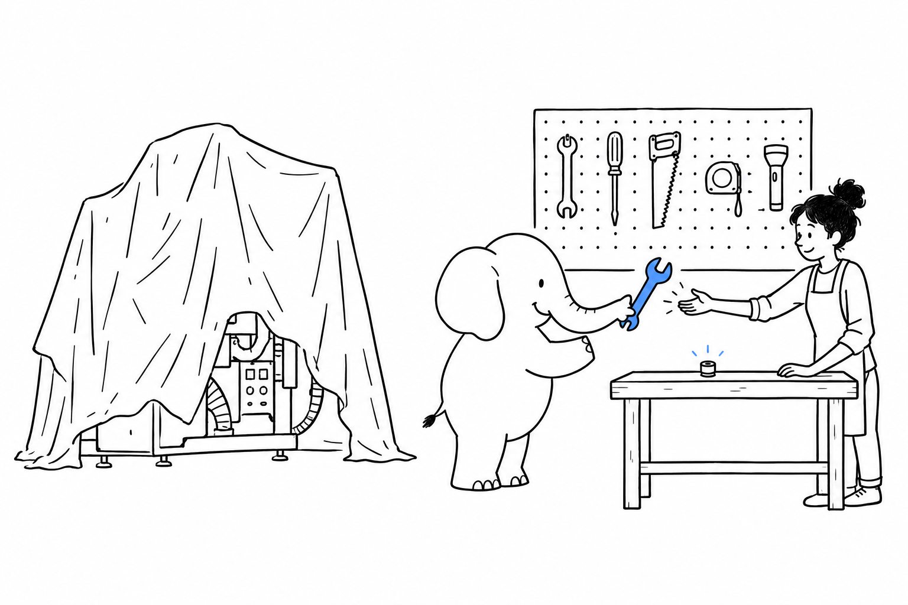

# Shipping Without a Framework: Standalone Components

A one-off import script doesn't need Laravel. A cron job that pings three APIs and writes a report doesn't need Symfony. **Sometimes the fastest way to ship is one `composer require` for the library built for this job, and forty lines around it.**

Every package in this chapter stands on its own: no framework underneath, nothing to configure beyond the one thing it does. Several of them are also the engines inside the frameworks covered later in this book. Once you have used them alone, the "Under the hood" boxes of later chapters read like old news.

- [Command-Line Tools: Symfony/Console](ch02-01-symfony-console-standalone.md)
- [Talking to Other APIs: Guzzle](ch02-02-guzzle-http-client.md)
- [Templating Without a Framework: League/Plates](ch02-03-league-plates-standalone.md)
- [Logging That Just Works: Monolog](ch02-04-monolog-standalone.md)
- [Validating Input: Respect/Validation](ch02-05-respect-validation.md)
- [File Storage Without Buying Into a Framework: League/Flysystem](ch02-06-league-flysystem-standalone.md)
