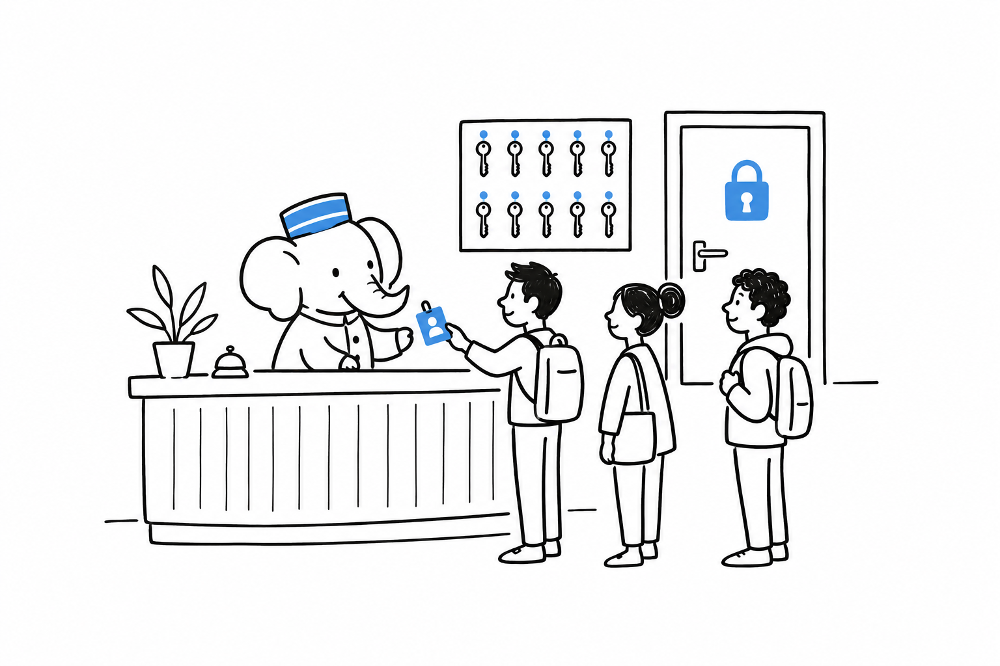

# Shipping User Accounts

Sign-up, login, "forgot password," and knowing who is looking at the screen right now: nearly every application needs this, and almost none should write it from scratch. **Password hashing, sessions, and the dozen small security details around them are code you want to inherit from a well-maintained package**, not reinvent under a deadline. Timing attacks, session fixation, and rate limiting have all been solved before you started.

- [Laravel: Breeze, Fortify, and Jetstream](ch04-01-laravel-breeze-fortify.md): three official starter kits, from "just the views" to a full team-based SaaS scaffold.
- [Symfony: The Security Bundle](ch04-02-symfony-security-bundle.md): authentication and authorization driven by configuration.
- [WordPress: Roles, Capabilities, and Application Passwords](ch04-03-wordpress-roles-capabilities.md): what WordPress core already ships, and when it is enough.
