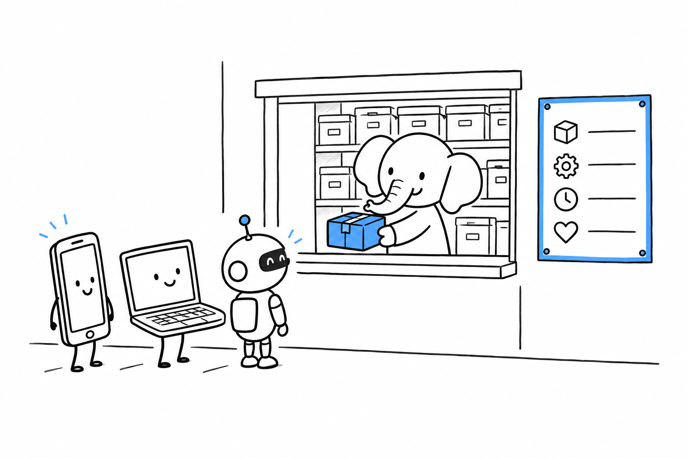

# Shipping an API Other Teams Can Use

"The mobile team needs to read our data by next sprint." Someone else always ends up talking to your data: a mobile app, a partner's system, a front end built by another team. That means endpoints, request validation, consistent error responses, and documentation that does not go stale the moment the code changes. **Writing all of that by hand for every resource is the repetitive work the PHP tooling exists to remove.**

The decision is how much you want generated for you, and how much you want to keep explicit.

- [API Platform: A Full API From One PHP Class](ch06-01-api-platform-from-one-class.md) generates REST, GraphQL, and OpenAPI docs from one annotated class.
- [Laravel: Sanctum, Resources, and API Versioning](ch06-02-laravel-sanctum-resources.md) is the lighter, more manual, more common approach.
- [WordPress: The Built-In REST API](ch06-03-wordpress-rest-api.md) is what a WordPress site already exposes, before you install anything.
